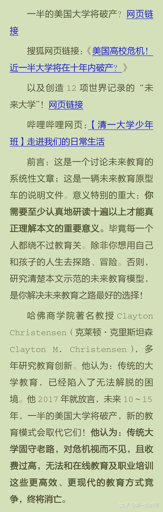
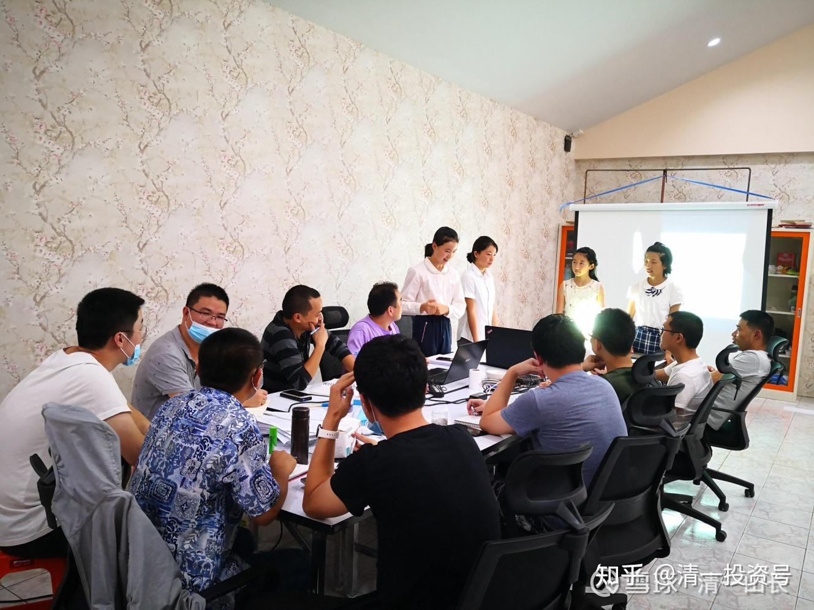

原雪球专栏[121篇.X国大学破产潮与未来教育原型车：清一大学](http://link.zhihu.com/?target=http%3A//xueqiu.com/9310099567/173768227)

[清一山长](http://link.zhihu.com/?target=https%3A//xueqiu.com/9310099567/column)2021年3月8日

**清一大学，就是一所满足新时代教育需要的新型大学、微型大学。**虽然规模很小，但她**代表着对传统大学的颠覆，代表了对教育的创新**。虽然她很不“传统”，但却**可以与传统大学，保持高度的兼容性**。她目前已经创造了教育界12项“世界纪录”，每年吸引一批学业成绩达到世界排名前30名顶尖大学要求的优等生，申请入读该大学。

**通过清一大学创造的12项世界纪录，我们可以了解：世界教育界当今最前沿的教育创新成果和方向！**

**一、清一大学是全球第一所“本科少年大学”**

该大学本科阶段的教学对象，是为15岁就完成美国K12中小学课程要求，并取得优异成绩的天才少年，提供优质的大学本科教育服务。现代大学，基本上都是为18岁以上的成年学生提供教育服务，而该大学全日制本科大学生的整体年龄，介于**14～19岁**之间，相当于传统教育高中生甚至初中生的年龄。

虽然该大学也为成年学生提供更深入的专业课程以及职业培训，并授予成人学生**“新教育硕士”**和**“新教育博士”**学位，但**本科阶段均以少年学生为核心教育对象**，并在专业教学成绩上，取得明显超越其他大学成年学生的教学成果，是大学教育的创举，并必将因此而受到全世界教育界的瞩目。

**二、清一大学是中国第一所采取国际通用标准（SAT考试）以录取学生的大学**

基于高端教育必须具有全球教育视野的追求，清一大学采用国际大学通用入学标准——SAT来作为学生入学申请的考试标准。而且**要求学生的入学成绩，必须高于世界排名前50名的顶尖大学的入学成绩**。这是**一所刚起步就按照世界最顶尖大学的入学成绩和课程标准来要求学生的大学！**

（清一大学2020年春季招收的首届学生，SAT官考成绩分布在1350～1520分。2019年，美国排名第19名的加州大学洛杉矶分校，入学成绩分布在1220分至1500分；第30名纽约大学，学生SAT成绩分布在1290～1490分；排名第53名的大学是迈阿密大学，SAT入学成绩分布为1220～1410分。清一大学的最低录取分数线要求，要明显高于这些世界名牌大学。如果再考虑到清一大学本科阶段的招收对象，是年仅15岁的少年大学生，这个入学成绩，就更加令人瞩目了。仅以入学成绩为评价标准，清一大学就已经是超过世界排名前50名大学的全新教育机构）。

**三、清一大学是全球第一所“联合国文化”大学**

清一大学是全球第一所多国语言文化大学，**要求学生至少掌握三国语言，以适应国际化人才的培养需要**。该校每年新开设一门新的小语种专业，**要求学生必须达到顶尖外国语专业大学的本科毕业程度才能结业**。**甚至以外国的母语同龄学生作为对照标准来要求学生的掌握程度**。

因为清一大学认为：大学生作为社会的精英阶层，必须具备深度的多国语言和文化理解交流能力，才能符合目前“地球村”的国际化需要。与传统大学要么强调母语教育，要么强调外语——英语教育（国际学校）不同，传统大学都忽略了小语种教育。**现代教育所谓的国际化，其实是英美化，不是真正的国际化**。**清一大学通过批量培养精通三语的学生，是一所兼容性更强，更强调国际文化平衡，多国文化平等互动，互相尊重的新型大学！**对于传统大学来说，因为外语教学的难度一直无法逾越，导致普通大学无法培养出这种多国文化人才。清一大学等于是弥补了一个国际教育的重大空缺。

**四、清一大学是全球第一所“超速学习”大学**

清一大学创办人认为：目前的教育系统僵化落后，效率低下。**完全可以用更短的时间，完成大学教育，让学生能够早一些进入社会做出更大的人生贡献**。因此，清一大学采用了超速学习模式，当其他普通学生在大学毕业的年龄，22岁，清一大学的学生，就已经完成了其他大学四个专业的本科教育阶段学习任务。成为当代社会最紧缺的跨界人才、复合型人才。

为了实现这个教育目标，该校采用了非常规教学模式，整体性学习模式，抛弃了传统大学极为低效的**“学科模块拼装”**教学模式，实现了快速学习的结果。学生可以只用相当于传统大学三分之一的学习时间（一年多一点），就可完成传统大学本科专业四年的教学任务，并通过国际水平资格证书的考试，取得优秀成绩。

如该校多国语言专业的学生，普遍用一年时间就完成了传统外国语大学四年的本科课程，并达到甚至超过中国最顶尖外国语大学相同专业毕业生的学业成绩。也就是说，**该大学入学年龄更小的学生，用更短的学习时间，取得了比传统名牌大学成年学生更好的专业课程成绩，大大提升了传统大学教学的效率，创造了世界教育界的奇迹！**

**五、清一大学是全球第一所“文体合一，文武合一”大学**

清一大学不仅仅提供优质的文化课程教育，并达到了世界顶级大学的水平和成绩。与此同时，清一大学特别强调体育运动，全员练武，无论是学生还是教师，均需练习和掌握中国传统武术。其中一部分师生，甚至能够达到专业格斗人员的水平。

因为清一大学的教育精神是，秉承中国古代“以武入道”的文化传统，认为：**不爱运动的老师，就不是好老师！不爱运动的学生，就不是好学生！**因此，该校**所有的学生和教师，都是运动达人和武术爱好者**。传统学校特别是普通大学只是把武术和体育运动，当做是少数群体专门修习的“专业技能”，而这里**每一个人都是体育运动的深度参与者，体育是师生日常生活的一部分**。这种教育模式，彻底改变了东亚文化中“文弱书生”的教育形象，塑造出了新一代的文化人、读书人。

**六、清一大学是全球第一所“文理兼容”大学**

**清一大学奉行“柔性教育”原则，恪守中国“君子不器”的文化传统，提供不分文理科的真正综合大学教育，培养“跨专业”“全能型”的通才。**该校培养出来的学生，可以适应各种不同专业的需要，学生完全根据自己的兴趣去从事自己喜欢的专业工作。而工业化社会的传统大学“分科教育，专业化教育”出来的学生，一生均受到专业学习的局限。清一大学强调**培养学生可以自主学习任何新学科、新知识的能力**，从而打破了传统大学的专业限制，也打破了学生的学科知识壁垒。如果学生需要任何专业知识，都可以轻松去学习和获得。

传统大学实行文理分科教育，毕业生很难跨专业学习和工作。特别是中国的外国语大学毕业生，总体上没有可能去考理工类的大学，无法学习工程和技术专业。导致这些学生毕业后，仅掌握有限的语言能力，普遍缺乏专业知识和技术能力。这种学生，与现代企业的实际需要差距甚远，只能去做做翻译工作，当当语言培训教师之类的。而清一大学的三语毕业生，不仅仅具有优秀的语言能力，同时兼有各项专业技术能力，和灵活变通学习的能力，属于综合素质强、文理合一的复合型人才。这种毕业生，更加符合现代企业的高层次需要。

**七、清一大学是全球第一所培养“全能型教师”的师范大学**

**目前清一大学设有教育学院（师范学院）、商学院、大医学院和武道学院，各学院学生都具有很强的“跨专业”能力**，不仅师范学院的毕业生能胜任“全科教学”，属于“全能型教师”，非师范学院毕业生也能胜任教师工作，并且是一个班只需要一个老师包班教学，即一个老师负责所有学科的教学，教学效果比普通学校8～10个老师才能完成一个班教学的效果好太多，比如轻松实现初中生4个月学会美国12年数学。

清一大学培养的学生，还能胜任任何一门外国语的教学，并且实现4个月超过国内外学校12年的外语教学效果，相当于一个人就可以开办多语种的外国语学校。除了清一大学，全世界尚未发现其他大学能够培养这样的特种类型教师。

**八、清一大学是全球第一所“学以致用”的文理大学**

除了工程类大学比较强调学以致用外，西方顶尖文理大学在学科设计、课程安排上，都忽视了大学课程服务人们现实生活的需要，更强调“为学问而学问”的象牙塔精神，强调“脱离世俗，仰望星空”的学术精神，比如会要求学生去学习早已没人使用的拉丁文、马术等这些并不具备现实生活意义的学问。这与西方顶级文理大学早期脱胎于教会有关。这些大学初创的目标，只是培养社区牧师，因此鄙视世俗生活，为学问而学问，就成为传统顶尖文理大学（如哈佛、耶鲁）的传统和特征。实际上，全世界的大学在学科设计上，无论文科、理科，都程度不同地脱离现实社会需要，教学内容老化，陈旧迂腐，既不符合现代社会需要，也无法满足学生个人发展需要。

清一大学认为：**学校是提供教育服务产品的机构，必须帮助学生在走上社会前，就做好社会所需的生存准备。如果学校无法帮助学生了解社会，并顺利地融入社会，成功地服务社会，反而让学生变得与社会生活格格不入，这种教育、这种大学就是失败的**。

这种教育精神和原则，来自于中国明朝教育家王阳明“知行合一，服务社会”的“中国书院”精神。基于这种教育思想，清一大学特别重视培养学生的“人际沟通能力”。除了让学生具备超强的国际语言能力外，还特别重视对学生理解能力和表达能力的培养。不仅仅限于演讲、辩论、写作这些传统的教学方式，更强调每个学生都要参与特殊的表演课程，学会人际互动、肢体语言、微表情表达等。这些传统大学根本就忽略的教学元素，却是现实生活中最重要的生存能力。

清一大学也会教学生们两性关系课程、心理学课程，甚至与现实相结合的哲学心理学、古代文化、中西文化比较等课程。因此，清一大学的毕业生，往往比其他传统大学的学生，思想上显得更成熟，对社会更了解，更能够适应这个变化的社会。

**九、清一大学是全球第一所重新定义“师生关系”的大学**

传统中小学和大学的教师都是知识的拥有者、提供者、创造者。学生是知识的接受者。在清一大学，教师不再负责提供教学内容，不负责储备知识和技能，不要求成为行业知识的专才，不再高高在上的扮演“知识来源、知识之神”。而是**让跨越全球的网络世界，让全球最顶尖的行业专家，来为学生提供学习的内容**。

**清一大学的教师，只是教学工作的组织者和管理者**。**教师的工作，不是负责给学生讲课，而是用各种有效的方法，去协助学生高效率地完成学习任务**。这种新型的教师，更接近于传统体育运动队的“教练”。这种特别版的新型大学教师，可以帮助学生掌握一门教师自己也不懂的专业知识和技能，比如学习一门全新的外国语言。

传统教师扮演知识来源和学科专家的身份，就像常说的：“教师拥有一桶水，他可以教给学生一碗水”。而清一大学的教师，不负责自己制造水，并交给学生，他**只负责给学生指路、带路，帮助学生去找到水的源头——一条人类知识积累的大河！**这种新型的师生关系，完全颠覆了数千年来的教育传统。

**十、清一大学是当今世界第一所“融合双重教育目标”的大学**

在教育目的上，工具主义（工具论、手段论）和人本主义（本体论、目的论）长期争论不休。工具主义（含国家主义）认为教育的目的是服务于工业社会的生产需要，把人培养成合格的社会工具；人本主义认为：学校教育应该服务于人类自我成长的需要，让学生有可能更加深入地了解自我、了解他人、了解社会，以帮助他们成为更幸福、更快乐、更成功、更有理性的人。这两种教育目的都有其合理性。反映了教育的实施者和接受者，对于教育目标的不同需求。

最近两百多年来，国家主义、工具主义教育目标占有明显的上风。当今世界各国的学校教育系统，特别是公立学校，都是奉行工具主义教育原则，负责把人民培养成工业社会的合格零件。现代大学的开办，来自于两百年前德国教育家洪堡的教育规划设计，这是为了帮助当时德国从农业社会，进入工业化社会的发展需要，而定制的“专业化、标准化、流水线化”的新型教育模式。这种教育模式，让德国到二战之前，成为全世界科学和技术的中心，也成为现在世界各国学校和教育体系的模仿榜样。这种类型的学校，**更重视学生知识和技能的传授，而忽略学生心理个性和人格发展的需要**。而**传统的英国培养绅士的牛津和剑桥，更偏向于人文主义教育目标，英国的贵族教育模式**，和德国大众教育模式，从此就成为世界教育的两个不同的范本。

有没有可能：有一种能够融合人本主义和工具主义的教育思想，**通过激发学生的内在潜能，提高学生的能力和整体素质，让学生成为“更优秀的人”，同时还能更轻松地胜任国家和工业化社会对知识和技能学习需要**的教育模式？

如果有这种大学，是否代表**对工业化教育模式的升级换代和提升**？**是人本主义和工具主义教育的融合**？西方的大学教育传统，有两种学术倾向，一种是“仰望星空”式的象牙塔学术精神；另一种是强调学科和专业的实用主义，具有物质主义的特征，让学生专注于探索物质世界的奥秘。哈佛和MIT，就是这两种西方教育精神的不同呈现。但两者的**共同缺陷，都是把大学教育的重点，放在对外在世界的研究和探索上，很少让学生去研究探索人类的内心世界**。

清一大学认为：**全部教育的重心和目标，首先应该指向人的内心，应该服务于人的精神需要，同时要满足人类内心服务社会的需要**。认为：**真正的教育，是要教学生学会克服自己身上存在的各种缺点和不足，并让学生在毕业的时候，成为比进校的时候更优秀的人**。**一个人通过教育之后，应该具有更强的人格魅力，拥有更优秀的个人素质和能力，具有更强的学习能力和愿望，这些才是教育最核心的任务**，而不只是考评学生是否学到了更多的专业知识。

同时，清一大学并不拒绝现代大学知识和技能的学习，认为要融入社会，学生掌握一定的专业知识和技能很有必要。但传统大学的知识传授方式，已经落后于时代的发展，需要用更新的技术手段，采用更接近现实发展的知识和内容，打破老旧的学科限制，这样教育出来的学生，才能更适应目前这个“知识大爆炸”时代的需要，能够满足知识快速迭代的要求。因此，**清一大学跨越了传统大学的学科壁垒，培养无固定专业的“柔型人才”，是创新教育的典范。**

**十一、清一大学是当代第一所“复古型个人大学”**

清一大学是现代版的“柏拉图学院”、“中国书院”。但她并不是简单地复归古代的学术传统，不是闭门造车，自我封闭的私塾。而**是一种利用互联网带来的便利，与现代大学无缝融合，与当代社会的需要完美接轨的新型“个人大学”。**

在中国和西方历史上，都有“学在民间”的传统，学界精英具有鲜明的学术独立特征。历史上最具有影响力的高等学府，往往是由学界领袖独立创办的学院。在西方，有亚里士多德、苏格拉底的私学，有柏拉图的“学院”享誉世界；在中国，有老庄学派、孔子、鬼谷子、王阳明等学界领袖举办的精英私学。这些学院都成为当时社会的学术文化中心，培养了影响当时社会发展的一批顶尖人才。

人类进入工业化时代之后，由于批量培养产业工人的需要，由于教育标准化的需要，使得流水线工厂式学校，代替了小规模的私学，古代“教育家办教育”的传统消失了。为了普及大众教育，国家开始建立**新型的官办工业化教育系统，私立学校也是按照官方的教育规定，来举办与公办同质化的学校**，这**就是现代的各种学校**。这些学校客观上提高了社会整体教育普及程度和人口质量，但也留下了严重的后遗症。

这种**统一的标准化、学历教育模式，对个体成长而言，教学效率极其低下，还完全忽略了学生的个性和心理的发展需要。虽然满足了工业化的职业需要，但忽略了人的精神需要。**所以，**恢复古代大学的学术精神，服务被教育者个人素质提高的需要，并与现代教育模式完美结合，同时满足国家和社会的需要**，就成就了“清一大学”。

这所大学，是由新教育的开创者张清一先生，完全使用个人资源，用自己培养的“私人弟子”作为教师，独立开办的新型个人大学。清一先生认为：**一所大学的举办资格和水平认定，应该由举办者的教育理念，和学生的学业成果来确认，并由社会具有权威影响的专业学术考试机构，来进行学业评估，有效地检验学生的学业水平和成绩。**这是现代开放式大学和互联网教育的精髓，完全突破了传统大学、传统教育的框架，创造了低成本、高效率的新型大学模式。

大学是否应该开办，是否值得去上学，完全取决于这所大学能否得到学生和家长的拥护和支持，属于自发自愿的市场行为。只要不出现危害社会和他人的行为，就不需要进行“人为干预”。对教育进行人为认证，硬性规定何种教育才是“正确”的，是很荒谬的。**统一标准的教育认证，总是落后于社会需求的变化，会阻碍教育创新，只会产生符合工业标准的“传统大学，平庸大学”，不可能出现创新的大学**。

**清一大学是一所没有官方组织参与的、一个人举办的大学，完全靠卓越的教学品质吸引了全世界一批比较优秀的学生前来学习。这也许代表了一个新的个性化教育时代的到来！**未来，会有更多的“一个人办的大学”涌现，会有类似于“得到大学”那样的更多新型大学涌现。传统大学，不改革跟进的话，只能纷纷倒闭，被时代所抛弃。

**十二、清一大学是世界第一所“跨国籍的大学”**

**清一大学是一所由中国个人独立创办，在海外施教的跨国大学，是世界上第一所超越国籍、不属于任何国家和地区的大学，也不接受官方资金支持而开办的大学**。

现代教育体系，是最近两百年来为了服务于工业化社会的需要而建立的，是世界各国为了适应工业生产的需要，为了批量培养有知识的劳动者，而专门设置的。这些由官方投资开办的学校，自然要符合国家的统一标准，这无可厚非，资本当然可以为自己说话。被教育者如果享受的是公立教育资源，他被教育成国家统一规定的标准件，他被培养成一个合格的产业工人，是无可厚非的。

但有一些个人，是自己拿钱来购买教育产品的，他们希望得到的教育产品，是能够满足自己所需的更高的目标，显然要高于国家定制的“标准产品”。如果只是满足于国家提供的标准教育服务，就不需要自己掏钱来购买教育服务，而应该由国家来负责（提供所谓的义务教育，是国家的义务）。每年那么多出国学习的家庭，如果满足于国内大学教育服务，就不会花大钱去国外上大学。所以，私立教育基于基本的商业道德法则，必须提供与公办学校不一样的教育产品，必须满足教育消费者更高的要求。

另外，当今的世界已经成为了一个“地球村”，要建立“人类命运共同体”。**国家可以互相分割，但人不应该因为国籍而彼此对立。**因此，世界上，至少需要有一所大学，要来培养“世界公民”，让学生从小就能够以“全球意识”去思考问题，成为全球人，去适应全球生存的状况，去解决全球性的问题。

**清一先生作为有中华智慧的中国人，创办的清一大学，专门服务于后工业时代的个人需要，服务于国际化生存的新时代需求，培养用中华优秀文化去帮助包括中国人在内的世界人民。**清一大学**要求学生能够和世界上任何国家的大学毕业生无缝链接。这些学生毕业后，可以去任何国家的企业工作，能够承担各种正常的专业工作任务。**这正是中国实施“一带一路”战略所需要的国际化人才，也是中国文化崛起所需要的人才。

为了实现培养“世界人”的教育目标，**清一大学第一年的基础课程，就是“世界各国语言”**。从第一届学生开始，每年都开设一门新的小语种教学。首先覆盖联合国的工作语言，每一年至少有一个班的学生，要学习新的语言，毕业后去相关国家的大学，继续深化学习该国的文化和专业课程。**清一大学的学生，只需用一年的时间，就可以熟练掌握世界上任何国家的语言，达到其他名牌外国语大学四年的专业学习成果。**

**结语：**

**清一大学，是中国古代书院教育传统和现代大学教育要求“古今合一”的教育，也是中国文化和世界文化互相融合的“中西合一”的大学。**她的学生，可以轻松地与全世界的现代顶尖大学接轨，而传统大学培养的学生，却很难拥有考上这所大学所需要的学力和成绩。这就是区别所在：证明了**清一大学，显然处在更高的学术教育维度上，可以“向下兼容”其他大学。这所创新型大学，必将成为全球未来教育的典范！**

照片中，是清一大学年仅15岁的三语学生，正在给中国电建的海外项目经理们上泰语提高课程。反馈是：比他们在曼谷请的专业语言博士的讲课更好，更受欢迎。对于学生们来说，通过教学、实践去真正掌握一门语言，比课堂学习更重要。实际上，这些小女孩们，都已经通过了严苛的清一大学课程要求——冒充本国人不被识破。很多当地泰国人，都认为她们就是本土的泰国人，不是外国人[大笑]。她们就没见过泰语这么地道的“外国人”。

**评论回复：**

[屋足君2021-03-09](https://zhuanlan.zhihu.com/p/355574106)回复清一山长：

哈佛大学的教授既然知道自己10～15年之内要失业，有没有提前辞职来清一大学面试？

山长 清一2021-03-19回复屋足君：

本帖最高赞居然是这个：“哈佛大学的教授既然知道自己10～15年之内要失业，有没有提前辞职来清一大学面试？”

不知道是“清黑”们的语文没达到小学毕业，还是大脑没有完成初级进化？或者是良心坏掉了？为黑而黑？否则，怎么能把“哈佛教授说：10～15年后，一半的美国大学要破产”，阅读和理解为：哈佛大学要破产了？等哈佛都破产了，美国100%的大学都完蛋了吧？现在的学校，就培养出这种令人着急的教育结果，不是证明教育很失败吗？不知道这些人，该去找小学语文老师补课？还是找数学老师补课？还是应该回家，找你妈去补课？

​参考链接：

[46篇.新教育送给中国人的礼物——中国公主](https://zhuanlan.zhihu.com/p/553173076)

[56篇.创造历史的清一大学：首届学生集体合影](https://zhuanlan.zhihu.com/p/551968023)

[58篇.明天,清一大学将演出莎士比亚戏剧,迎接新年！](https://zhuanlan.zhihu.com/p/551974574)

[64篇.世界的新未来大学，是怎样的存在？](https://zhuanlan.zhihu.com/p/559554811)

[【清一大学少年班】走进我们的日常生活](http://link.zhihu.com/?target=https%3A//www.bilibili.com/video/BV1Fi4y1F7uK/)
