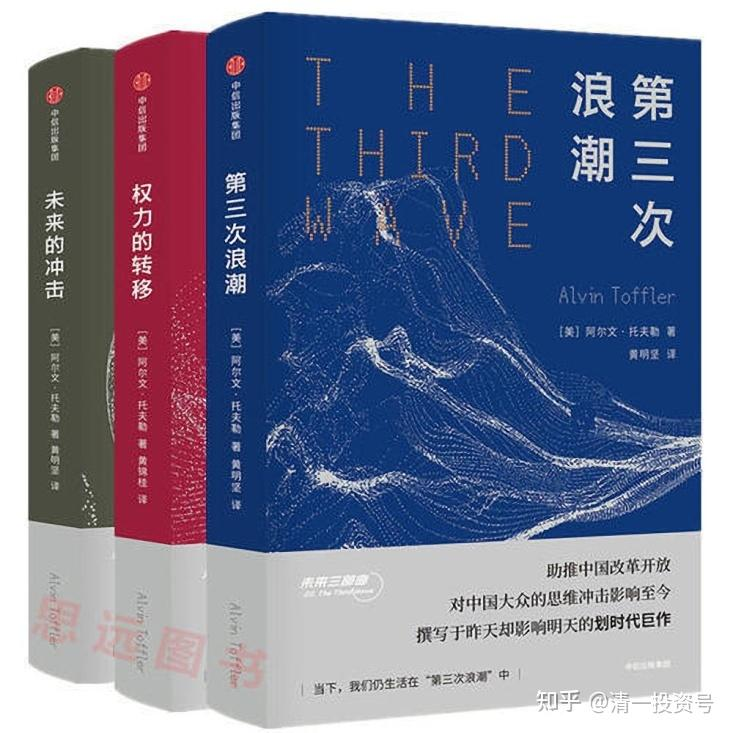
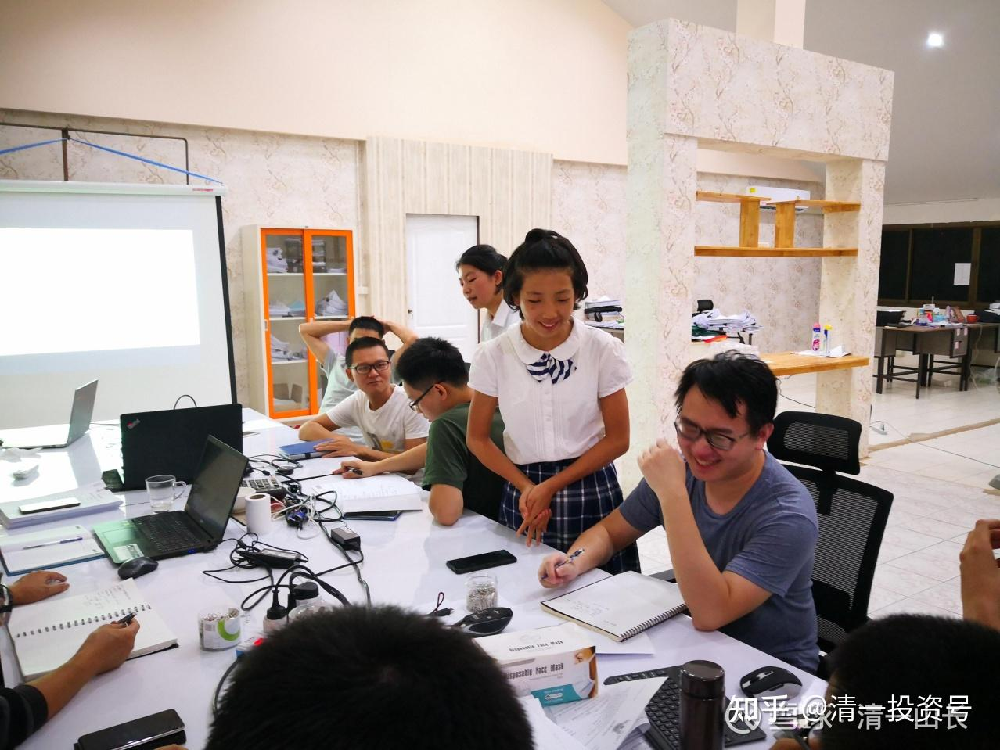

[原雪球专栏](https://zhuanlan.zhihu.com/p/563658774/edit)[125篇.知识权力时代，教育战决定胜负!](http://link.zhihu.com/?target=https%3A//xueqiu.com/9310099567/174228296)

清一山长2021年3月12日

未来世界，什么才是最重要的话语权？

农业时代，国家或者集团，个人的地位，是暴力至上，是获得统治权、话语权的核心力量。

工业时代，谁拥有金融力量，谁就有统治权。金钱的力量，可以发动战争，可以创造繁荣，可以颠覆政府。资本家可以呼风唤雨，暴力集团也只能沦落为雇佣军和打手。

未来，什么力量最强大？谁会获得这种力量？在世界权力转移，不断转移的过程中，中国人有机会吗？

世界知名的未来学家阿尔温·托夫勒，以《第三次浪潮》享誉全世界。后来他又写了《未来三部曲》，其中的第三部是《权力的转移》。提出了“社会权力”的新观念，并探索了未来企业、经济、政治和世界局势的改变。他把人类社会的权力，分为三类：分别是暴力、财力和脑力。他认为：在企业界的权力争夺战里，主要的斗争工具跟其他社会阶层的斗争相同，就是**暴力、金钱和知识三者的变迁。不了解这三样工具如何变动的人，等于是搭上通往衰亡之路的倒退火车。**

他认为：暴力是等级比较低的初级权力；金钱是中等的权力；知识是高等的权力。三者融合、变迁，就是社会的变迁。人类社会发展之初，是暴力的地位最高。暴力的价值和地位，使国王和将军们，能够获得最高的历史地位，最能影响历史的进程。**中国古代的几千年的历史，就是一部帝王将相的历史，就是一部暴力和战争的历史。**

**工业化社会，资本主义时代，开启了“金钱的力量”主导时代。这个时代，资本——金钱左右了世界。**虽然也有暴力和战争的加入，更多的是辅助的力量，金钱成为了这个时代最强大的力量，金融资本的力量，超越了国家和政权的限制，成为了具有跨国的力量。这个时代最强悍的国家，就是美国。它构筑的金钱帝国，控制了全世界。是历史上最成功的帝国，远远超过用暴力来征服世界的罗马帝国。这个国家，可以啥事情都不用做，只要开动机器，印刷一些绿色的纸币出来，就可以从全世界买买买，买各种东西，享受全世界的供养。比用武器去全世界到处抢钱的罗马帝国，要强多了。中国人用很多东西换美国人的钱，赚了钱自己舍不得用，又继续存起来去买美国人的低息债券，甘心情愿的白打工，成为美国人在世界上最好的跟班。美国拥有全世界最强大的武力，但美国的武力，服务于美元：伊拉克废除石油美元，用其他货币结算，触怒了金融霸权，所以——美国人的武力清除了萨达姆，现政权恢复了石油美元。可见，美国人非常清晰地用暴力保卫自己的“美元力量”。

现在的**信息化时代，开启了“知识力量”时代。**也把原来的世界格局打破了——特别是影响到了工业时代最强悍的国家——美国人的世界地位。现在，只要拥有信息，拥有知识，拥有影响力，你就能够影响世界。在最新版的几部007电影中，我们很明显地发现了这种世界认知的趋势变化：代表暴力手段巅峰的007们，功劳累累的传统间谍，被认为落后于时代的需要，需要淘汰。而掌握电脑信息技术的新贵们开始出来掌控局面。甚至连007们的新敌人，都不再是过去的简单的暴力拥有者，而是拥有“知识经济”的现代狂人。Q这个角色，也从老谋深算的设计怪异武器的高手，变成了一个精通电脑的年轻人。信息、资讯，成为这个时代最强大的“武器”。——很有点意思：说明，连电影娱乐业都知道，未来真的已经来了。

**知识权力，并不仅仅是一个国家、民族层面的问题，也是一个与每个人个体相关的权力。**比如：现在一个网红，会远远超过一家公司的产值。出来带货，创造的利润相当于几千个工人没日没夜干活的总和。做锤子手机失败的罗永浩，做直销带货赚了几个亿，这在农业时代，暴力集团需要一支军队来干的事情。在工业时代需要很多工厂和工人来创造的利益，他一个人就实现了。**因为他拥有“知识”，一种你无法拥有的信息时代的影响力，**使得一个人创造的财富，可以超过几千人的工厂。甚至这几千人的工厂，缺了他这“一个人”就有可能停工破产。他拥有了更大的“知识权力”。非暴力，非金钱，仅仅是“个人知识”而已。

**传统农经时代，大学必须依靠政府才能建立。金融时代，资本家也可以建立大学。但到了知识权力时代，一个人就可以建立一所大学**，甚至可以击败最强悍的传统大学，比如清一大学。如果脱离了这个时代，这基本上是不可能的事情。因此，知识权力，其实就在我们身边。也许你就有知识权力。欠缺的是把这种权力使用出来，不要抱着金饭碗去讨饭！

**暴力权力时代**，您的家族拥有统治的权力和地位，拥有军队，就拥有财富以及一切！（金家王朝，似乎依然在坚守这个过去的逻辑？先军政治？暴力地位第一的哲学。但这个家族和国家，都已经被世界远远地抛在背后，几乎被遗忘，符合托夫勒“走向衰落国家”的特点。只好不时闹点事情来引起国际关注，实在可怜可笑。）

**金钱权力时代**，您的家族拥有资本，拥有资源，您就拥有财富及一切（如中东富豪们，以及与北朝鲜形成鲜明对照的韩国，走了资本主义的金钱权力道路）。

**知识权力时代**，您要追求什么？拥有什么？才能拥有财富和社会地位？未来最受追捧的行业，一定是教育，而且必须是新教育。因为传统的教育，是服务工业化时代的老教育，培养的是资本家的打工仔和跟班，不再适合知识权力时代的需要。

信息时代，也就是知识权力的时代。到底是什么知识，才有权力？才能够让世界动容？肯定不是打工的技能知识，不是过去的死知识、笨知识。而是创新性的知识，全新的视角。比如说：您能开发3纳米芯片的知识，就比拥有7纳米的知识更有力量。甚至你可以因此而拥有控制世界，影响世界的力量。比如用这些最尖端的知识技术来敲打其他国家（如美国封锁中国的芯片技术）。如果你只掌握了70纳米的知识，十年前还是有力量的，今天，几乎就是废物，属于过去时代的垃圾知识！毫无用处了。就像原来备受追捧，要卖肾去买的iPhone 4，现在有谁要？废品站吧？

所以，**未来的教育核心要点，已经不再是记忆过去的知识，重复过去的技术。**过时的知识结构，过时的科技、学科，已经不再有力量。未来教育，是要教出全新的一代学生，这些学生必须拥有热爱学习的心态，必须能脱离老师的知识经验范围，**获得自我学习，自我创新知识的能力，不断实现新领域、新知识的拓展。**如果无法实现这种教育目标的学校，就不是符合未来社会需要的教育。

显然，已经延续两百年的传统工业化教育系统，这个曾经很成功，但是强调学生听课，老师讲课，强调学生跟随和模仿老师，老师作为智识之源，传授知识和经验的教学系统，显得非常的不合时宜。这个让90%的学生都厌学的教育系统，是绝对无法胜任这个未来教育任务的。目前看，只有清一新教育实现了这一点（看这些示范班学生，像是厌学的样子吗？[网页链接](http://link.zhihu.com/?target=https%3A//www.bilibili.com/video/BV1Qy4y1a7S3) [https://www.bilibili.com/video/BV1Qy4y1a7S3](http://link.zhihu.com/?target=https%3A//www.bilibili.com/video/BV1Qy4y1a7S3)）。新教育学堂中，一些自己不懂外语的老师，却带出了语言教学历史上成绩最卓越的学生，这说明两种教育思维的完全不同。**当然——也说明新教育的核心逻辑，是完全植根于信息时代的技术支持，自然能够轻松超越传统时代的教育。**

**第二：未来的知识权力时代，资源将更加的集中。**大多数人，并不需要掌握知识权力（就正如暴力时代，并不是每一个人都需要当将军一样）。一个罗永浩，将替代成千上万名推销员、销售经理、商店老板、代理商等等。让这些人失去传统的销售工作，统统只能降级成为“送货小二”，要么转行和失业。在越来越多的网红带货人越来越丰厚的利润背后，是大量的中级职位被替换为廉价的底层工人。所以，知识权力时代，没有拥有知识力量的人，将面临可怕的降维打击，“城市平民”将大量增加，白领职位将大大减少。

**由于知识力量的特征，未来的知识精英，注定只是少数。所以，未来的真正教育，一定是精英教育，不再是现在齐步走的、工业化的大众教育格局。高等教育，真正的大学教育，将成为精英阶层的专利，成为社会分层的重要工具。**大多数人，只需要接受基础教育，成为合格的体力劳动者，从事低端的体力工作——如上工厂流水线，送外卖等就行了。未来，只有极少数从小就按照知识力量时代的需要严格训练培养，符合未来需要的人群，才会被选出来，得到真正的优质创新教育的机会，得到提升层级的机会。大多数人，将成为群氓，是愚民的对象，每天傻乎乎地过日子就行了。就像是现在的游戏一族一样，成为被超级聪明人专门为他们设计出来的机器，来喂养着的一群“待用材料”，成为“知识消费者”却不掌握任何知识（玩游戏的人，会设计游戏吗？）。所以，哈佛专家认为：十几年之后，美国50%的大学要倒闭，是很正常的推理。因为这些大学，不再被社会需要。我认为，未来恐怕只有10～20%的大学才会剩下来，其他大学都会倒闭。再过十年，我相信很多国家的大学校园，都愿意免费送给清一大学去办学。就像现在到处都有免费的校园可以送给清一大学附中一样。

**第三：除了芯片技术，人工智能这样的科技知识高点，未来社会更需要生命科学的知识。了解人的生命奥秘。了解健康的奥秘，了解疾病的原因和治疗的方法，将成为未来最受追捧的知识权力**。这个内容，不是传统大学的生物系，生命科学学院所能够掌握的。不是西方的物质科技可以探索和发现的。**只有深入研究道家传统的人，才能揭秘人类的生命密码**。这个不是靠啥先进的仪表、仪器能够做到了，**必须要“修内功”才能实现**。**只有掌握了传统文化精髓的人，才能达到现代物质技术达不到的知识高点，实现生命科学的突破。**

清一医学院的重点，就是深入研究这个领域，掌握深度的生命科学尖端知识力量。而不是培养一批衣食医，去社会上看病混饭吃。这个目标，更像是医学研究院，生命科学的研究院，医学知识创新中心。而不是普通的培养执业医生的医学院。十年后，这批学生将与哈佛医学院PK，比赛双方对于人类各种疑难杂症的治疗能力，我相信清一医学院将完胜！因为是“降维打击”。但我们的真正目标，真不是要开医院。治病，只是一项副产品，业余爱好，玩一下就行了！我们的目标，**只是示范给全世界看：生命科学的奥秘，掌握在中国人手里。**

**第四：未来的知识权力，还包括拥有“跨界知识”的能力。**真正的知识权力，绝对不是和工业化时代一样，分门别类的格子知识。这种分科的知识，是没有能量的，当然也没有权力，只有去当知识工人的“权力”，如做码农。在未来知识分化的时代，只有能够熟练掌握跨界专业知识的人，广博之人，精深之人，才拥有最大的发展机会，以及拥有最强的知识权力。简单一点说，**未来的知识权力，一方面来自于最尖端的知识创新。另一方面，来自于对知识和专业的跨界整合和掌握！**所以，未来，只有拥有真正广博的知识，或者是拥有真正最精深尖端的知识，才会拥有真正的知识权力。大量的跟随者、模仿者，将不再有知识的权力，只有“消费知识”的权利——其实成为了基础支持的阶层。

（坐标清迈：小孩子给985大学毕业的大人们上课——这就是新教育的知识权力，颠覆传统的教育思维。方式也完全不同于传统课堂。）

**不学新教育的代价，坚持传统教育**，就是托夫勒所说的“**等于是搭上通往衰亡之路的倒退火车”。一直在黑新教育的“清黑”，其实黑的是自己。**

当年强大的马车协会董事们，可以用各种花式笑话，编段子整蛊新出现的汽车。可惜，汽车并不会因为马车夫不喜欢就停下前进的脚步。马车协会把时间用来骂汽车，不如去学习汽车如何制造更有价值。

当然，不幸的是：马车时代，可以有数千家马车作坊和谐相处，一大堆的马车老板都过得不错，养活了一大堆交通行业的“中产阶层”。但汽车时代到来后，只有少数最有竞争力的汽车企业能够存在。大多数马车老板们、管理层们，如果还想从事“交通行业”，就只能去当汽车司机了——沦落为底层工人。这就是时代变迁带来的必然结果。

**在明仪、明颖们可以获得千万酬金的同时，您是否知道：很多大学毕业生，要得到一个普通的教学职位，月薪数千元的教职，家里人要拿出上十万来“走后门”？“马车行”不景气，已经很明显了。还不开眼看世界吗？[俏皮]**

（以下内容为编者收录）

**评论回复：**

**爱玛生活笔记回复清一山长：**

我是非常幸运的，我的孩子在体制内学校比较成功，一路走来都是阳光又轻松，非常快乐的（在省级重点高中的重点实验班），对于学习一点都不觉得苦。去年高考考了她水平的下限，但还是已经进入了一所比较好的大学。但我竟然忧虑我的孩子会不会还如此幸运，拥有超级省心的下一代。昨天看了山长学校的宣传视频，感到很震撼，如果我有足够的钱，不需要子女为了工作获取文凭，也会把孩子送到那样的学校。

**清一山长2021-03-12 12:57回复爱玛生活笔记：**

“如果我有足够的钱，不需要子女为了工作获取文凭，也会把孩子送到那样的学校。”

您好像完全搞错了核心逻辑[俏皮]，全搞反了。是你——如果孩子根本就不需要将来去打工，你就可以养孩子一辈子，就可以放心送已经明显缺乏职场竞争力的体制学校上学去。如果你是穷人，你就必须学新教育，未来社会才有更多的职场机会。而不是去跟同质化的数千万人抢饭碗，你家长没关系，毕业还找不到工作。

**越穷，越想赚钱，越要学新教育**。越不在乎钱，就可以读北大、复旦混圈子。

而且，**新教育门槛已经很低**了，比体制更低。我可以一个人办一所大学，你们家长每个人都可以当一个人的校长。你的教师可以全部来源于网上，您可以使用今日学堂的高价师资，但你还不用付一分钱给他们。你只要能管好自己的学生就够了。你的家庭学校，教学质量可以拥有比任何名校都高级的教学资源。你们如有小孩子，跟示范班，我相信现在的中国任何国际学校、名校，教学成绩、实力、学生状态，这些省会名校，有谁可以比得上？能比，就来拿一千万元。

**四季投资回复清一山长：**

昨天有看到的文章，因为急事，转到个人微信待细看，闲下来发现不见了，以为被和谐了，山长的每一次发言不断在扩展我的思维认知，非常感恩，一直在看山长的文章及发言，得遇山长，是此生福报！[笑]

**清一山长2021-03-12 10:32回复四季投资：**

的确被不知名的人给删除了。这是重新改写的[哭泣]，还好留了底稿。

ellhll李华丽修2021-03-12 11:59**回复清一山长：**

好莱坞的电影主题，也在表达【掌握知识掌控世界】，连电影娱乐业都知道未来已经到来，您还要继续驻足吗？

1、农业时代，军队权利是关键

2、工业时代，资本机会是关键

3、信息时代，知识力量是关键

在信息时代，一个知识王者的影响力可以抵得过一支军队，他的财富可以超过数万人的综合、一个大型的成功公司，甚至于富可敌国。罗永浩个人年收入7亿人民币，巴菲特个人财富是1004亿美元，他们就是证明。

三个时代王者的输赢，就是暴力、财力、脑力的争夺较量。

1、农业时代，国王政府建立大学，培养的是维护其地位的军队和幕僚。实现了教育目标，他为王。

2、金融时代，资本家建立大学，培养的是为其创造财富的大量工人。实现了教育目标，他为王。

3、信息时代，知识精英一个人就可以成为王者，一个人就可以建立一所大学。如果有一所大学，是由一个人创办的，而且，他培养学生的方向，就是让学生成为像他一样的知识精英，拥有匹敌军队和资本家的知识力量，这样的学校，必将是未来的王者学校，拥有这样学校的国家，必将是未来的王者国家。

清一大学，是清一山长一个人建立的。

清一大学，培养的学生是拥有知识力量的少数顶级精英。

您看到了吗？未来的王者会是谁？

**清一山长2021-03-13 07:31转发：**

**权威人士亨利·基辛格一年多前曾表示，美中正处于“冷战的山脚”。我们评估认为目前两国正迅速登上这座山的山坡，并很可能在不久的将来陷入全面的类似冷战的状态。到2034年这会不会导致两国发生热战？甚至是核战？不幸的是，答案或许是肯定的。**[网页链接](http://link.zhihu.com/?target=https%3A//news.sina.com.cn/c/2021-03-11/doc-ikkntiak7955646.shtml%3Fcre%3Dtianyi%26mod%3Dpcpager_news%26loc%3D1%26r%3D0%26rfunc%3D45%26tj%3Dcxvertical_pc_pager_news%26tr%3D12)**（**[中美是否会爆发大战？美媒：答案或许是肯定的](http://link.zhihu.com/?target=https%3A//news.sina.com.cn/c/2021-03-11/doc-ikkntiak7955646.shtml%3Fcre%3Dtianyi%26mod%3Dpcpager_news%26loc%3D1%26r%3D0%26rfunc%3D45%26tj%3Dcxvertical_pc_pager_news%26tr%3D12)**）**

**qff94a回复清一山长**：

山长您好！

我是清一塾挑战班6号刘书铭的家长齐芳芳。读了李小虎老师在武道班的学习分享，有很大触动。他的近距离观察让我对什么是示范，什么是自律，什么是尊重，什么是影响有了一点体会。原来是知道家长要做示范，要自律，要学习尊重孩子，其实是怀着目的对自我的逼迫——“老妈都这样了，你还不努力？”本质上是更精致的利己。如果对自己的孩子都不能发自内心的“利他”，对其他人更免谈。

从李老师的描述中感受到武道班的小老师们每个人都真正与自己的内心共振时的安静，谦虚以及专注的力量。让我的内心产生了很大的向往和想学习的力量。

同时也看到李老师在这短短二、三周的学习后所产生的巨变以及带给国际今日的能量。

其实，如果没有李老师的亲身经历以及文字的详细描述，并不能真正理解武道馆的好，不能理解武道之武，才是在培养真正的文人贵族。通过李老师的文字读到的是武道馆师生身上的贵气、静气。

作为清一塾的家长，虽然看到了与武道班巨大的差距，值得高兴的是看到了真实的未来应该有的样子。

作为第一界清一塾人，我们也有自己的使命和示范性，尤其现在大战当前，家长们也在努力改变也在示范，但似乎有种力不从心的感觉，能否请山长对清一塾家长指点下迷津。或者如果清一塾家长做到什么，可以获得一个去武道馆学习几天的机会？

另外还有一个个人的问题就是，为什么想得很好，文字表达却是两样。怎么训练自己的文字表达能力？

**清一山长2021-03-13 11:14回复qff94a： **

**武道馆是个很单调的地方。只有最细致的心，才能知道它的复杂。**李总原来不时会去庙里面住一段时间修心。广东的企业家，学稻盛和夫的很多。有修行、济世之心，我知道他有这种背景，才告诉他：中国的庙里面，可能很少有修心提升的课程，静静心差不多。加上李总一直有武侠梦，才让他来武道馆“代训”的。**武道馆是培养未来职业武术冠军的地方，也是中国国学的专修之地（真国学，必须文武合一）**。偶尔一些商界人士去，是会有帮助和提高的。一般家长不需要去，去了也是受罪的。

你们清一塾，孩子考上高中，如果不想去国外，不要海外文凭只想学国学的话，可以选武道馆作为“出路”。它**也是未来的国学师资班**。

**qff94a 2021-03-13 12:40回复清一山长：**

感谢山长点醒。反复读了多遍，get到两点：一是“武道馆是个很单调的地方，只有最细致的心才能知道他的复杂”。丢掉内心的浮燥和自私，专注的去做好自己该做的事，就像许骥老师在辛苦枯燥的长时间训练中，水准都是一样的。所以，自问丢进武道馆也是活受罪。但可以顺着这个方向，慢慢训练自己的细致。

第二个“广东的企业家，学稻盛和夫的很多，有修行济世之心，我知道他有这个背景”。这让我明白了，清一塾孩子除了示范打败今日的勇气，更重要的是要有“济世之心”，否则赢了的意义太小了。而作为支持孩子的盟友，虽然能力上比不过孩子，但一定要在心胸和愿望上支持孩子。学做淡泊、富足、有静气的父母。今天，我突破了自己，也得到奖赏。感恩，感谢山长！

**参考链接：**

[清一投资号：26篇.国际今日——做最好的中国人](https://zhuanlan.zhihu.com/p/537994917)

[清一投资号：46篇.新教育送给中国人的礼物——中国公主](https://zhuanlan.zhihu.com/p/553173076)

[清一投资号：56篇.创造历史的清一大学：首届学生集体合影](https://zhuanlan.zhihu.com/p/551968023)

[清一投资号：58篇.明天,清一大学将演出莎士比亚戏剧,迎接新年！](https://zhuanlan.zhihu.com/p/551974574)

[清一投资号：66篇.如何鉴别优质教育](https://zhuanlan.zhihu.com/p/560659119)

[清一投资号：76篇.真大学，就是“神仙，老虎，狗”的大学！](https://zhuanlan.zhihu.com/p/562264164)

[清一投资号：85篇.未来世界需要跨国际，跨文化，跨专业的综合人才](https://zhuanlan.zhihu.com/p/563658774)

[【清一大学少年班】走进我们的日常生活](http://link.zhihu.com/?target=https%3A//www.bilibili.com/video/BV1Fi4y1F7uK/)

[敬请查阅：比欧三语首届毕业生成绩单](http://link.zhihu.com/?target=https%3A//mp.weixin.qq.com/s/RoyjFZVfB4ybK6NL2-PYjQ)

[这就是今日学堂](http://link.zhihu.com/?target=https%3A//space.bilibili.com/487498588/channel/series)

[2012年今日学堂](http://link.zhihu.com/?target=https%3A//www.bilibili.com/video/BV193411178W)
