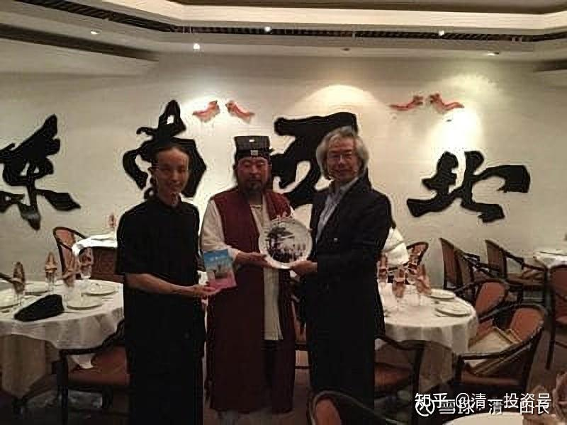
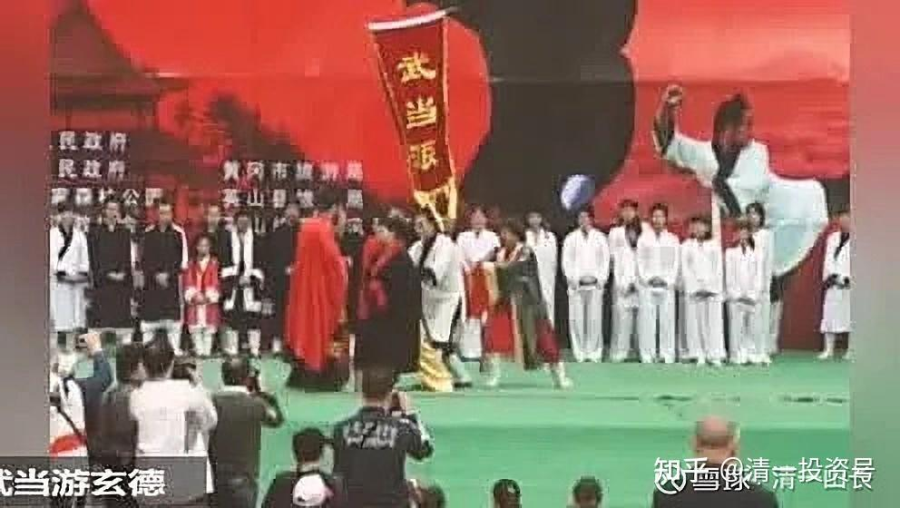

原雪球专栏[127篇.真被“武术界、国术界”给恶心到了](http://link.zhihu.com/?target=https%3A//xueqiu.com/9310099567/174719025)！

[清一山长](http://link.zhihu.com/?target=https%3A//xueqiu.com/9310099567/column)2021年3月17日

今天我看到消息，现任的“武当山派掌门人”游某（游玄德）：自称自己是中国唯一的“降龙十八掌”、“一阳指”的传人。这么高级的武功，找谁学的？据说是家传。他们家祖上是襄阳人，是跟随郭靖和黄蓉的亲密弟子，因此学到了这门“绝世武功”，然后一代一代“秘传”传到他这里发扬光大了。

我还看了中央电视台拍的某派太极王大师（王占海）的纪录片，他一个人，就单挑了中国击剑队，还玩空手对剑，居然击剑教练怎么出剑就是刺不中他；他一个人单挑橄榄球专业队牛高马大的三个队员，比赛橄榄球；他还跟专业的柔道队员摔跤，居然全都赢了。好了不起呀！世界全能冠军出世！还看到他一掌就把四个弟子打飞的神功。我寻思：让他去参加奥运会，中国不多几块金牌吗？据说一块金牌要用一个亿来培养。用上此人，肯定会节省国家的大量体育投资。

**我只是纳闷：既然大师有如此绝技，跑去跨界打这些专业运动员，都获得全胜的成绩。干嘛不专心练练自己，去跟梅威瑟打一架？为自己和国家赢得数千万元美金？**一身功夫，拿来玩这些江湖把戏，不嫌掉价吗？后来电视台播放节目后，这些跟他对阵的运动员纷纷被节目恶心到受不了，也被周围的朋友质疑得受不了。都出来**[澄清](http://link.zhihu.com/?target=https%3A//www.163.com/sports/article/CKB2I9OQ00058782.html)：是[教练、领导要求他们配合一下](http://link.zhihu.com/?target=https%3A//www.sohu.com/a/139743253_785372)**，象征性地玩一样。没想到被媒体算计了，居然变成专业运动员不如太极大师的证据了。于是就纷纷出来公开忏悔，对不起自己热爱的运动。好狗血的剧情。

这俩人，全是国家、省级的重量级人物，省级甚至更高的武协会长之类的角色，属于正统的中华武术的代表。跟雷雷、马保国们这些单打独斗的江湖混混们，完全就不是一个级别的。但是居然有这种中华武林宗师人物，出来说这种郭靖、黄蓉传给他们武功——这种考验中国人智商的话，实在让我受不了。我觉得自己的智商，瞬间就被拉低了很多。

这话，真把我给恶心到了。**知道玩传武的很多人是没底线的，不知道居然这么没底线的**。关键是，这些人还是媒体追捧，地方官员抬举，到处晃悠，甚至出国，“代表中国武术，中国文化”的人。而且此人还当选了**“当代中国弘道人物”**的伟大使命，更让我实在不知道该说什么。

**我认为：就算我吹牛，硬说我的功夫就是武当张三丰传给我的，都要比上述的神话更靠谱一些。**因为历史上真的有张三丰存在过，至于是不是太极的创始人，有学术界在争议。但郭靖、黄蓉，谁都知道，只是金庸老先生编出来的小说人物，“**降龙十八掌”和“一阳指**”**，更是小说家嘴里的武功**。金庸本人，是不懂武功的。这些人，居然成了“历史人物”，这些“文人的武功”，居然成了他们“家传的武功”了。如果这人正好姓郭，是不是赶快说自己就是郭靖的后代子孙？

想起来了，某沟（陈家沟）的“太极传人”，就把自己的祖先，说成了是历史书上记载的辽东某大将军。至于地方、年代对不对得上，就不管了。地方志明明记载他们的祖先只是一个乡镇的民兵队长一样的角色，硬被子孙们，根据看到的史书，就抬高到了明朝的某边关守将身上，八竿子都打不着。不知祖先地下有知，会不会气活过来？

**人，可以没底线到这种地步？我真的见识了中国人的“创造力”。**

最近，爆出现代格斗运动员玄武跟某太极大师（王占海）比武的[全部视频](http://link.zhihu.com/?target=https%3A//v.qq.com/x/page/c32010ds1wz.html)。原来的[视频](http://link.zhihu.com/?target=https%3A//haokan.baidu.com/v%3Fpd%3Dwisenatural%26vid%3D13126128026575691993)剪辑，是太极大师把玄武摔翻了两次，然后玄武恭恭敬敬地说：“大师功力深厚”，心服口服地拜师。然后公开宣传：以后某师父就是俺家师父，谁想挑战他师父，先过他这一关。马上摇身一变，成为陈氏太极的嫡系传人，要“捍卫师门”了。

当年，正是徐某（徐晓冬）打假，点名王某的时候，所以，这番话，就是叫板徐某了。徐某很聪明，知道太极门这种玩法厉害，所以不接招。申明他只打师傅，不打徒弟。还说这师傅的徒弟，全是一帮练现代格斗的专业人员，又不是练太极拳的，打啥？后来真发现，连全国摔跤冠军，都投到王师傅门下了。徐某，也练过摔跤，但离冠军的距离还远着呢！当然不能去打徒弟了。这徒弟又不是大师培养出来的，是专业队培养出来的。徐某只是业余队的，去瞅啥热闹？

**为啥这个武力值不高的人，这么多的搏击冠军们纷纷投到他的门下？**

现在就知道原因了，因为大师手上，有“资源”。别人问玄武，你功夫不错，一龙都不是你的对手，为啥要拜这个水货为师？玄武就老老实实地说，王师傅答应帮他介绍给马云，还给他找以后大力发展的机会，他当然要拜入门下了（这说明，老板们给传武的价值很高，愿意花钱，但现代武术不值钱，所以现代格斗只好纷纷投身到传武大师手下，好混一碗好饭吃）。传武真的很有地位，我算体会到了。

只是，这个大师没有兑现诺言。后来一直都没有给他介绍生意和机会，不知道是不是没有交拜师费的关系，据说拜师费是10.88万元。是不是玄武拿不出来？也可能是他多了个心眼——拜师就拜师，别赔了夫人又折兵。一再拒绝了师傅要求拿钱出来大肆操办拜师礼的要求。现在几年过去了，看越来越没机会，马云也失踪了。于是，当年与师傅大战的“[未剪辑视频](http://link.zhihu.com/?target=https%3A//v.qq.com/x/page/c32010ds1wz.html)”，就流出到了网络上。

我们才发现，他当年固然输了两跤，但他跌王师傅更多跤。这些虽然是事实，他原来给面子，不吭气。但今天看对方不拿他当回事，自己拜师是吃了一个大大的哑巴亏，就拿出来晒了。

太极大师一看，这下面子全没了。这小子，连拜师费也不给我交，这小子不是东西。于是把他开除师门，这事情就闹大了。

同时还爆出了一龙的假打问题：新闻发布会都召开了，两人要比一场。但玄武傻到赛前拒绝了一龙的“表演赛”要求，名和利都没了。于是一龙取消了比赛。一龙正式发言澄清，没有此事，是玄武交不起房租要主动退赛的。吵得一塌糊涂的。不过，一龙真有实力，上去打一场不就得了？这么多人关注，正好吸引注意力？前途，“钱途”都大大的有，为啥就是不出来打？只打嘴巴仗？律师仗？

知情人说：原来70公斤级的一龙，现在已经成了100公斤“重量级”，自然不方便出战。怪不得现在没看见他的表演了。我看过他与播求的一战，刚开始其实很猛，很快就体力不支，但播求毫无影响。谁更专业？毫无疑问。我看场上的局面，就想到武松笑话西门庆的一段故事：像是一个被酒色掏空了身子的大官人，完全跟不上格斗的节奏。不过，**这一场比赛一龙居然赢了，泰国人纷纷表示不敢相信。证明在中国，钱多，功夫就好。**

**就像上面说的某大师，能够提供“钱途”，旗下弟子不用培养，冠军们统统都跑来拜师。这恐怕就是中国武林与世界武林最大的差别吧？**

照片中，就是当代武林的“东邪西毒，南丐北帝”。了不起的“大侠”！我以为武林这种传言，是笑话。没想到是真的。据说“中神通”就是“一龙”[捂脸]。

《射雕英雄传》的人物全齐了[很赞]！

当代武林，实在了不起。我看谁都很厉害，就没看到谁去专挑现代格斗，都在学现代格斗的技术去打架，然后练一些套路来骗钱，名利双收。

**这样的武林，我真玩不来。我这种人，就只能关起门来，玩我“一个人的武林，一个人的太极”吧！注定孤独的一条路。我的武道馆是这样的，平淡无奇的。[亿万企业家的武道馆体验记录](https://zhuanlan.zhihu.com/p/354387957)：**

[当亿万企业家走进清一武道馆](https://zhuanlan.zhihu.com/p/354387957)

知乎链接：[https://zhuanlan.zhihu.com/p/354387957](https://zhuanlan.zhihu.com/p/354387957)

**我的目标很简单：武术就是实战。传武不能实战，就不能称为传武；太极拳不能实战，就不能称为太极拳。这是给祖宗抹黑。**

**如果中国的传武，要证明自己的价值，就必须能够“成建制”地培养出一批一批的，能够击败现代武术的人出来。而且还必须是用中华武术的技术，不是现代格斗的技术。**可以研究，参考现代格斗的一些训练方式，但技术特征，必须是中华武术的才行。不能期待某个神人的神功，比如啥“一阳指”、“降龙十八掌”之类的。必须要能有一批年轻的后生，能够接受传武的训练后，取得良好的实战成绩。否则就是骗子。

**中华武术，是建立在中国长期的严酷战争环境之下的，军队的搏杀，是强调速成的。最多三五年，就要训练出精兵上阵**，否则怎么打仗？我才不相信中国古人就是一批练了几十年的老头上阵打出来的。老头可以当教练，但上战场绝对是年轻人。这才是真正的传武。而不是某些人传言的：练太极拳的，越老越厉害。这不是规律，只是个案，更不能拿来忽悠中国人。

徐某的打假，我以为有血性的武林人，应该有人会站出来，用真正的实战训练，来捍卫传武的荣誉。但我看到的**都是一批鸡鸣狗盗之徒出来扎眼睛**。

现在，已经四年了，却没有人出来真正地捍卫传武，培养传武的新一代传人。这绝对不是缺钱的问题，是缺了良心。传武界，其实比格斗派更赚钱。我在昆明一个培养出世界冠军蔡宗菊，还培养了一个男性的矿工拳王（熊朝忠），属于很专业的拳馆。我去考察学习，与教练交流。**我发现：他们的收费很低，交2980元就可以跟着练一年。但是，传武界的大师们，一节课就要1000元。拜师费10万，几十万都有。格斗界，哪有这个机会？**

徐某的MMA比赛，一个级别很高的赛事，他的朋友拿到了决赛的冠军，也才有18万的奖金，还是很高的意外惊喜了。一龙的上场费，低过百万吗？假的比真的更值钱？这绝对不是传武没钱，没支持，而是钱太多了，烧的。

如果现在系统地研究和准备对战现代格斗的，传武界就只有我一个人，我就一个人玩这个游戏。其他人，就别跟我谈啥传武了。我不认识这些人。我们不是同道，不是朋友，我们各玩各的，你们去赚你们的钱去。

**如果你的目标，是要用传武的技术，击败现代格斗。您可以跟我做朋友，一起走。你找不到人，我可以输送人才给你，我做经济和后盾支撑，让你的门派弘扬光大。要赚钱没问题，先真打实战出来，拿结果出来说话。别骗人！**

我相信：真传武出山，中国人愿意出钱的。（就像来我武馆的老总，还有很多人，是愿意出钱来捧真正的传武。但别拿假货来骗人）。

马云，绝对是愿意为真太极出钱的人。你们笑话他的太极水平不行。但他是商人，不是武者。可惜的是，他出钱，出得再多，但只能去买假货。因为中国的太极拳，看样子就没真货。我至今没见到谁拿真货出来了。

不服气的，去打现代格斗去，用实战来证明自己。别跟我叽歪，打嘴巴仗。我承认打不赢你们，我只能拉黑你们。

**你愿意去真打实战，我愿意支持，我来出钱，我出学生，我们一起去打实战。没人就算了，我一个人去打这一场仗。**

几年前，有个狂飚武师，狂言他一年，就可以培养出可以击败我的学生，只要是15岁的学生都可以。我就一文人，从小读书上学，教书到老。从来没有专业练过武术，更没有打过擂台赛，也没啥家传武功，不认识郭靖、黄蓉，就上大学后，才开始业余时间练练武玩的。中国这些来头很深的专业武术人员，能够训练出击败我的人，应该很正常。金庸的书上经常写名家弟子一出手，就多么的不一样。

我很愿意给这些身怀中华武术绝技的“神功”师傅一个理想的机会来展示自己。**我就淡淡地说：我给你一个班的15岁学生来训练，真做到了，击败我，我奖你一千万。能打败我的学生，打败一个也给奖十万，培养了十个出来，奖100万。**打不了，我也不找他要钱给我，这些人也没钱，我就不欺负他没钱。我就当他只是普通的体育老师，只给他正常的一份工资就行了。我还愿意跟他签合同，家长做中间人，签字担保，我不会赖帐。

这合同，对谁有利？**赢了一本万利，输了一点不吃亏**。我拿钱、拿名出来，帮他打名声？**如果真做到了，他收千万只是起点**：一年就击败我的名声放出去，马上全国知名，可以让他当教练，卖武术就赚更多的千万。但合同写好了，他却要求，一年后的双方比赛方式是“点到为止”。我要求必须按照“国家散打格斗规则”来比赛，并请国家级的专业武术裁判来全程主持比赛。但此人不同意，说打伤人咋办？国家规定咋办就咋办呗？他居然不敢签这份合同，放弃了。**这种无本万利的合同都不敢签**，说明啥？但此人背后却到处骂我“暗算”了他——谁暗算谁呀？**“点到为止”**是啥？我真不懂。

其实雷雷比武，自己说，他早就点到徐某的关键要害了。一旦功力发出去，徐某就要受内伤，生命危险，他心善，就收手了——中国传统武德嘛！可是，徐某这个人，不懂传统，也不讲武德，居然趁机袭击雷雷，导致雷雷“不小心”被打倒了。所以，雷雷现在一直不服气，还想要跟徐某打两番战。但徐某就是不敢打，一直躲着他。怕雷雷来真的。（我不是说笑话，是真的，雷雷真的在约两番战，计划复仇）。这就是中国的武林人！

**今天，我的以上设奖依然有效。谁想要1000万？谁有实力来拿这一千万？或者打赢我的弟子拿10万，一百万？有本事的，你来，教出来，我给钱！不管你啥派的，中国的，外国的，现代的，古代的，据说中国的民间高人很多。给你钱来教本事，教出来学生就拿钱？怎么样？**

没有人来，这些武师们，就别吹有啥神功，啥身怀绝技，啥怀才不遇，啥时运不济等等的鬼话了。各位也别相信中国民间有啥真武术、真大师了。恐怕真快死完了！

（以下内容为编者收录）

**附录一：[千万豪礼，武林盛宴，花落谁家？](http://link.zhihu.com/?target=https%3A//mp.weixin.qq.com/s/4kx5NK3ab1ufYpO-qLTLbA)**

清一山长2016年5月29日09:11:34

**互联网时代的思维模式，是相互支持，互相成就，是共享，是共进**。这与**中国传统的黄色思维“你输我赢，我赢你输”的掠夺思维模式**，大家**彼此习惯了欺骗和忽悠人的单赢思维模式**相比，形成了鲜明的对照。今天，不懂这个共享互助思维模式的人，依然抱残守缺，注定会被历史淘汰！

今日学堂的平台价值，到底值多少？我的估值至少是9位数。而且，五年内，这个估值将上升到10位数。这只是它能够创造的，可以实现的金钱价值部分。还不算“无形资产估值”，“文化价值”，这些，就是无价了。

这笔资产，是属于谁的呢？是我的吗？其实不是，它**是所有与今日学堂相关联的人的，是所有参与平台建设的伙伴们的**。只要大家维护好平台，谁盘好了这笔资产，用活了这笔资产，这些能量，就会为谁服务。

举个例子：我带的**今日学堂高中部学生，每个人都享有7位数甚至8位数的估值**。如静慧、WC[1](https://zhuanlan.zhihu.com/p/563695431/edit#footnote-1)以优秀的带班成果，在家长们中享有“击败今日学堂1.0老师”的卓越名声。如果她们愿意外出去自办一个私立学堂，生源将马上涌来，每年的收入，至少可达7位数。会很轻易地超越其他一些举办多年的新教育学堂，甚至成为除今日学堂以外的不二之选。这家新开办的学堂，估值是多少呢？至少是8位数吧？这个价值的再创造，就是得益于分享了今日学堂的“核心平台价值”。固然这个结果，离不开她们自身的努力。但是，**新教育圈子的人认同和信任她们，不是因为她们个人的名声，而是她们作为今日学堂一员的“身份”**。如果她们没有这个身份，就算有相同的能力，可能需要10年的努力耕耘，做出明显的成果来，别人才会看到她们的成绩，才承认她们的价值。而且，办学过程中，由于各种不是她们能力的问题和原因，有可能还会中途失败，一生就被埋没了。所以，才有**“千里马常有，而伯乐不常有”的说法——平台价值高于个人价值！**

不仅仅是她们两个人。对于她们的同学来说，也具有类似的“聚光效应”。其他家长，会认为高中部的其他学生，既然与静慧、WC都是同学，一起学习的，水准应该差不大，也会给予差不多的溢价和估值。她们一离开学校，马上就有很多“订单”找过来，她们可以根据自己的人生发展目标，来确定去何处更好。比大学毕业生的选择多多了。这就是**依托今日新教育平台的好处：你可以不需要慢慢地摸索探路，而直接就走上“高速路”，获得人生的快速成功，快速实现自己的价值**。除非有超级傻瓜，非要自己亲手砸掉来帮助自己上升的台阶（我还真见过这种超级傻蛋，黄色思维，爱面子，找感觉，想与今日学堂争风，想踩今日学堂上位，结果——就没有结果了）。当然，**对于毫无本事的人，不想做事的人，没有追求的人，这个平台，也没什么特别的好处。因为这个平台是精英的平台，只会支持真正的精英和经营者。它的价值再大，也只与经营者分享，消费者在这里没有市场。**

**这个平台其他人能不能用？**

能！**只要你尊重这个平台，并愿意在这个平台上充分展现自己能力和价值的人，都会根据自己能力大小，分享到不同的价值和收获。**现在已经有一些做手法治疗的民间医生，原来在没有进入这个平台的时候，给人治疗一次，只能收到几十元，或者100～200元的辛苦费。但现在，他们借用了这个平台的影响力之后，做一次手法，居然收费达到了数千元。一两年下来赚了百万甚至更多。这种飞跃，不就是分享了今日新教育的平台价值吗？

**我不会吝惜今日新教育的平台价值只让“自己人，内部人”使用。我还愿意把这个平台价值，分享给更多的有心人、更多的经营者。**

前段时间，一名武师宣称：他带15岁以上的学生，不到一年就可以击败我。我周围的朋友，都劝我别理他，没好处。

的确是的。因为，我五十多岁了，武功不高不低的，在圈内还算享有点虚名吧！我出来跟任何民间无名武师对战，无论胜负，都是吃亏的。因为一个无名之辈，正好借此成名了，以“跟山长的同级对手”身份，获得大家的良好评价。何况是现在的局面，要我出来跟一个15岁以上的孩子对阵，就更是笑话了。直接的隐藏含义，就是这个师傅随便教个15岁的学生，水平就能够跟山长一试高低。这个师傅的武功水平高低，还用说吗？武师都不用上场，就自动把我比下去了。我怎么做，比不比，都是输家。我赢了，是胜之不武，打赢了一个小孩，没什么荣誉可言的，还把关注能量都送给对方了；我输了，就更是掉得大了——“连一个15岁的孩子都打不赢”的山长，还谈什么武术，从此就别言武了。相反，对方无论胜负，都可以获得良好的评价。输了，是面对强手，敢打敢拼，虽败犹荣；赢了，更是名利双收——大大的双收。这也是巧妙借用了今日新教育的平台能量。

这笔账，我不是不懂。无论输赢，我都是给别人垫脚的一块石头。所以，朋友们都叫我别理他。

不过，我还是公开表示：“接受挑战。我愿意丢掉自己的面子，用自己和今日学堂的名誉，来为您背书，做一块垫脚石，助您成功。只要您真是为了中华武术在下一代的推广和繁荣而努力，我都认了。”甚至我还为对手担心：要培养年轻学生一年就与我对战取胜，难度可能太高了。还对联络的家长表示：“只要培养的学生能够击败我的学生，就承认您的教学水平高，就发给奖金。”（因为我对于自己的武功，还是比较自信的。我认为要学习一年就击败我，需要三个条件具备才可以：第一，老师的实力特别高超，教学水平也一样高超；第二，学生的资质特别好，领悟力也特别强；第三，我只是个光说不练的嘴上武术家。至少我认为第三条，就不是事实。）

**为什么这种明显对我来说没好处的事，我也愿意去做呢？**

首先，我对于传统武术界很多“江湖拳混子”很不屑，我觉得就是这些**拳混子，喜欢玩概念、玩心机、玩手段，喜欢忽悠国人，败坏了中国武术的声誉，弄得中国武术毫无信用**，学生们居然只能去学拳击、空手道、跆拳道、泰拳等等。**国粹和国学，现在已经变成了骗子、草包大行于天下的局面，而真正的中华武学，很难出来让大众受益**。只要愿意通过真打实战来弘扬中华武术的人，我都尊重，都支持。**中华武术博大精深，就要做出来，让大家看到才行。**

第二，**我对中国下一代的积弱很痛心。与日本学生相比，中国的孩子一个个像羊一样**。日本的中小学校，武道课是必修课。中国呢？专门培养只会考试的书呆子，连体育课都不认真上。日本的职员要升职，必须持有武道段位资格证书。而中国的升职，则必须有英语等级考试的资格证，要当洋奴。长期这样下去，中华民族就完了。

因此，我一直倡导“文武合一”的教育。无论孩子还是家长，都鼓励他们练武强身，同时强志强心。所以，面对某武师的“越级挑战”，我没有什么意见，反而很高兴。我真的希望有更多的能够击败我的学生出现，希望尚武之风，在新教育圈里面劲吹。我希望这不是一个玩笑，而是一次严肃的检验，是中华高级武学的一次精彩呈现。因此，我很认真地对待此事。假如我的个人牺牲，能够换来真正高水平的国术为世人所知，也算值得了。我甚至告诉我的学生，要他们做好准备。假如明年我真的被击败了，我就不再言武。因为我已经替他们找到了更好的武术老师，我的武术教学任务就完成了。我的荣誉，并不体现在我是大家的“全能教师”，而是我能否找到最好的老师来教他们。

基于以上认识，在请该武师来学堂执教的商谈过程中，我要求负责联络的家长，尽量放宽条件，不要求最终结果，尽量促成此事，让该武师能够来学堂执教“明二班、天二班”的学生（学生年龄基本符合要求），不过，最终还是没有谈成。我把此事通告了学堂的家长群，我把报告转发出来吧：

山长 清一2016-05-29 09:26:43

最新校内消息播报：###武师，已经跟“天二班”的家长商谈来校任教的合同多日了，因学堂方为推动此事的顺利开展，在多项条件均尽量放宽要求下，因此协议商谈一直进行顺利。不过最终，还是因一个核心原则，关于“一年后的比赛方式”的分歧，双方无法达成一致，导致协议的失败。

\###武师提出的比赛方式是：“三招定胜负，点到即止”。由于家长方，无法理解“三招”是什么意思，也不知怎样去比赛？（“招”，不一定是一次出手，也不一定是一个动作，而是一系列的动作，例如太极88式，并不是只有88个动作）。我们大约只从武侠小说里面看过这种比划的方式。因此，家长方面，提出的比赛方式，就是以“**国家散打比赛规则**”为基本的比赛标准，具体条件需要调整的部分，双方再协商的模式。但###武师对此思考多日，并在昨天上午，与家长再度面谈和沟通后，下午正式回复，以“所定比赛规则，违背我的无招教学原则”为由，表示无法接受学堂的条件。我对此表示遗憾。

我是真的有点遗憾：不知该武师是眼界太高，看不起这份我已经做出重大牺牲奉上的大礼呢？还是另有顾虑，别有因缘。反正，我看来不用与15岁的小孩去同台竞技了！也好。

不过，是不是中国真的无人了？我还是不相信，堂堂中华之大，巍巍武林之高，居然找不到一个真心传播中华武学文化的热心人？中国现在就没有真正的武学大师了？甚至连一个敢于不要面子，不计输赢得失，只想把事情做好的热血武林人士都没有了吗？我已经算是“公众人士”了，我都不怕输，你们畏首畏尾的怕个啥呢？中国武术界，就任由我这种无门无派，缺乏武术传承根基的半吊子，一个山中“猴子”来称王？这不是中华武林文化传承最大的悲哀吗？

我就想：咱们就全国公开招贤吧！**谁有本事，谁就拿走这份千万豪礼！**如果你觉得一年不够，我给你两年时间，来实现这个突破！

**下面公开招贤条件：**

**如果敢接这份单的武师，愿意来今日学堂教学（今日学堂的学生一向重视武术基本功和体育，身体素质和基本条件良好，绝对胜过普通的体制学生，取胜条件相对更容易），可以获得如下基本条件：**

**一、享受今日学堂正式带班老师的待遇，月工资不低于万元（学生的每天武术训练时间不超过四小时，工作半天，拿全天工资，没亏待人吧？）。**

**二、如果您带的学生，一年内击败了我带的学生，带出一个就奖励两万元！带出十个，就奖励20万元，以此类推。**

**三、如果您带的学生，一年内能够击败我，即使只有一个人能够做到这个水平，也一次性奖励28万元（前提是先击败我的学生后，再来跟我打。我可没时间随便陪小孩玩儿）。**

**四、如果您一年内做不到以上目标，希望延期去实现上述教学目标，可在家长和学生自愿接受的情况下，延期一年执行奖金标准。**

**五、如果您实现了击败我的目标，您带的学生，将正式拜您为师，终身是您的武术弟子，承担您武术传承的师门责任和荣誉。即使您没有实现目标，学生们也可以自愿拜您为师，做您的弟子和传人。**

**六、比赛方式，以国家规定的散打比赛规则为标准，如有取舍，双方互相商量决定。不另定特别比赛规则，以示公平。**

**七、即使无法兑现最终的教学目标，您也不用承担“违约责任”，解除合同回家即可。原来已经发的工资照样拿走，不收回。不用担心，我们不为难您！**

我们给的奖金是多？是少？与您的“实际价值”相比，是低估，还是高估？比一比国家级别的散打比赛奖金就知道了：

**转载：“全国武术散打争霸赛到今年举办到了第三届，但因为商业运作和电视推广上的成功，散打运动员的收入也呈现连年攀升的趋势。在去年的散打王争霸赛中，除了总冠军能够获得40万元的高额奖金，其他选手平时的出场费都很低，即便是各级别的年度冠军的奖金也和他们的付出不成正比。运动员1：出场费600；运动员2：出场费600，赢了再加300。再加上提成和税也没多少；运动员3：级别冠军3万，总冠军30万”。**

这还是经费充足的、全国级别的大型官方比赛的奖金了。民间机构组织的赛事如何呢？我们看一个报道：

**北京：即将于北体散打队高手决战的“铁臂侠”郑军峰：从2009年开始，17岁的他开始登上擂台，打武林风、打中泰对抗赛、打中俄对抗赛，各种比赛的奖杯拿到手软。2016年1月，他拿到了“我就是拳王”民间擂台赛60公斤级的全国总冠军，从男孩变成真汉子！他就是“铁臂侠”郑军峰。拿到“我就是拳王”全国总决赛冠军，郑军峰获得了五万块奖金。**

拳怕少壮，来对付我这个山中老头，我们一个区区的民间小机构，就给出了28万元的奖金，咱总不能跟全国散打总冠军的30万元去拼吧？水平实在不知差到哪里去了。仅仅是打赢我的非专业老师带出来的非专业学生，也给出了奖金2万元，比全国比赛的级别冠军3万元，也是差了点；但一些搏生死的黑市拳比赛，赢家的奖金也就两万元了。我教的学生，怎么能够跟全国级别的散打冠军去比呢？更不是搏生死了。我认为，给出的这个奖金，是很慷慨的了。当然，如果您心中的目标，是瞄准了国外综合格斗大赛的冠军，K1等百万美金级别的奖金，我们给的这个奖金就太寒酸了。但您既然有这个实力，我相信不可能呆在国内的，早带学生去拿美金去了。咱就不说了。

**带出成绩来，除了以上的好处，您还可以得到额外的“超级红利”。**

如果您看了现在这个好处，上面的一点点好处，您就根本看不上眼了。您就算一分钱不要，都值得来为此拼一下。何况上面算是“保底”的收入，都已经是很体面的了。

因为新教育圈的家长们，都很希望自己的孩子，能像我一样“文武双全”。文的课程，虽然今日学堂最牛，但目前还有网校可以上，很多家长也找得到地方学。但武的课程，因为鱼龙混杂，江湖水深，难以辨别真假，家长们普遍求教无方。假如通过您与今日学堂的武学交流，家长们知道了您有这种功力和教学水平，肯定会纷纷把孩子送到您那里去培训学习的。您要办一个超过登封市众多普通武校的“高端中华武校”，就很容易了。您每年7位数的学费收入，就妥妥地收到手里了。

如果用一个企业的估值法来计算，这显然是一个刚在起步状态的，成长中的生意项目，算上20倍市盈率，算是很低估的估值了。这样，您与今日学堂，进行良性武学交流的价值，就至少价值千万元。就是这种价值，它**只属于有准备的、有实力的人。**这还是您“武术单干”的效益。

**如果您懂得合作、互助、共享、跨界，您的收益，将扩大十倍以上。因为，目前最值钱的教育，并不是武术教育，而是今日学堂代表的“人学，文学”。家长们对孩子的要求，是可以不学武术，但都想得到今日学堂的“人学”教育。**如果您懂得“合作共享”，我们也愿意支援您师资，协助您办学堂，您就成为顶尖的“文武学堂”了。因为，今日学堂的老师，包括2.0老师，都是喜欢和热爱中华武术的。您PK成功后，他们见您有如此高的水平，也都会愿意去您的道场向您学习武功的。您只要取得了他们的认同，就可以让他们去您的学堂帮你带班，教学生们今日原版的“人文学科”，您只要课余，教教他们武术就行了。这样，您办的“**文武学堂**”，品质将不亚于今日学堂，将成为唯一能够与今日学堂比肩的新教育学堂。这个价值，您用多少钱、多少时间精力，才能够堆出来？假如今日学堂的价值是9位数，您的学堂价值也是与此相当的。今日学堂是用了13年的时间来积累的品牌和名誉，您如今一年就可以拿走，不是赚大了吗？难道这个机会，不值得您好好地把握吗？

**更大的礼物：您还可以获得比金钱更高的价值：武学传承人。**

通过这种良性的武学交流和比赛，您得到的，不仅仅是金钱，还有比金钱更贵重的东西：武术的传承。因为我知道，现在很多的中国传统武术家，都面临一个非常绝望的局面：就是找不到可以把绝艺相传的弟子。由于体制学校的严格控制，就连自己的孩子，也没有时间来好好练武。绝艺在身，却无人来学！一些成年人来找您学习，往往只是健身，谈不上真正的武学修养，更别谈传承了。如果您击败了今日学堂，就有很多家境和条件很好的学生向您拜师学艺，这不是一件比赚点钱要好得多的，大大的好事吗？**我的学生，起码是文化、德行、修为都很好的年轻人，我认为他们都是将来中华文化的大师级别的人**。您只需努力这么一下，就收过去做您的弟子了，我相信这一定是为您的师门争光的好弟子。何乐而不为呢？我不会掠人之美的，您教的本事，就是您教的。我不会假装因为这些学生在今日学堂上学，就把您的功劳算在我的名下。

为了弘扬中华武术文化，为了帮助目前处于发展困境中的中国武术家们，我很愿意用我个人的名誉，以及今日学堂的影响力，以及我们优秀的生源，来作为铺路石，帮助真有这个水平境界的中国武术家们，在新教育圈内发扬光大你们的绝艺。我送给您的，是一份您赢了就名利双收，前程远大且光明的礼物。您就算是输了，也没半点损失，毫无投资风险。所有可能的失败风险，都是我和今日学堂来独立承担的。**这就是我送给中国武术界的一份大礼、豪礼。要不要，您决定！**

请各位有实力，有水平，对自己有信心的中华武术家们，联系下面这个学堂家长的信箱，请拿出一些您能够说明和证明您的武学能力和实力的资讯，让家长知道您有真东西，不是来玩儿的，您就可以通过他们，得到一份经学堂的高级律师审定过的正式合约样本查看，经您认可合同，家长们也确认了解了您的基本实力后，就可以正式签署合约了。联系人：XXX[2](https://zhuanlan.zhihu.com/p/563695431/edit#footnote-2)

[http://blog.sina.com.cn/s/blog_4f7cd6a10102w4uy.html](http://link.zhihu.com/?target=http%3A//blog.sina.com.cn/s/blog_4f7cd6a10102w4uy.html)

---

**附录二：[今日学堂如何面对国家散打队和民间武林高手的共同“绝杀”？](http://link.zhihu.com/?target=http%3A//blog.sina.com.cn/s/blog_4f7cd6a10102w4uw.html)**

**今日学堂校长 张清一先生 2016-05-27 20:42:49**

如果我带的学生，要面对国家散打队和民间武林高手带的学生共同挑战，您会把赢的筹码，放在哪一边？

目前，我还是清一系新教育圈里的“第一武林高手”（不好意思，此山暂无老虎）。但一年后，一批15岁的学生，就将取代这个“高峰”，您信，还是不信？

前段时间，有某拳师在群内公布豪言：新版武道创始人，###，习武三十六年，拥有目前世界上最新、最先进的拳学理论和训练体糸，直接从无招教学入手，无需一年就能训练出打败山长的学生！条件15岁以上新教育学堂的学员，每天习武4小时，如有学堂感兴趣，可与我联系。手机###########

认识这位武师的学堂家长，对我表示这位武师对新教育很支持，愿意来今日学堂教我们的学生。我想：能够让今日学堂的学生，近距离学习传统武术，当然是好事呀！因此决定邀请该武师来学堂教学，该武师也高兴地答应了。说需要准备一下，过些时间，就与家长们确认条件后，签署最后的教学合同。（**因目前教拳合同尚未签署，故隐去武师的名字，以示尊重**）。

但是，学堂的家长和老师，对此举表示了不乐意。有家长就直接说：“怎么看都像是广告噱头”。家长还表示：“学堂有山长教功夫就足够了，没必要外面请老师。”我只好做家长的工作，在家长群内回答：“文无第一，武无第二。我没必要假装自己很厉害。我认为，一年内想要学生们击败我，恐怕没这么容易，但也不是没可能。有武师愿意出来挑这个担子，认真教你们的孩子，在江湖中国，这很不容易，大家要支持。学生们有一个高远的目标，为了击败山长而好好学习武术，成为比文武双全的山长更厉害的人，也是我办学的目的。我的学生超过我，我很高兴。总比让别的学堂的学生来超过我们学堂的学生好吧？因此，无论真假，我们都值得一试。真的当然好，做不到，我们起码强身健体了，也没吃亏。干嘛这么不信任人？起码给一个机会给人。因此，我才“抢来”###老师，教我们的学生。我可不希望被其他学堂抢了先。万一是真的呢？无论如何，专业练武的老师，总比我们学堂的老师带学生的武术更好吧？希望家长们不要因为###老师放言“藐视”了我，而对他有意见。更不要因为尊重我，而表示不愿意孩子们向他学习。真尊重我，就是让孩子们超过我。当然，明年打架，如果我打不赢，希望各位家长提醒和拜托你们的孩子，到时候不要往死里打我就行了。这点武德，我相信###老师和学生们都有的。

热爱武术的学堂教师钟少鹏，多次跟我交过手，比较了解我的实战能力。他专门找到了该武师的视频观看后说：“不相信会有这个结果。单从这个视频看，这位老师要一年训练出打败山长的学生，不可能。甚至从他的一些动作细节来看，速度、力量未必比得过山长。”

我对钟老师的回复：“其实某老师教学生一年要击败我，我也认为可能性不大。不过如果他来学堂教学，我觉得总比普通教师要好。而且，为了实现这个目标，他一定会尽心尽力教学生的，最后结果就不用在意了。真实现了，学堂找到了一个好的武术教师。就算没实现，也增进了我们对于拳学的了解。”

据悉，家长们为了鼓励“明二班”的孩子们“后来居上”，特别安排了学生兵分两路的暑假修学计划，打算6月10日考完高中入学考试后，就分一路去“国家队”做集中训练。因为今日学堂的家长们的资源都很丰富，可以找到正规体院的，已经培养出多名全国散打冠军，且正在带队冲刺全运会的专业散打教练，暑期教孩子们真正的实战武功。

另一路，计划假期去民间高手处培训，回来看是“国家队”厉害，还是“民间高手”更牛。

我不仅鼓励学生们参加这些活动，还给“明二班、天二班”学生“额外的奖品”，宣布：“PK的目标会低一点，现实一些，今日学堂的任何学生，不需要击败山长，只要“明二班”的学生一年内能够击败“明一班”至上组，就可以算考试合格，可以正式进入高中学习，名额不限。至于“明二班”的至上组成员，一年内只要击败“明一班”至上组，就可以自动升级，获得免费入读今日大学的入学资格（这份礼物很值钱的，起码今日大学学费，是按照美国哈佛大学的学费算的），成为山长弟子（每年仅限一名成员）。“天二班”也有相类似的安排。希望今日学堂武林风，帮助孩子们的青春风采迎风飞扬！”

这个安排，给高中部学生们造成了巨大的压力，也让他们认为有必要出来捍卫师门的荣誉，就在今日学堂内部家长群上，公布了她们的应战信件。

**高中一班学生关于###老师执教挑战山长的回应**

**一、事件陈述**

前段时间，一个想开办私立文武学堂的某武当名门的掌门来到会泽，表示想从高中部邀请一名2.0老师到他们学堂任教一年，并承诺一年内就可以教会我们击败山长的武功。但是我们高中部的同学考虑后都认为：虽然这位掌门人开出了十几万的年薪，但相比之下，我们自身素质的提升学习更加珍贵。虽然我们很想拥有短时间就战胜山长的武功，但似乎这不太可能。因此我们就婉拒了这位掌门人的邀请。因为，金钱并不是我们追求的目标，最重要的是有没有学到真本事。假如有某位老师能够证明，他能教会我们一年内打败山长的武功，我们一定会抓住这宝贵的学习机会，认真地跟随他学习的。

山长也一直告诉我们：只有能超过他的学生（或有这种潜质的学生），才有资格做他的弟子！这是我们的荣誉，也是他作为老师的期望。所以他很希望能替我们找到比他教学水平更高的武功老师来教我们，因为这样我们在武功方面超越他的胜算会更大些。但如果没找到，他也只好多操操心，文武教学都负责了。

然而就在一周前，得知有一位专业习武三十六年的J老师，表示他有信心把15岁以上的学生，不到一年就可以教到击败清一山长的水平。山长听说此事，很高兴地邀请了#老师前来学堂指导“明二班、天二班”的学生，希望他们在一年后能用“击败山长”的水平，来表达对他的支持鼓励的敬意，也呈现自己作为新教育优秀学生的风范。我们相信，这是#老师对于新教育支持的好意，也是“明二班、天二班”以及学堂的幸运与机会，同时更代表了山长对我们的爱护之心，愿意用自己的荣誉，来为学生们的成长铺路。

**二、我们的责任和荣誉**

面对J老师要执教“明二班、天二班”的学生，一年后来挑战山长，我们高中部的全体同学，经过认真的商讨后，认为：我们作为山长的弟子和学生，愿意竭尽全力来捍卫山长和我们自己的荣誉：“明二班、天二班”学生想要挑战山长，先要过我们这一关！这是我们作为学生和弟子的责任和荣誉所在！

古人云：“有事弟子服其劳！”中国传统文化，就是：师门有事，弟子当先。**让对手直接打到老师的门下，是我们作为弟子和学生的最大耻辱！**山长作为五十余岁的长辈，愿意出来面对十五岁小孩的挑战，给孩子们做铺路石，是他作为师长的大气与包容；而我们作为弟子和学生，既然跟随在山长身边学习，就希望用山长教给我们的武功，来维护师门的荣誉，也是维护我们作为山长学生的荣誉。

因此，在未来的一年内，我们高中部的学生，会跟“明二班、天二班”的学生一样，放弃假期的休息，每天坚持四小时的刻苦练功，好好地学习山长的武功，来迎接一年后“明二班、天二班”的学生的挑战。只有先打败了我们，才有资格向山长挑战。我们希望用我们的成长和承担，来表达作为弟子和学生对山长的感恩与敬意！

**三、我们如何面对战败**

学堂一直强调**“尊重事实、尊重真理”**的原则，山长本次的应对也给我们做出了最好的示范。秉持着这样的态度，首先我们希望通过自身的精进和努力，做#老师和他的学生们值得尊重的对手。即便明年战败，也不是因为自己的不努力，不进取而给对手让路。如果明年的“比武大赛”证明了#老师确实武艺过人，能够教出非常优秀的学生，**基于能者为师，公正、公平的新教育精神**，我们高中部的同学，也都会心悦诚服地接受和欢迎#老师，愿意向#老师学习，以后在校内见到了击败自己的“明二班、天二班”的学生，都会尊称为“师兄、师姐”并问好。我们不会因为失败而拒绝事实，只会发自内心地尊敬并向卓越者学习，这才是真正有荣誉的表现。

相信无论输赢，一年后的“比武大赛”，都将成为我们和“明二班、天二班”自强不息、努力精进的动力。我们会在过程中用自己的努力和汗水，捍卫我们和师门的责任和荣誉。祝福“明二班、天二班”的同学也能取得最大的进步，展现出新教育优秀学生的气节与风采！

今日高中部全体成员

2016年5月22日

**签名：**

[https://set3.mail.qq.com/cgi-bin/groupattachment?att=0DCBBDC8000007FB00010142CDDBF0](http://link.zhihu.com/?target=https%3A//set3.mail.qq.com/cgi-bin/groupattachment%3Fatt%3D0DCBBDC8000007FB00010142CDDBF0)

**参考链接：**

[清一投资号：传武杀人技？太极不出门？](https://zhuanlan.zhihu.com/p/562299554)（专栏文）

[清一投资号：实战太极与传武高级黑！是实话，可真相是这样吗？](https://zhuanlan.zhihu.com/p/563538316)（专栏文）

[清一投资号：实战太极与现代格斗之谜一：发力技术](https://zhuanlan.zhihu.com/p/567532235)（专栏文）

[清一投资号：11篇.武道论之一：武林遗事](https://zhuanlan.zhihu.com/p/562801583)（整理文）

[清一投资号：14篇.武道论之二：真比武是什么样的？](https://zhuanlan.zhihu.com/p/523056291)（整理文）

[清一投资号：15篇.武道论之三：拜错老师误终身](https://zhuanlan.zhihu.com/p/522738920)（整理文）

[清一投资号：16篇.武道论之四：文武合一，道术合一，不忘初心](https://zhuanlan.zhihu.com/p/522751539)

[清一投资号：17篇.武道论之五：太极的低级、中级、高级境界](https://zhuanlan.zhihu.com/p/522768387)（整理文）

[清一投资号：18篇.武道论之六：武功无秘密唯有苦练](https://zhuanlan.zhihu.com/p/522789501)（整理文）

[清一投资号：26篇.解答大家对真太极的误解](https://zhuanlan.zhihu.com/p/527851327)（整理文）

[清一投资号：33篇.观真太极，现众生相](https://zhuanlan.zhihu.com/p/529770512)（整理文）

[山长 清一：当代传武人画像！传武毁于"传武人“！](https://zhuanlan.zhihu.com/p/561047657)

[山长 清一：中国百年来“传武人”的丑陋暴露无遗](https://zhuanlan.zhihu.com/p/467233067)

[山长 清一：中华武林和泰拳交战的历史记录](https://zhuanlan.zhihu.com/p/495443356)

[山长 清一：泰拳500年不败神话，正被清一太极终结](https://zhuanlan.zhihu.com/p/488027181)（第一、二场）

[山长 清一：昨天决战结果：拿了一条金腰带；另一条泰国人死活不给](https://zhuanlan.zhihu.com/p/505089200)（第三、四场）

[山长 清一：太极征泰第五战视频及点评：太极和泰拳的不同](https://zhuanlan.zhihu.com/p/533876532)

[山长 清一：太极征泰第6，7，8场战报：明晓一对二获胜](https://zhuanlan.zhihu.com/p/537753601)

[山长 清一：清一木兰第九战：明晓越级挑战50公斤级对手](https://zhuanlan.zhihu.com/p/544183017)

[山长 清一：太极征泰第10场比赛：木兰明晓 VS 帕卡（pancake）](https://zhuanlan.zhihu.com/p/555150182)

[山长 清一：太极征泰第11战：木兰佳惠第5战 KO胜](https://zhuanlan.zhihu.com/p/557345876)

[山长 清一：太极征泰第12战：明晓第七战VS男职业拳手](https://zhuanlan.zhihu.com/p/557820557)

[山长 清一：太极征泰第13场：佳慧第6战 KO胜（最怪异的比赛）](https://zhuanlan.zhihu.com/p/560524655)

[山长 清一：太极征泰第14，第15场比赛！](https://zhuanlan.zhihu.com/p/562359802)

[山长 清一：太极征泰16战：明晓第9战，点数胜。原版无点评](https://www.zhihu.com/zvideo/1552263008361082880)

[山长清一：太极征泰第17战 木兰佳惠二番战KO胜](https://www.zhihu.com/zvideo/1553014525674364928)

[山长清一：太极征泰第18战（明晓第10战）KO胜 近景视频](https://www.zhihu.com/zvideo/1554023338728456192)

[山长清一：太极征泰第19场（佳惠第9战）近景高清视频](https://www.zhihu.com/zvideo/1554774629603840000)
