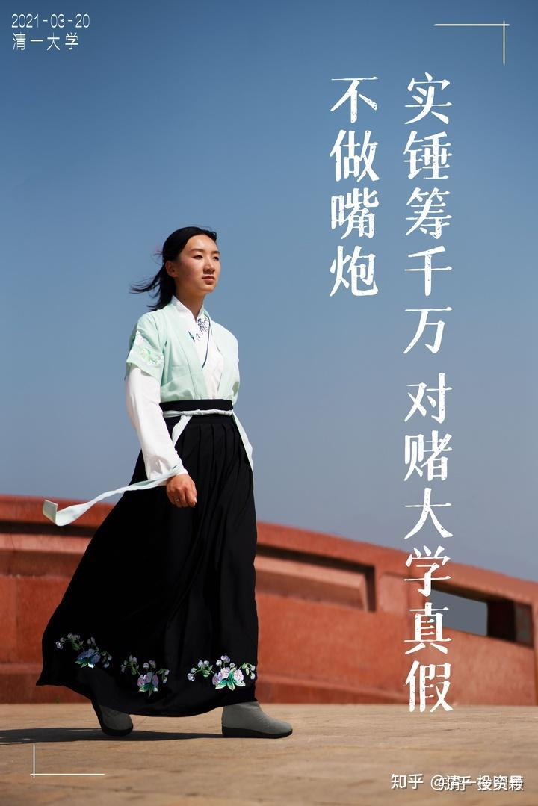

[原雪球专栏](https://zhuanlan.zhihu.com/p/566733044/edit)[129篇.两位20来岁的小女生：真筹到了一千万？](http://link.zhihu.com/?target=https%3A//xueqiu.com/9310099567/175227574)

[清一山长](http://link.zhihu.com/?target=https%3A//xueqiu.com/9310099567/column)2021年3月23日

两位刚满20的小女生，居然把自己的一年工作权卖了一千万？要与体制大学生对赌谁才是真大学？网页链接：[明仪：我用一千万元为我的教育信仰买单！](http://link.zhihu.com/?target=https%3A//www.bilibili.com/video/BV1ih411Q7D5)

核心要点是：她们真有一千万吗？是不是骗子？内部操作玩概念？两人的真实身价，真能卖到这个价钱？

真有这钱，您肯定值得一试。可以设法把这钱拿走。万一没这钱，别人只是吹牛，你相信了，就是傻了。

如果真有钱，你居然有钱不赚？数千万人找十个人出来都赢不了？可能吗？也是大傻子。名利双收机会就在眼前。参加比赛，就算是失败了，也是虽败犹荣。赢了，更是前途光明。您的身价，恐怕也一样要破千万了。

当然，如果这两女生，真能赚到这钱，也说明这个大学培养出来的人，真是不敢小看的。要打赢不容易。[大笑]

（2025年，此人变成了欺师灭祖的清黑）

两人年薪千万，说实话：谁都不信很正常。现在每年几乎上千万大学生毕业，优秀的人才也不少。谁能有这身价？华为开价200万元聘用天才博士，已经顶天了。

所以，不相信两位女生能拿千万是正常的，相信就有点不正常了。因为华为再大方，花钱也要讲回报的。他们花了200万一年，他要得到的东西，一定要超过200万。不然就亏了。别的企业，无法取得这个优势。华为作为头部企业，有条件创造出让人才发挥更大价值的优势，才能出大钱而不冤。

那么，花钱买着两个小女孩工作权的老板，真能用她们赚到一千万以上，这种事情才有可能是真的，否则，肯定是骗子！

我就来算账，看她们两人，一年能不能创造千万的价值？

首先，局外人不明白的就是：这两位虽然都是我的清一弟子，属于同一师门。但这俩师姐妹，互相却是“敌人”。两人虽然都是我的在职研究生，但分别服务于两家互相竞争很激烈的学堂：明颖是国际今日的主力战将，明仪是清一塾的核心教师。两人都是各自学校的主力教师，也是家长和学生们最喜欢的2.0优秀教师。她们两人，也是各自学校2.0年轻教师们学习和模仿的对象，相当于“2.0示范教师”。都是早期明德一班留下来的佼佼者。

这是她们的身份地位。她们的实际教学业绩怎样？做出了什么工作成绩没有？当然有的。带班四个月突破一门外语；带班四个月教学生突破12年数学；全班高分通过SAT数学考试；带班西语班，一年就从零起点，直接突破B2到C1、C2的战绩；英语班获得1480分的高分，就是她们带的学生成绩。两人的教学风格如何？

有无公开课示范？各位跟踪过**“[今日示范班·明师荟](http://link.zhihu.com/?target=https%3A//space.bilibili.com/487498588/channel/collectiondetail%3Fsid%3D55359)”**的人，应该见识过她们两人的讲课水平。别说985博士了，现在的大学教授，来带班的话，恐怕也不是她们俩的对手（知识、能力不谈，这里只谈教学能力）。

[网页链接](http://link.zhihu.com/?target=https%3A//www.bilibili.com/video/BV1LA411N7BD)：[【示范班第二学期 主题课】明颖老师《灰姑娘》表演解析#1 2021-03-13](http://link.zhihu.com/?target=https%3A//www.bilibili.com/video/BV1LA411N7BD)

这两位教师，都有能力让学生在正常的22岁大学毕业的时候，拥有相当于四个大学本科专业的学术能力。这种教师，值多少钱？

明白了这个道理，就明白她们的价值了。现在的中国市场上，英语培训，1000元一小时的机构，能培训出来上面的教学效果不？

国际学校一年20～30万的学费，能带出这种水平的学生吗？如果国际学校能教出这种学生，要能教出来，要值多少钱？

另外，很多圈内的家长都知道：想要把孩子送进今日学堂，比考体制名校都难。光有钱，是根本不够的。如果家长只需花钱就能够让孩子进入今日，得到这两位老师的带班机会，家长愿意出多少学费？开个五十万一年，会不会嫌多了？现在的中国家长，花千万拼学区房，香港人花上亿买学区房，只这点钱，真真不稀奇的。

如果您的孩子，有机会得到今日的头牌教师，出来主持教学，当您孩子的带班教师，您只要花钱就可以上学，不必考选了。不收你多的学费，收一个国际学校的中等价位：20万学费，多不多？如果她们带的这个班，收50个学生，总学费收入是多少？我相信您已经算出来的了：正好一千万！（**如果您认为她们不可能收到50个学生，还要跑来质疑我抬高自己弟子的身价。我们就不谈了，双方都没起码的信任基础，您就自己玩去。别在这里凑合了**。）

光这，用她们俩来招生，就已经值回本钱投入了。但各位应该知道，外围学堂都特别缺教师，都非常想要培训新教育的教师。这两位学生，都是跟随我学习很多年的弟子，如果能聘用到自己的学堂带一年班，顺便把其他教师的教学水平也带出来了，这不是赚大了吗？找我培训要花钱，把我的学生找去，不一样学本事吗？这笔师资培训费，值多少钱？

还有更多的好处：如果这两位教师，去任何一家学堂，这家学堂，立马会成为新教育家长们追捧的热门学堂，这种“广告效应”，会吸引多少家长追捧？需要花多少钱能买来？

所以，堂主们算算账，马上就拍出一千万来抢人了。这个不是假的。几家头部学堂的堂主，都私信找我，要求“照顾”——也就是说，拍出一千万元，还担心得不到。想找我私下沟通，说服俩孩子去他们的学堂，开的条件，除了钱以外，还有更优待的条件。还有企业老板，想要培训员工的总经理助理，也想找她们去，说比培训费交给一些职业机构更靠谱。

我说：她们还没输呢！输了才要“卖身”还债。现在连对手都还没有找到，你们就着急花钱，想花，恐怕都花不出去的。我想为两位女生托底，她们都不干，要自己筹钱来玩。有志气，我当然支持。

我上面说的，还是两位女生的正常价。有些不正常的价格，我都觉得太夸张了。有个老板，直接拍出1000万元来，说这两人，做什么都划算。其中他安排一个弟子去为企业赚钱。另外有一个重要任务，专门拿一个人来承担：就是来给他儿子做一年的家庭私人教师。我不禁咂舌——这老爸比我更牛。我都没想要把学堂最优秀的教师，用来做我女儿的私人教师。只是为她请了小伙伴一起学习。看来，我不够这老板豪气！[滴汗]

甚至有熟悉的老板，私信找我，表示愿意为她们两人开出来两千万的价格。说：一千万拿给她们俩去对赌。另外再给一千万，额外付她们两人一年的酬金。不让她们白干。这个——我觉得给太多了。拿两千万买一年，老板就真亏了。起码这一年，金钱上的账，我是算不过来了。用她们的老板，就只赚了名，和以后的发展基础。

说到这里，我相信大家已经明白了：两人把自己的工作权，卖了一千万一年，这不是假的，是真的！不是啥炒作，不是别人要“给我面子”。而是真实的市场行情。体制学校大学毕业，哪有这种人气、经历？基本上都是小白一个。这俩女生，都不是职场新人，而是老手了，所以，市场开出来的价格比华为博士都高，不稀奇。华为做了几年的优秀头部员工，我相信年收入千万也不奇怪的。所以，拿新人和老手比，是不太公平的。比起一些网红推手的身价，年收入，她们两人这身价，实在算不上什么。

但话说出来：21岁，两人就已经成了圈内的“名师”。这恐怕也是吃体制饭的人，万万想不到的吧？**她们的出彩，其实就是“跨界”的优势。**这两人，拿去混体制，恐怕也未必比一般人更好。更谈不上千万年薪了。一句话：赛道不同，不好比。新教育的优势，是体制难以想象的。这是一篇蓝海。供有心人翱翔天地之间。

**明颖（2025年，此人变成了欺师灭祖的清黑）**的视频与文章↓

B站视频：

[网页链接](http://link.zhihu.com/?target=https%3A//mp.weixin.qq.com/s/CcQVMZ8FXdgSYhBnUHNCBw)：**[不做嘴炮，实锤筹千万对赌大学真假](http://link.zhihu.com/?target=https%3A//www.bilibili.com/video/BV1554y187JB)**

微信公众号：

[网页链接](http://link.zhihu.com/?target=https%3A//mp.weixin.qq.com/s/CcQVMZ8FXdgSYhBnUHNCBw)：**[不做嘴炮，实锤筹千万对赌大学真假](http://link.zhihu.com/?target=https%3A//mp.weixin.qq.com/s/CcQVMZ8FXdgSYhBnUHNCBw)**

[网页链接](http://link.zhihu.com/?target=https%3A//mp.weixin.qq.com/s/qSJoTZXxcB5_gfJiMX3OMg)：**[千万大奖 教育擂台赛 比赛项目和内容细节介绍](http://link.zhihu.com/?target=https%3A//mp.weixin.qq.com/s/qSJoTZXxcB5_gfJiMX3OMg)**

知乎个人文章：

[网页链接](https://zhuanlan.zhihu.com/p/358474498)：**[不做嘴炮，实锤筹千万对赌大学真假](https://zhuanlan.zhihu.com/p/358474498)**

**明仪**的视频与文章↓

B站视频：

[网页链接](http://link.zhihu.com/?target=https%3A//www.bilibili.com/video/BV1ih411Q7D5)：[明仪：我用一千万元，为我的教育信仰买单！](http://link.zhihu.com/?target=https%3A//www.bilibili.com/video/BV1ih411Q7D5)

微信公众号：

[网页链接](http://link.zhihu.com/?target=https%3A//mp.weixin.qq.com/s/XKr9JZbGiXdAD_ksw1SNog)：[我用一千万元，为我的教育信仰买单！](http://link.zhihu.com/?target=https%3A//mp.weixin.qq.com/s/XKr9JZbGiXdAD_ksw1SNog)

知乎个人文章：

[网页链接](https://zhuanlan.zhihu.com/p/359080322)：[我用一千万元，为我的教育信仰买单！](https://zhuanlan.zhihu.com/p/359080322)

知乎个人视频：

[网页链接](https://www.zhihu.com/zvideo/1357451639767547904)：[明仪：我用一千万元，为我的教育信仰买单！](https://www.zhihu.com/zvideo/1357451639767547904)

（以下内容为编者收录）

**评论回复：**

**国学中医黎天焕回复清一山长：**

山长，我认为这一“仗”没有那么容易打起来：第一，输不起心理，某些高级教育人物是不敢出头接招的，他们的心理是羸了还好讲，输了就没办法混了；第二，一盘散沙，如果官方没接盘，民间的就更不会接，单独接盘是不可能的，联合起来就更加是散沙。

跑出来黑一下的能力是很厉害的，真要上台，他们很清楚自己的斤两。看看播求来中国这么多年，基本上都是打那些包装过的。

**清一山长2021-03-24 14:07回复国学中医黎天焕：**

您说对了：应该打不起来！我知道这是最可能的结果。虽然是最令人失望的结果。

您说的情况，叫做生态系统问题：我们要求的这种物种（跨学科人才），虽然看起来并不稀奇。但如果生态系统不对，就怎么都长不出来这种人的。几千万人都选不出一队人的。一两个超怪的人，有可能。

香蕉树稀奇吗？泰国到处都是。但您在中国的北方能发现吗？我相信绝无可能（除非专门的试验机构特种温室里面的样品）。**我们没必要找遍中国整个北方的每一寸土地，才能总结说：中国北方没有一颗香蕉树。**

中国教育系统，是一片贫瘠的土壤，生态环境太差，不太可能长出如此多彩的花朵。就像西藏高原长不出一颗小树来一样。

7年前的大学生辩论赛，我为啥在弟子们还没出山，一仗未打，我就判断中国大学生们必败？因为我知道中国大学的辩论模式，就是耍嘴皮子的游戏，有口无心。全国大学都这样玩，都玩虚的，不来实在的。都只秀个人技术，没有团队配合。我们只要不耍嘴皮子，我们玩真功夫，真研究，我们玩团队配合，协同作战，他们就绝对会输掉的。这个，真没啥技术难度，只要用心就可以了。问题是：大学生知道“心”在何处吗？

当然，如果当年真给1000万元的奖金，我相信大学生们绝对能够拿走的。其实，给一百万，他们就能拿走了，可以完败今日。因为，看在一百万的面子上，大学生们就会自动自发地组织起来，与今日真正的对战，我们就会输掉了。也就是说：中国的大学实力是有的，但需要更强烈的刺激才会去“用心”。否则都是混混日子的。

现在这个比赛，虽然比辩论赛难多了。但中国大学依然是可以赢的，因为真不难。只要用心还是可以赢的，我说过：准备两三年，就可以赢过我们的学生了。

但难点在于：大学生倒是很想要奖金，但实力不足。虽然可以培训出实力来（我们挑战的内容都没啥技术含量，比武也不是要你拿世界冠军），但没有人来组织和系统地培训对战。他需要一个系统来做这件事情。

而中国的“系统”是很昂贵的，运作起来特别的不容易，他不可能自动产生这种结果。最糟糕的是：这个系统，要用来克服的，并不是我们，而是他们自己。除非有大领导拍板，消除这些牵制，否则他们自己就把自己打垮了。

如果一些有能力的人，能够调用得到资源的人，用他们的系统资源来专门地做这件事情，就会成功了。拿到一千万又嫌太少了。他们想要十个亿，因为他们的胃口太大了。

当然，没人会拿十个亿给他们的。这笔钱，可以办十个清一大学了。

所以，这个答案，对于体制来说，是无解的。虽然他们大幅调整了系统，但真这样做了，中国教育就开始改变了。中国很可能成为世界创新教育的领导阵营。

我们如果对海外的国家，海外的大学，我们开出同样的这个条件来比赛，我们会输掉的。因为，海外的教育系统，有足够的“生态系统”，可以生产出特别门类的学生，要找出10个人来拿一千万是很容易的。他们可以很低成本地运作起来，学生们会自动自发地组织起来，利用社交账户，发布组队消息，符合要求的人会自动报名，他们会弄成一个必赢的“特战队”，就像寻宝小组一样，大约需要用半年时间来做准备，最终就击败我们了。不是我们差了，而是对方的“题库”太大，优秀者很多，其实我们的真实能力，是无法对抗全国的精英的。

中国的大学生，根本就不会做这种事情。少数能做这种事情的人，也得不到别人的配合，无法协同一致，沟通成本就太高。所以，要找到一两个人来挑战，肯定是有的。但要找5个十个来比赛，几乎没可能。他们先就输给自己了。

简单地说：我们在大陆做这种比赛，相当于我们用火枪，对方用大刀。你就算有一个亿的军队，跟我们一百多个人的团队来作战，也不是我们的对手。来多少死多少。

但在西方，相当于我们用先进的冲锋枪，对手只是落后的火枪而已。但架不住他们人太多，各种手段都用上，跟他们去作战的话，最终一定是我们输掉。

因为，机枪也好，火枪也好，都是一个档次的战争。只是程度不一样。

枪对大刀的作战，是没有可比性的。完胜。

中华真武功，对西方格斗，是不会差距太远的。双方的技术差距，没有想象的这么大。谁没练好，谁就输了。

但如果可以用一把小刀来对付武功高手。只要有初级的武功水平，不是菜鸟，就足以击败世界冠军。

这就是我的最终答案！我根本不相信中国大学能培养出啥真正的对手出来。只抱有万一的希望，也许——某地会冒出一批会做事的大学生？这几乎是奇迹了。

我很希望我是错的。但看样子，我真没错！[捂脸]

**刘秋苑回复嘟嘟瞎：**

首先你得自己想想自己有没有本事来参与PK？

**清一山长2021-03-24 10:08回复刘秋苑：**

想鄙视我们，最好的方法，就是来拿走这笔钱。再留下一句话：你们清一大学太嫩了！好好学习，继续努力，再过一百年，再来挑战我们体制大学吧！

只会说疯话、怪话，是自己鄙视了自己。自己知道不行，却不甘心承认，于是——种种怪语。

不是网络上有句话吗？小众说，我就是喜欢你看不惯我，又拿我没办法的样子[大笑]。

**ellhll李华丽回复清一山长：**

山长您好。澳洲这边发了擂台赛的信息之后，有些人质疑：

1.设擂台的1000万哪来的？学校出，还是家长出？

2.为了钱比赛还是为了吸引眼球而比赛，有这个钱为什么不去做公益？

3.如果自己真的认为自己的大学那么好，就自己好好学习好了，也不用出来争辩什么，冷暖自知，掌握知识是为了更好的工作生活，不需要和其他人比较。一个内心充盈的人应该不会在乎外界对他的评价。

山长这篇雪球专栏很清楚地回复了第一个质疑。

1.两人开班，一年带50个学生，每个收费20万，有1000万。

2.两人去新教育学堂培训师资，多家学堂堂主争着支付1000万。

3.两人去企业培训员工，企业老板出资1000万聘请。

4.两人一个帮赚钱，一个做儿子的私教，企业家出资1000万争着要。

所以，这1000万是设擂台的学生自己赚的，不是学校，也不是家长出的。

质疑1和2，我的回答是：

设擂台不是为了擂主自己，也不是为了擂主的学校，而是希望通过这个比赛，让我们的社会反思：我们的教育是否走在对的路上，我们的教育是否有需要改革的地方。教育直接关系到目前2.3亿学生的未来，影响所有有孩子的家庭，教育输出的人才直接决定国家未来的国力。这样的教育擂台赛，如果真能促成教育更新换代的改革，其功德不是捐款1000万给慈善机构可以比拟的，甚至可以说它的影响是1000万的n次方。

不知道我这样理解的方向是否对，请山长解惑质疑1和2。感谢您。

**清一山长2021-03-24 10:01 回复ellhll李华丽：**

回答：“有这个钱（1000万）为什么不去做公益？”什么是公益？

首先，**好教育就是最大的公益；坏教育就是对公民最大的损害。**

其次，**把钱公开地拿来为公众服务，提供给不认识的人，甚至提供给反对自己的人，这就是公，就是无私。目标是为了提升公众的生存品质，这就是公益。**

这件事情，本身就是拿钱来做的公益事业。不是为了某人、某小集团自己的私利，而是为了让国人能够看到教育的本质，给出来的参与奖金。这不是公益是啥？

这件事情，同时也是教育事业，**我们让国人知道有另外一种活法，可以选择另外一种人生——更有价值的人生**。两个小女生，明明有赚大钱的机会，自己也不去外面赚钱。而是安安静静地拿一份小钱教书育人。明仪更是要求去武道馆练武，去准备百人组手战，去进行自我提升。连每月两万的带班工资都不去拿。她们这一次，却愿意为了捍卫自己母校的荣誉来“卖”了自己，为别人的愿望而牺牲自己的愿望，去为别人工作服务一年，不为自己得到金钱，而是为了给反对者发大奖，因为知道国人是“无利不起早”的。现在世界上，还有几个这样淡泊名利的人？有几个人能做到“见钱眼不开”？这个动作，已经说明**我们培养出来的人不一样，能力超常，心态超好，欲望超低。**

以为做公益，就是**拿钱出来“救济穷人”**，这难道不能说：**只是为了秀自己的优越感**？**物质上的存在感**吗？**用给钱比自己差的人，来证明自己很了不起**了——而付出自己的时间，牺牲自己的利益，拿出自己的名誉来垫底，来做公益事业，却要被嘲笑“居心不良”？这是啥逻辑呢？

第二：1000万代表什么？如果一些考上清北的优秀学生，会为了每年十万的奖金，重新复读，再复读。给一些中学争面子，争名额。每年高考状元们，都能得到当地政府部门、中学的奖金，因为他们努力为当地政府争光了。那么，这种背景下，有1000万可赚，为啥体制不一百倍的努力来挣这笔大钱呢？恐怕不是不愿，只是不能吧？

第三：我会拿出十种方法，让体制大学的学生能够赢下清一大学。因为我相信中国大把的“千里马”，中国的大学生很多是很优秀的。但我反感的是：中国的这些优秀学生，却被这些“园丁”们拿来拉车。这是对中国人才的滥用，对天才的误用。这才是最对不起学生的事情。

体制大学不是“赢不了清一大学”，而是他们就不愿意去好好珍惜人才，使用人才。更不愿意去发挥人才的最大价值。甚至抱残守缺，明明有机会也不去争取。这就是体制最大的问题。

明仪、明颖真的真稀奇吗？现在看，当然稀奇，全国也没几个是她们的对手。

你现在去跟两女生全面PK，我认为你也没有赢的希望。但是，如果你十来岁，就来今日学堂接受教育，你绝对不会比她们差的。甚至可能会更好。因为我看你学习的态度很好，领悟力也不错。而你这样的学生，中国每年都会有上百万。谁说体制没人才？

如果让我从体制每年的数千万学生中，选出上百万有潜力的优秀学生，再从中选出几十个人，来专门培养跨学科人才。这些人，将来取得的成就，将远远超过现在的清一大学的学生。要击败清一大学学生很容易。因为我们可选范围太小了。**我们只能得到相对平庸的“材料”，但我们做出了最优秀的“产品”。如果给我们最顶尖的材料，我们能创造更大的奇迹。**

但是，没人来做这种事情，也没有人能让我来做这种事情。宁肯让学生们低效、无效地学习，浪费天赋，也不让他们来发挥自己的天性，这就是落后的教育系统最可恶的地方。

我们发出这个挑战，目标也很简单：**清一大学真要创世界名校，就必须吸引素质顶尖的精英学生，不愿意浪费自己生命，愿意努力又有悟性的学生前来上学**，**就必须让清一大学的优胜之处让更多人知道。**如果我们用目前这么小的样本，就做出了体制海洋般的资源都做不到的成绩；如果我们把平庸之人，都能变成天才。那么，真给了我们天才学生，我们会拿出什么样的结果来呢？这就是这个挑战的思考和必然的设想。最终，就是世界最顶尖的名校必然在中国产生。

**我们必须不断地提升我们初级生源的素质，而不是人数**。**将来有一天，我才有机会说：中国最优秀的学生，都已经来清一大学了。**即使让我去外面找学生来对战，我找不到战胜清一大学的可能性。这才是我想要的目标。

现在，只要给我机会选人，不用全国选秀，只要去一个名牌大学，甚至名牌中学范围内选人，来对战现在的清一大学，两年后，清一大学就会被击败。您认为我会满意清一大学的这个结果吗？我们超越体制，其实只是超越了两年而已？

现在的笑话就是：体制大学，明明有机会击败清一大学，却没人敢来，只会说怪话。说明体制真的没人——不是没有学生，是没有人知道如何指导学生，才能击败清一大学。不是体制大学生清高，不想要钱，是真的不知道如何才能拿到钱。没有脑子来拿钱罢了。

这是中国大学的悲哀——集体无能症！[捂脸]

**ellhll李华丽2021-03-24 11:16回复清一山长：**

感谢山长这么详细的解答。看到最后让人捶胸顿足！

清一大学只有100来人资质普通的学生，体制学校有海量的资源和“千里马”，出来的结果却完全逆转——震撼；

山长想为国家和民族，让优秀的学生物尽其才，齐心为中国创建世界顶尖的学校。结果却是“没人来做这种事情，也没有人能让我来做这种事情。宁肯让学生们低效、无效的学习，浪费天赋，也不让他们来发挥自己的天性”——悲凉；

山长一直在为教育开创新局面、创造新纪录，对这样一个“全国3700万人无人能应战的局面”，却说“您认为我会满意清一大学的这个结果吗？”。永远在超越自己，这就是给顶级精英最好的精神示范——赞叹；

**好教育就是最大的公益。**明颖、明仪不要千万金，付出时间，垫上名誉，为真教育代言。她们淡泊名利、大公无私的行为示范就是最好的教育——赞扬；

我这样已过青春的人，看到清一新教育的光芒，虽不可能回炉重造、像10来岁的孩子般学习，但是，求学永远不迟，我不会气馁不会停步。以前看过侯老师分享她跟在山长身边学习了16年，我当时就想：我跟随山长学习，先以超过16年为目标。就像山长讲的，体制学校的学生和清一大学的学生相比，相差的只是2年的时间，只要有明师指导，超越就有可能。即使16年后我仍不能追上老师们，我的孩子也有追上的可能——不轻易言败。

3700万大学生，2.3亿的学生，4.6亿的父母，难道真的没有人看到新教育，没有人敢于、能于试一试吗？

**般若蜜回复清一山长：**

哎，不知能否找到有如此胸怀格局的大学生，愿意为全国大学生荣誉而战。大部分人反应是荣誉真的和自己没啥关系，不要为别人做广告了。[滴汗]

**清一山长2021-03-23 22:22回复般若蜜：**

大家跟钱没仇吧？有钱不赚是傻瓜。国人为了钱，啥“好事”都干得出来的。我才不相信大学生们就只喜欢去送外卖，不喜欢来拿一千万的？有点不符合常识。也许，真是没人了！泱泱大国[大笑]。

**优质eva回复清一山长：**

清一山长，您好！我是通过U兄的文章关注到您的。我目前在广州，在2020年的8月份，我们夫妻2人接触到了价值投资，目前也正在学习价值投资的路上。U兄说“教育才是一个家族最核心的竞争力，最大的精神财富，比金钱重要多了”。我们也非常认同这一说法。我们的儿子7岁，正在读体制学校一年级。我现在想向您了解一下新教育。

**清一山长2021-03-24 22:10回复优质eva：**

了解新教育，你看B站的示范班就行了，找我干嘛？[滴汗]

**刘先生lgm回复清一山长：**

不是没人应战，是新教育的知名度太低了，很少有人知道这个事情，如果能上热搜，央视报道了，肯定有很多人来应战的。

**清一山长2021-03-24** **18:21回复刘先生lgm:**

您的意思，就是长春没找到香蕉园。但如果在CCTV的电视台发布消息，让全体东三省的人都知道：有人在找香蕉树，还给1000万元，就可以找到了。是吗？

想找香蕉树，不如去海南找吧？[大笑]

雪球上我的粉丝并不多，但也有六七万人了。我相信地理上，已经覆盖全国的范围，加上他们的亲朋好友们，绝对覆盖了全国的大学校友。给了一千万，真有其人，就会来拿的。抢都要抢的。没见到雪球上，发个几元的红包，都有一批的人到处抢呢？更别说一千万了。没人吭气，自然是没人有这实力来拿奖。别找啥面子、场面话，怪我们没上热搜。只能说：中国“格式化”真的太严重了，的确无人拿得出来！

**-lily-:回复清一山长：**

感触很深。我是一名体制生，比明颖明仪大几岁，但能力素质都差很多。初高中时通过网络接触到今日学堂，不过没有条件上。本科也是武大（现本科已毕业，不过已入科研的坑[滴汗]）。很佩服山长，也很喜欢山长的弟子。我了解新教育后，就没有让后代去体制的想法。不过之前总觉得新教育是富人玩的游戏。现在觉得自己或许也能做一点事。好好努力，前面有一大批人带队呢[大笑]。

**清一山长2021-03-24 18:07回复-lily-：**

原来是“武大”郎[笑]。欢迎武大有人来组队来，击败两位小女生，拿走这一千万。赢了就拿走全部奖金，都给队员。输了我来垫背。没啥企图：只是捍卫母校荣誉而已。老武大人的一份情怀。只是怕现在的年轻人不行了，扶不起来。

**嘟嘟瞎回复李士建：**

不合常理的事情必然有其不可告人的目的，这么简单的道理你们也不知道吗？

**清一山长2021-03-24 22:14回复嘟嘟瞎：**

我刚打赏了这条评论¥1.00，也推荐给你。您这么聪明，怎么能不给打赏呢？虽然您的名字的确跟您的眼睛一样瞎！走吧您！

**武洛奇回复清一山长：**

感恩山长的示范，每天都会来雪球逛一逛，看完之后每次都有些新的思考。这个回复特别有意思，让我想到了前一段时间阅读的过程中看到的一段话。

大概意思是：有人说新教育是富人才学的，因为新教育的学费真的不是普通家庭能够承受的。

对于大多数人来说，走新教育似乎并不是最好的选择，毕竟从时间精力收费等来看，都比体制要花费更多的个人精力，时间才有可能看到自己想要的结果。并且新教育没有“保障”，只是说这是一种新的教育理念。这也是很多人反对的理由之一。

不过我并不认同这个观点。甚至说强烈反对！

我认为富人的确要学新教育，毕竟你的亿万资产如果想要传承，想要家族传承必须了解人性，子女教育也要从小做起，搞不好很可能变成他人生的灾祸根源。但如果你现在还是个中下层，那你更需要去学新教育了，因为这是你未来提升自己家族竞争力，甚至是超越别人的法宝。结合自己的经历来看，学历真的是不重要，如果我们没有学会独立思考，为自己负责，哪怕就是学到了博士也只是个无脑跟随的棋子，被别人，被社会无形中操控的木偶人。

我也不是从小学习新教育，第一次知道新教育也是4年前了，四年过去了，又是一个大学的时光，但我和四年前已经完全不一样了。回头看看自己曾经走过的路，真的觉得挺有意思。很多比我更早接触新教育的人，慢慢的也退出了这圈子，过上了自己想要的“幸福生活”。

对于这一次比赛丝毫不感兴趣，我认为这并不是装的，我也将这些相关的内容转发给了一些看起来很厉害的朋友，但基本上没什么音讯，竹篮打水一场空。

我历来听不惯别人背后嘀嘀咕咕说母校的“坏话”，也不觉得自己的母校有多差。但对于这件事我只能“直接认怂”。因为，根据我的认知这件事绝无胜出的可能。[哭泣][哭泣]

虽然您也在雪球，群里发言说，如果给你一些机会，你可以带外面的学生轻松打外清一大学的学生。您有自己的方案，我相信这是真的。因为您从来不吹牛[大笑][大笑]一路走来，反对您的人似乎都没有得到什么好处，尽管我不是所谓的骨灰级粉丝，但我也知道，如果仅仅是为了反对而反对，那和存货没有什么区别。

再说方案，从看到信息第一天我就将自己带入角色，一直在思考:

如果我现在还是大学生，我是否有勇气来应战？

如果我想迎战，我需要具备哪些能力才有可能博得一局胜利？（因为我觉得全面胜利几乎没有可能，至少在我目前的认知里面是这样的）

如果我是高校的负责人，我有哪些资源可以调动？如何才能够激发我的学生来应对？等等……很遗憾，想了几天，我想破脑袋也想不出来个一二三。[吐血][吐血]感觉比江湖课的策论还难。

**清一山长2021-03-25** **10:53回复武洛奇：**

说得对！**富人肯定要学新教育。穷人，就更要学新教育。否则无法改变命运。学了，就可以与富人站在一起了。**比如明颖、明仪的家庭，不是富裕人家，都是工薪阶层。但现在，亿万富翁的孩子，能追上她们就算家族有光，她们已经改变了家族的地位。如果她们是去读的体制大学，现在正忙着到处找工作吧？富贵人家，谁会把她们当回事呢？

**聪明人和笨人，也都要学新教育。聪明人学了更聪明。而笨人学新教育，学不会也没太大关系，总有人学不会的。但起码能落个好身体、好心态。做个好员工没问题。**

**只有一种人,才不需要学新教育——蠢人！找抽的人!**[大笑]

​参考链接：

[46篇.新教育送给中国人的礼物——中国公主](https://zhuanlan.zhihu.com/p/553173076)

[56篇.创造历史的清一大学：首届学生集体合影](https://zhuanlan.zhihu.com/p/551968023)

[58篇.明天,清一大学将演出莎士比亚戏剧,迎接新年！](https://zhuanlan.zhihu.com/p/551974574)

[64篇.世界的新未来大学，是怎样的存在？](https://zhuanlan.zhihu.com/p/559554811)

[【清一大学少年班】走进我们的日常生活](http://link.zhihu.com/?target=https%3A//www.bilibili.com/video/BV1Fi4y1F7uK/)

[敬请查阅：比欧三语首届毕业生成绩单](http://link.zhihu.com/?target=https%3A//mp.weixin.qq.com/s/RoyjFZVfB4ybK6NL2-PYjQ)

[这就是今日学堂](http://link.zhihu.com/?target=https%3A//space.bilibili.com/487498588/channel/series)

[2012年今日学堂](http://link.zhihu.com/?target=https%3A//www.bilibili.com/video/BV193411178W)
