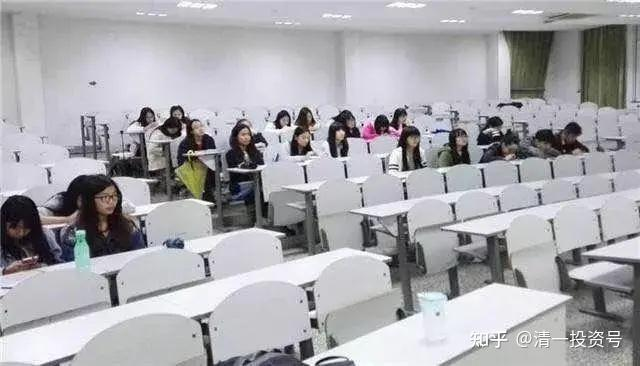

原雪球专栏131篇.长江学者眼中的中国大学生

清一山长2021年3月25日

两个女生发出的千万大奖的教育擂台赛，居然没有人敢站出来接招。有人纳闷：中国大学数千万人，干啥去了？

[明仪：我用一千万元为我的教育信仰买单！](http://link.zhihu.com/?target=https%3A//www.bilibili.com/video/BV1ih411Q7D5)

[https://www.bilibili.com/video/BV1ih411Q7D5](http://link.zhihu.com/?target=https%3A//www.bilibili.com/video/BV1ih411Q7D5)

其实，答案一点都不神秘：中国的大学，真没这号人存在。别说跨专业的综合比赛了，单项比赛，都没有多少人有信心过的。因为，**中国的大学生，基本上只会考试。除了考试以外的正经东西，几乎都不会。**而擂台赛，除了SAT和DELE证书外，其他都不是考试内容。所以——大学生们自然无法应对。两项考试证书的要求，体制内大学的通过率就已经很少了。大多数人，其实根本就够不上基本的入选资格。

我这样说，可能不客观。毕竟我只在武汉大学当过教师。下面是中国大学的长江学者，资深专业教育专家，对大学生们现状的评价：你看现在还有啥大学精神？博大精深的大学，博学多识的大学，现在根本就没有影子了。只有历史回忆了。

（[https://zhuanlan.zhihu.com/p/115412799](https://zhuanlan.zhihu.com/p/115412799)

[中国大学的现实是：大学层次越低，上课越多，学生读书越少](https://zhuanlan.zhihu.com/p/115412799)）

**转发：**中国大学的现实是，上课和大学的层次地位是相反的。**大学层次越低，上课越多；大学层次越低，学生读书越少。**事实上，在中国，“研究型大学”基本上是一流大学，而“教学型大学”基本上是三流大学。“研究型大学”最重要的特征就是强调学生自己读书思考，“教学型大学”最重要的特征就是上课。

大学的优势在于，它不仅让人学习知识，更重要的是学习如何学习知识，大学所学习到的知识可能会过时无用，但大学所学习到的如何学习知识却是终身有用的。

【研究生面试，问的问题就是读了什么书，然后围绕所读的书问下去，直到学生答不出来为止，这几乎是公开的秘密。最初我们还担心学生读的书我们没读过，甚至没听说过，或者学生谈的问题太深刻把老师难住了，但这么多年下来，从来没有发生过这种情况，往往是几个回合学生就败下阵来。学生的很多知识都是从课堂上来的，或者是从教材上来的，还有是从网上来的，或者是从微信上来的。**现在的大学生根本就没有时间坐下来静心地读书，根本就没有时间安静地思考问题，他们还是沿袭中学甚至小学的学习模式，课堂教什么就学什么，完成老师布置的作业就算完成了学习任务。**

大学生不读书，这是当今中国大学最糟糕的情况。如何让大学生在大学里真正读大学而不是读中学甚至小学，这才是当代中国大学教育最迫切需要解决的问题。

——高玉（浙江师范大学教授，教育部长江学者特聘教授）】

当年，我上大学的时候，常常逃课。每天最喜欢泡在图书馆里看书，最多一天学习13～15个小时。周日无休。看了很多各种各样的书。作为理工科大学生，我看了最多的人文学科的各种书籍。后来考哲学专业研究生，半年时间就通过了全部的专业课程。

如果我去高玉教授面试，我敢肯定：我会说出她没读过的书。当年研究生毕业，我的毕业答辩的教授就说：他根本就看不懂我的论文。我写的论文是初民思维研究，采用了很多文化人类学家的原始资料。这些书，很多教授都没读过。我的毕业论文以全优资格通过。

现在的研究生，如果就是高教授所说的：就是研究微信和短信息，读教材的研究生。怎么和我们这一代比？怎么出来和我的学生比？

我的学生，大量时间是用来自己读书的。各种各样的书。哪里是读教材，考教材的人。

现在大学用读微信，短消息得到学生来和我的学生拼，哪有机会赢！

我当年上大学，前排位置都要抢的。现在是图中的样子[哭泣]。时代真的在进步吗？

参考链接：

[46篇.新教育送给中国人的礼物——中国公主](https://zhuanlan.zhihu.com/p/553173076)

[56篇.创造历史的清一大学：首届学生集体合影](https://zhuanlan.zhihu.com/p/551968023)

[58篇.明天,清一大学将演出莎士比亚戏剧,迎接新年！](https://zhuanlan.zhihu.com/p/551974574)

[64篇.世界的新未来大学，是怎样的存在？](https://zhuanlan.zhihu.com/p/559554811)

[【清一大学少年班】走进我们的日常生活](http://link.zhihu.com/?target=https%3A//www.bilibili.com/video/BV1Fi4y1F7uK/)

[敬请查阅：比欧三语首届毕业生成绩单](http://link.zhihu.com/?target=https%3A//mp.weixin.qq.com/s/RoyjFZVfB4ybK6NL2-PYjQ)

[这就是今日学堂](http://link.zhihu.com/?target=https%3A//space.bilibili.com/487498588/channel/series)

[2012年今日学堂](http://link.zhihu.com/?target=https%3A//www.bilibili.com/video/BV193411178W)
