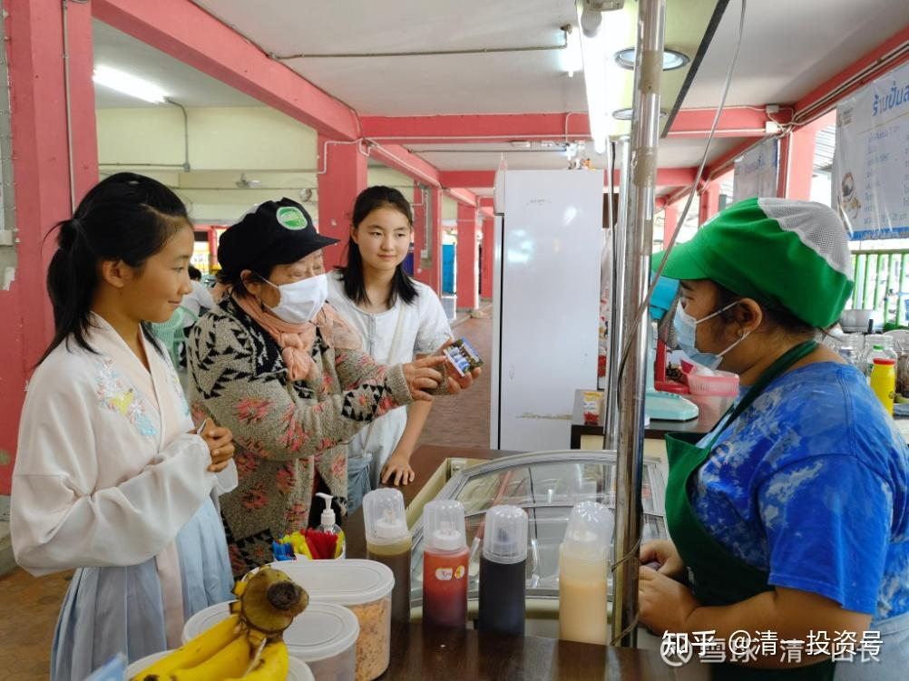
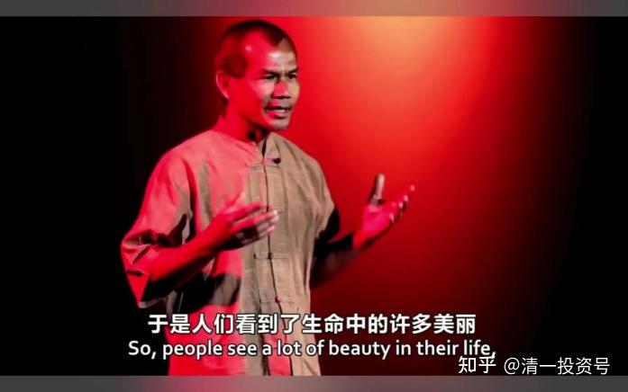
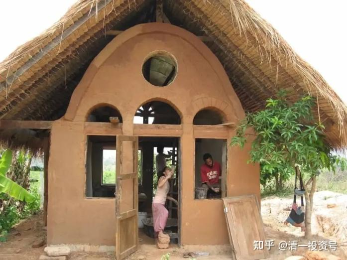
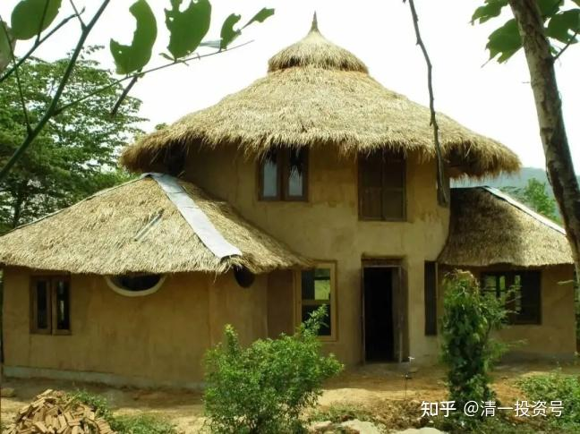

[原雪球专栏](https://zhuanlan.zhihu.com/p/565458966/edit)[135篇.读过书，跟受过教育有啥不同？](http://link.zhihu.com/?target=https%3A//xueqiu.com/9310099567/176159103)

清一山长2021年4月2日

**读过书，跟受过教育不是一回事。虽然很多人都假装“受过教育”，甚至“受过高等教育，上过名校”。其实，这些人，都只是读过书而已，谈不上“受过教育”，更没有啥“高等教育”。**

读过书，就是会认字，懂一些支离破碎的知识。甚至这些知识还是找抽的，自我折磨的知识，是伪知识！

有些人，已经发现现在的学校，并没有做教育。比如这位演讲者。

[优酷网页链接](http://link.zhihu.com/?target=https%3A//v.youku.com/v_show/id_XMTUyODc5Njg1Mg%3D%3D.html)：[TED演讲：Life is easy，Why do we make it so hard？](http://link.zhihu.com/?target=https%3A//v.youku.com/v_show/id_XMTUyODc5Njg1Mg%3D%3D.html)

[https://v.youku.com/v_show/id_XMTUyODc5Njg1Mg==.html](http://link.zhihu.com/?target=https%3A//v.youku.com/v_show/id_XMTUyODc5Njg1Mg%3D%3D.html)

他发现，去上学，去学专业，做专业人员，纯粹就是找抽！是严重降低生活质量的表现。

他明白一件很简单的事情**：牺牲自己最需要的，最宝贵的东西，去换取自己不需要的，可有可无的东西，是一件愚蠢的事情。**而学校居然教人做愚蠢的事情，**越专业的人，做的事情越愚蠢。自己越努力，就离真正的生活越远，越找抽**。所以，他认为这些学校里面，都没有真正的教育，所以他就退学回家了。他想过一种正常的生活，不过疯子的生活了，更不想在曼谷这样的疯狂城市当一个被愚弄的打工仔。

小女也有一样的思考，她懂得什么才是教育，什么不是教育。我原来支付了一个学期的学费，让她去泰国的国际学校上学。可她去了不到一周，就死活不去了。因为她敏感地知道：**去这种学校上学，就是找抽的，有知识没文化**。她宁肯在家里自学都行。我对她的最大威胁，就是**“在家不好好学习，就要被我赶到学校去”**。去国际学校上学，对她来说，是一种折磨（可很多中国家长，要花大钱送孩子去学校被折磨[捂脸]）。

现在她也在通过网络学习今日学堂的示范班公开课程。但学习的要求不一样，对她的要求是：她必须在半年后，能够像老师一样，讲一节示范课出来，还要跟对手PK水平。这可够她忙坏了。她不得不去观摩老师们是如何讲课的？去研究思考每一句话背后的意思。我呢，教她也很轻松。给她一台电脑去看，在她不懂，找我提问的时候，回答她问题就够了。一起学习的小伙伴也会互相帮忙。所以，她需要找我的时候并不多。

没错，所谓**教育，就是教会人们学会思考，如何才是对自己更好**。**真正的教育，就是进来之后的你，比进来之前的你更聪明，更有能力去应对生活中的一切。如果没有做到，你就只是读了书，没有受过教育！**

想检验一下吗？我们来试试看，您是否能回答以下的问题！

您为什么要上学？这肯定是一个非常重要的问题。小女也常常要换着方式去问，要不断自己回答的问题。小女正是会问这个问题，才坚决不去泰国学校上学的（其实我送她去上学的目标，是明知学校不可能学到什么知识的，我只是让她去交泰国朋友的。但她跟我解释了：这种学校，不但学不到东西，一节英语课，只教两个英语单词。所有课程都在混日子。而交朋友更没可能。因为除了上课，还是上课。学校基本上没给多少自由活动的时间。老师很负责地让学生处于严格的管理中。所有学生都只能被迫装乖，所以她不去上学了）。

我猜，你们很多人，应该根本就没有想过这个问题。你只是反问：“怎么能不上学”？

这个答案是没有固定的标准答案。如果您的回答是：

“我想通过上学，去过上更好的生活。”

我就要问你：您认为什么才是更好的生活？也许，您又没有想过这个问题了。你以为：像别人就是更好的生活。

如果您对生活的定义不同，你得到的答案就不同。

上面的演讲者，与他的大学同学对此行为的不同选择，就是他们对好生活的定义不一样不相同。他认为：三个月就可以建成一栋房子，他就没必要用30年的生命去换取它！他要用剩余的时间来好好生活。

而他的同学认为：拥有曼谷的房子，就是更好的生活。其他地方的房子都不叫房子。所以，他愿意用30年的工资、生命，去换一栋曼谷的小房子。我看到泰国的房产网上，曼谷一套49平方的小公寓，价格是12700000泰铢，相当于人民币267万元。清迈的一个对外国人销售的楼盘（因为用的英文，被我看懂了），每平方是7万泰铢。比曼谷“便宜”多了。但泰国大学毕业后的正常工资，一般是一万多泰铢一个月，你就需要用一千多个月的生命去换这所小房子。名牌大学毕业，可能工资会高一点？拿到3～5万，是泰国很不错的高工资了（其实泰国很多人，大学毕业后找个工作都很困难）。你也需要30年才能得到一小间49平方的房子。这就是很多人，包括中国人都在做的这事情。每个人都认为这很正常，北京甚至有人用800多万元去买一小间50平方的“学区房”！更是贵得离谱。

您自己，对“什么才是更好的生活”的回答是什么呢？我就不帮你回答了。

您认为什么才是真正的教育？**真正的教育，就是能够帮助你更好地生活的教育。**

**真正的教育，就是让你能够回答以下这些问题：**

**1：你是谁？**

**2：你知道什么？不知道什么？**

**3：你能做什么？不能做什么？**

**4：怎样才是对自己好？怎样才能对别人好？**

**5：什么是我真正需要的？什么是我并不需要的？**

**6：别人会如何愚弄我？我能否看破身边的各种陷阱？**

**7：这个社会是如何运作的？我怎样才能适应它？**

**8：我怎样才能用最少的资源和付出？来获得我想要的更好的生活？**

**9：我怎样才能与我自己和谐相处？我怎样才能与身边的人和谐相处？我们怎样才能跟周围的社会环境和谐相处？我们怎样跟自然环境和谐相处？**

您能回答这些问题吗？如果不能，如果您的学校没有教你这些东西，没有去解决这些问题，您就没有受过真正的教育。

您只是读了书而已。而读书，并不能提高你的生活品质。只有教你去思考以上问题的教育，才能让你的生活品质提高！

可惜，我发现**我们的国人，对不重要的知识和信息很关心，但对非常重要的知识和信息却很不关心。**

我发表一个对股票走势的分析帖子，阅读的人，基本两天就达到20万以上。我发表了[泰国450泰铢一晚的度假村](http://link.zhihu.com/?target=https%3A//xueqiu.com/9310099567/175811246)文章，一天之内阅读上升了40万。今天已经52万了。

而我发表关于教育，关于思考的文章，阅读的人就少了很多。数万而已。而没有这些教育和思考的基础，我的股票帖子你根本就读不懂。我发现很多人真的无法理解我在说什么，经常跟我说的反着做。还表示：是跟我学的[捂脸]。

我转发的两个女生发表的，对真正教育的思考的链接，阅读率更惨了，还不到一万。

网页链接哔哩哔哩网站：[明仪，我用一千万，为我的教育信仰买单](http://link.zhihu.com/?target=https%3A//www.bilibili.com/video/BV1ih411Q7D5)

[https://www.bilibili.com/video/BV1ih411Q7D5](http://link.zhihu.com/?target=https%3A//www.bilibili.com/video/BV1ih411Q7D5)

网页链接哔哩哔哩网站：[明颖：真大学还是假大学？](http://link.zhihu.com/?target=https%3A//www.bilibili.com/video/BV1554y187JB)

[https://www.bilibili.com/video/BV1554y187JB](http://link.zhihu.com/?target=https%3A//www.bilibili.com/video/BV1554y187JB)

我看到：中国人非常的愿意花上千万去买学区房，去香港读国际学校的学区房还有上亿的。

但是，**我免费分享出来的“三年学完美国12年”的课程，国际顶尖的教学课程，我看阅读也就是几千个而已（[这就是今日学堂](http://link.zhihu.com/?target=https%3A//space.bilibili.com/487498588/)[https://space.bilibili.com/487498588/](http://link.zhihu.com/?target=https%3A//space.bilibili.com/487498588/)）**。少数过万的视频，算很热门了。特别本学期的示范班第二学期课程，比上学期的阅读率都少了很多，有些才几百个点击。估计很多人已经跟不上了？

**很多家长愿意花高价来读今日学堂，但免费送给你跟读却不去珍惜**。让我百思不得其解：难道你们都是喜欢花钱找抽才舒服的人吗[为什么]？

原计划我的高中课程，也公开直播分享的。现在我取消计划了，因为我还没有公布计划，就不自作多情了。已经**公布的示范班三年计划，会按期完成的，无论你们看不看。它会是一个纪念碑**，也许你十年后才知道你错过了什么。

以后，我把我的高中课程，都私下来卖一个好价钱好了。不要白不要的！[俏皮]

从这些现象，起码你们知道：你们很多人是没有受过教育的。因为你们不知道啥才是对自己好！

如果连这基础的常识都不知道，你们也别炒股了。怪不得90%的人都亏本。你们不亏没天理呀！既然你们都是来找抽的，市场当然要抽你们了！

我的孩子，做这些活动，都是在“受教育”，这个不是死读书就能读出来的。我带她们外出旅游，也是受教育的过程。昨天我们已经回来了，故意去清迈的外国游客度假村看了一下：一晚房价是1800泰铢起步，最贵的10万泰铢一晚。环境孩子们说还不如她们前一天呆的地方好玩。她们从这个经历中，受到的教育就是：如果让别人替你思考，让广告推销员替你思考，不懂得自己要什么，花十万你得到的，与花450泰铢得到的，其实是一样的。

这就是我要的教育结果。您在教科书能看到吗？

（以下内容为编者收录）

附录：

**2016年TED：Life is easy. Why do we make it so hard？**

**TED演讲：生活很简单，为什么我们要把它变得如此艰难？**

**[Jon Jandai](http://link.zhihu.com/?target=http%3A//www.360doc.com/content/17/0904/12/11545909_684510336.shtml)**

有句话我想与我生活中的每一个人分享，这句话就是：**“生活很简单，它是如此简单又有趣。”**以前我不是这么想的。当我在曼谷的时候，我感到生活很艰难、很复杂。

我出生在泰国东部一个贫困的小乡村。在我小的时候，一切都是那么有趣、那么简单。但是后来出现了电视机，很多人来到了这个村子，他们说：“你很穷，你应该去追求一个成功的生活，你应该去曼谷去追求成功的生活。”于是我感到很糟糕，我就觉得自己很穷，我就觉得自己应该去曼谷。

当我去到曼谷，那里并不有趣。你需要学很多东西，很努力地工作，然后才能获得成功。我工作很努力，每天至少工作8个小时，但我每餐只能吃到一碗面，或是多摩菜炒饭或类似的食物。我和很多人一起睡在一个环境很差的很小的房间，里面非常闷热。我开始思考很多东西。

我这么努力工作，为什么我的生活还是如此艰难呢？我生产了很多东西，但是我得到的却不足以生活好，一定是哪里出问题了。我努力学习，我努力在大学里学东西。但大学里的学习非常艰难，因为它很无聊。

我看到**大学里每个专业的课程，大部分都是破坏性的知识**，大学里没有教给我建设性的知识。如果你学习建筑或者工程专业，意味着你将破坏更多的东西。这些人的工作越繁忙，就有越多的山林被破坏，昭披耶盆地的大好土地，会被越来越多的混泥土所覆盖。我们会破坏的更多。如果是类似农业这样的专业，意味着我们要学习如何下毒，去毒害土地和水，学习破坏一切。我觉得我们做的每件事都是那么复杂，那么艰难。我们人为制造了很多困难。生活太艰难了，我觉得很失望。我开始思考。为什么要到曼谷来？

我记得在我小的时候，没人会一天工作八个小时。大家每天只工作两小时，每年只工作两个月。一个月种大米，一个月收割大米。其他时间都是空闲的，一年有十个月闲置时间。这就是为什么泰国有那么多的节日。每个月都有节日，因为他们有那么多的自由时间。白天的时候每个人都会睡午觉。现在即使在老挝，你可以去老挝看看。人们在午饭后也会睡觉，睡醒之后他们就闲聊——你的女婿怎么样，你的妻子，儿媳妇如何如何——人们有很多的时间。

因为他们有这么多的时间，他们就可以从容地做回自己；当他们有时间做回自己，他们就有时间了解自己，就可以看到自己这一生想要的是什么。很多人发现他们想要幸福，想要爱，想要享受生活，于是人们看到了生命中的许多美丽。他们用各种各样的方式来展现美丽，有些人喜欢雕刻刀柄，很漂亮；他们编的篮子很好看。但是现在没人做这些事情了，再也没有人会做这些了，人们到处都在使用塑料的。

所以，我觉得肯定哪里出问题了。我不能再用现在这种方式生活下去。于是，我决定从大学退学，回到家乡。

当我回到家乡，我开始过上我记忆中小时候的生活方式。我每年只工作两个月，就收获了四吨大米。我一家六口人，一年吃不到半吨大米。我们还可以卖出一些大米。我挖了两个鱼塘，里面的鱼足够我们吃一整年。我还弄了一个小菜园，不到半英亩。我每天花15分钟打理菜园，里面种了三十多种蔬菜，六口人根本吃不完。我们还可以拿到市场去卖，还能有一些收入。我觉得这太轻松了，为什么要去曼谷呢？辛苦工作七年还总吃不饱。在这里我每年工作两个月，每天花15分钟时间，就可以养活六口人。太轻松了。

以前我觉得像我这样的笨人，在学校里从没取得过好成绩，肯定连栋房子都买不起。比我聪明的那些人，每年都在班级里排名第一的那些人，他们有一份好工作，也**需要工作30年才能买一栋房子**。而我没有读完大学，怎么可能拥有一栋房子呢？像我这样只接受基础教育的人是没有希望的。

但当我开始用老方法盖房子——我每天花两个小时从早上5点到早上7点，每天两个小时——三个月之后，我有了一座房子。我的一个朋友，他是班上最聪明的学生，他也花了三个月盖起自己的房子，但他不得不负债，要偿还债务30年。和他相比，我多了29年10个月的自由时间。所以我觉得生活很简单。我从未想过这么容易地盖起一座房子。于是我继续盖房子，每年至少盖一座。现在我没有钱，但是我有很多房子。我的问题就是想着：今晚要在哪个房子里睡觉。

所以房子不是问题，谁都能盖房子。学校里13岁的孩子们，他们把砖块拼在一起就有了一座房子，一个月之后他们就有了一个图书馆。孩子们可以盖房子，老奶奶也可以给自己盖一个小棚屋，很多人都可以盖房子。所以这很简单，如果你不相信，你去试试看。

接下来的另一个东西是衣服。我觉得自己很穷，长得也不帅气。我试图穿得像别人一样，像电影明星一样，让我自己更好看。我存了一个月的钱，买了一条牛仔裤。我穿上它，左看看右看看，照着镜子。再怎么看我还是那个我，最贵的裤子也改变不了我的生活。我觉得自己疯了：为什么我要买它？花一个月的积蓄买一条裤子？它改变不了我！

我更深入的思考。我们为什么要追求时尚？因为我们去追求时尚，所以永远追不上，永远在追，在后面，所以不要追，就用你自己有的东西。所以从那以后一直到现在，20年来我再也没有买过衣服。我所有的衣服都是别人剩下的。人们来拜访我，他们走的时候给我留下很多衣服。我现在有成堆的衣服。当人们看到我穿的衣服很旧，就会送我更多的衣服。所以我现在的烦恼就是我需要经常把衣服送给别人。

因此，很简单，当我不再买衣服，我领悟到——不仅仅是衣服还有生活中其他的一些事情——我明白，我买一些东西，是因为我喜欢它，还是因为我需要它。**如果是因为我喜欢它，就说明我错了**。想通这一点，我觉得更自由了。

最后一个问题是，如果我生病了该怎么办？开始的时候我很担心，因为当时我没有钱。但是我开始更深入地思考：生病很正常，并不是一件坏事。**生病是在提醒我们在生活中做错了某些事情，所以我们才会生病。所以生病的时候，我需要停下来反省自己，仔细思考哪里做错了。**我学会用水来疗愈自己，用大自然的资源来疗愈自己，用一些最基础的知识来疗愈自己。

所以，这四个东西，我全部自给自足。我觉得这很简单，我感到自由轻松。我觉得不需要为任何事情担心，我不再害怕。我可以做自己想做的事情。以前我很害怕，很多事情不能做。但是现在我很自由，我觉得自己是地球上独一无二的人，我再也不需要去模仿任何人——唯我独尊。这么想事情很简单、很轻松。

后来我开始思考：当我在曼谷的时候，我感觉生活一片黑暗。或许很多人和我的感觉一样。所以我们在清迈建立了个地方叫Pun Pun，主要的目的是拯救种子，去收集种子。因为种子就是食物，食物就是生命。没有种子，就没有生命。没有种子，就没有自由。没有种子，就没有幸福。你的生命是依赖万物的。所以拯救种子是非常重要的，这就是为什么我们要拯救种子。这就是Pun Pun建立的主要目的。

第二个目的是建立学习中心。我们希望有一个可以学习的地方,学习如何让生活变得轻松，因为我们学习到的东西总是让我们的生活变得变得复杂而艰难。我们怎样让生活变得简单呢？其实生活一点都不难。但是我们已经不知道怎样让生活变得简单了，我们总是把它搞得复杂，所以我们需要学习如何相处。我们以前学到的是把自己与周围一切隔断联系完全独立，仅仅依赖金钱而不需要依赖其他人。但是现在为了幸福，我们必须回归自我，与自己连接，与他人连接，让心灵与身体真正地连接，这样我们就能获得幸福。生活很简单。

从开始到现在，我了解到四个基本需要——食物、住房、衣服、药物——它们必须足够便宜可以让所有人轻易获得，这才是文明；如果人们很难得到这四样东西，就是不文明。那么我们看看身边的一切，每一样东西都很难得到，我觉得现在是人类历史上最原始、最不文明的时代。有那么多的人从大学毕业，世界上有那么多大学，有那么多聪明的人，但是生活却越来越艰难。我们把它弄得这么艰难是为了谁？我们现在艰难地工作为了谁？我觉得一切都错了，这不正常。我只想让一切恢复正常，变成一个正常的人，和动物一样。

鸟儿用一两天筑成一个巢，老鼠一个晚上就可以挖个洞。但是像我们这样聪明的人类，却要花30年才能有一个房子，还有很多人不敢奢望这辈子能有一个房子。这是错误的！

为什么我们要这样摧毁自己的力量，破坏自己的能力？我觉得自己受够了不正常的生活方式，现在我要回归正常。人们觉得我不是正常的人，是个疯子。但我并不在意，因为这不是我的错，他们要这样想是他们的错。我现在的生活简单又轻松，我很满足，人们爱怎么想都可以。我只能控制我自己。我能做的就是改变自己的想法，控制自己的想法。现在我的想法简单又轻松，我很满足。任何人都有一个选择，他们都可以做出选择。选择轻松还是困难完全取决于你自己。谢谢！

**评论回复：**

**无为至中和回复清一山长：**

连稻盛和夫在一本对话录中都说世界各国的教育都缺少一门关于生命的教育。为什么国家不开？或许对大多数人来说不需要吧！

**清一山长2021-04-02 15:40回复无为至中和：**

不是人们不需要，是**人人都很需要。只有上了这门课，人才能不自杀、不郁闷，才会高高兴兴地做任何事情**。但，**不开这课的原因，是大多数人自己都不懂。另外，懂的人也不想讲给你们听。因为懂这些东西的人，都往往是精英阶层。如果你们都懂了，就不好奴役了。就像真正的看盘技术，也没人愿意真教你们的，你们全懂了，主力、大户咋赚钱？小股民都像我一样，主力不都喝风去了？只能老老实实地拿股息了**。我是准备老老实实拿股息的人，所以分享一点。还被人骂、讽刺、挖苦等等[捂脸]。**说的不对，就是我骗人；说对了，就骂我凡尔赛**。你说，我还不如收费上课算了。想给钱上我技术课的人多的是。

**真正的人生课程，只有在自己不想被奴役，别人也不想奴役你的时候，才会成为我们公共学校的基础课程。这将是人类文明的一大进步**。现在，只能在今日这样的私立精英学校进行。而且，我的8个问题中，**大多数问题是在高中、大学阶段来帮助学生解答的。其实，我们的老师上课，就是解答这些问题，所以，我们和全世界的学校都不一样**。

**人在旅途喜悦回复清一山长：**

示范课内容都在一个一个给孩子看，三语高中的我们就指望山长示范课呢！体制那套只是灌输知识，做人、做事、心性思维根本的东西一点没有，山长一定要继续三语课程示范，布施出来，有没有缘看个人了。感谢山长！

**清一山长2021-04-02 15:43回复人在旅途喜悦：**

高中的课程，只要示范班的学习基础人数，不超过10万，我是绝对不考虑开设的（只是考虑开设，不一定开设）。因为只有全面上过示范班的人，才需要学习更深入的内容。公开给人的东西不要，我们就私下收费学习。只教给少数的精英阶层。[大笑]

**Vita蒋泰安微踏学堂回复清一山长：**

真正的教育，就是让你能够回答以下这些问题：

1：你是谁？

我是一粒最美的种子，我的身体只是个灵魂的载体（如同一辆汽车），我是因为爱这个世界而来的，目标是让这个世界因我而美丽的（虽然自己有点觉得矫情，因为我不是很擅长情感表达，可是我现在就是这样给孩子说的，每天起床歌就是《让世界因我而美丽》），所以带她们边爬山边捡垃圾，她们都很开心，看到丢垃圾的人她们会说这些人不爱这个世界，我们可不要这样！

这几天是清明节，我顺便跟他们说了上坟的含义（孩子老问，上坟啥意思啊！），虽然爷爷离开了，可是他也在天上祝福我们呢！我们上坟就是跟他汇报一下家里的情况，让他也高兴高兴！

爸妈也早晚会离开你们，可是爸爸妈妈也会在天上祝福你们的，希望你们生活得幸福美满！

2：你知道什么？不知道什么？

我知道我的任务是提升自我，同时扮演好人生各种角色，比如女儿、儿媳、妈妈、老婆、员工、顾客……

我不知道自己当初为何选择这么坑爹的剧本，可能被驴踢了吧！但是，正是这样的剧本，让现在的我越来越珍惜今天的生活，内心充满了感恩，好奇怪！

3：你能做什么？不能做什么？

我能做一个好儿媳、好老婆、好妈妈、好员工、好顾客……

我不能做一个好女儿、好老师！

4：怎样才是对自己好？怎样才能对别人好？

爱护自己的身心，俭朴生活，心怀感恩，每日反省，终身学习并不断成长。

尊重别人的选择，让他做自己！

5：什么是我真正需要的？什么是我并不需要的？

我真正需要的衣食住行：

衣：得体干净又保暖即可；

食：五谷为主，简单烹调能吃饱即可；

住：有个20厘米宽的床铺就够了（娃他爸曾说他睡觉的地方不够15公分，哈哈，当时孩子小，一家四口就一张床，他只好侧着睡）；

行：平时徒步或者骑车都可以，有家用代步车一辆已很好；

精神食粮：成长的书籍和经典音乐。

我并不需要的：

衣服：时尚前沿的衣服鞋子；

饰品：各种奢侈品，珠宝；

化妆品：大牌美妆，精油；

食物：鱼翅燕窝、鲍鱼茅台、各种营养品、维生素钙片、牛奶、进口水果；

住：豪华别墅，私家庄园，高级度假村；

行：私家飞机，豪华游艇，各种豪车；

6：别人会如何愚弄我？我能否看破身边的各种陷阱？

别人会给我戴高帽子，推销各种产品，从房屋到衣服饰品鞋子进口食品等。

有时候能看破，有时候看不破，因为内心会有点羡慕李嘉诚的财富！

7：这个社会是如何运作的？我怎样才能适应它？

这个社会是二八原则，少部分人是狼，剩下的是羊！

像狼那样思考，把自己也变成狼，或者披着羊皮的狼，但是，不让狼感觉有威胁力，不正面对抗！

8：我怎样才能用最少的资源和付出来获得我想要的更好的生活？

俭朴生活清心寡欲，心怀感恩，积德行善，每天进步一点点！

9：我怎样才能与我自己和谐相处？我怎样才能与身边的人和谐相处？我们怎样才能跟周围的社会环境和谐相处？我们怎样跟自然环境和谐相处？

与我自己：不纠结于过去，不计较将来，活在当下。

和身边人：

对大人是尊重他们的选择，不想着改变任何人，面对他们，做好自己该做的就行了；

对孩子是尊重她的个体，用言行来带动孩子成长，但不拔苗助长，尊重孩子成长规律，给他们找到价值伙伴和良师益友。

和社会环境：入乡随俗，外圆内方。

自然环境：爱护环境，每一次消费都列好清单，提醒自己是否是应该的，只做必需的消费，去超市自己带环保布袋，带着孩子捡垃圾，垃圾分类等。

**清一山长2021-04-02 15:44回复Vita蒋泰安微踏学堂：**

瞎说一气。真没受过真教育[大笑]。不过开心就好[献花花]。

**清一山长2021-04-02 15:04回复Vita蒋泰安微踏学堂：**

点评一下：为什么说这些回答是胡说的？因为**这些回答的内容，大多数是虚话，是毫无内容的语言。**如果你的话语毫无内容，就**毫无价值，也毫无思维可言。只是一堆标签罢了。**

最典型是这个回答：

“3：你能做什么？不能做什么？

我能做一个好儿媳、好老婆、好妈妈、好员工、好顾客……我不能做一个好女儿、好老师！”

你居然没有看到一个“事实判断”的标准，全都是形容词，虚话、大话。根本就无法落地。其实，她说完了，她也不知道咋做，该改变一些啥，她依然故我，答完就忘了。

**真实的回答，是每次回答，都会发现自己的一个新领域，就像是开悟一样。发现了自己的新身份，新的能力圈，也发现了自己的新局限。**

上述回答，有吗？完全没有。

为啥会这样？体制教育教出来的。体制教育最要命的地方，就是从小教你乱说话，不懂也要装懂，没东西也假装有东西，不去认真思考。而且从小作文，“好词好语”乱堆一气。结果就造成了这种人。

**我们学堂从小不让学生乱说话，更不能说虚话，老师会盘问，让孩子傻眼，下次说话就要认真想好才说了。不会鼓励孩子说的越多越好，写的越多越好。而是不能写废话，不能说废话。**

所以，3700万体制大学人，都不可能找到是我学生的对手，因为你们虽然人多，其实是一个版本的。没啥出奇之处。

我猜，她的这种回答问题的方式，跟很多体制人是一样的。

相反，**真学过新教育的人，看到上述问题会傻眼，会难过，会有些不知所措。但他们回答起来，就会落地多了。但显得很傻气**。

你们这种答案方式，显得很聪明，其实很傻气！

**你们把这九个复杂的问题，看得太简单了。你们要么不愿意去想，要么就很简单的去回答。这都是思维力被破坏的表现**。

**TimSu_62602回复清一山长：**

[网页链接](http://link.zhihu.com/?target=https%3A//www.bilibili.com/video/BV1uv411t7ao)视频不错（[沃伦·巴菲特1998年佛罗里达大学演讲](http://link.zhihu.com/?target=https%3A//www.bilibili.com/video/BV1uv411t7ao)）

[https://www.bilibili.com/video/BV1uv411t7ao](http://link.zhihu.com/?target=https%3A//www.bilibili.com/video/BV1uv411t7ao)

**清一山长2021-04-02** **15:49回复TimSu_62602：**

**巴菲特讲的大多数内容，其实并不是“如何赚钱”。更多的，是他对人生的看法，以及对“得失”、“对错”、“有为与无为”的理解。**

是的，**炒股不是要学金融学、数学，而是要学这些最基础的东西，就是我说的“人学”。了解自己，了解人的学问，就是今日学堂的学问。**

**巴菲特的这一课，我原来给今日的学生们上过。也让他们买入同学的10%，看谁是最被看好的人，谁都想买的人**。[大笑]

**红三兵的巴菲特回复清一山长：**

炒个鸟股，居然还要扯上无上大道。

**清一山长**2021-04-02 16:07回复红三兵的巴菲特：

你说鸟话，就请走吧[大笑]。可惜，您的名字虽然挂上了巴菲特，但你只想要他的结果——千亿富豪。但不要他的思维。这怎么可能呢？这是疯子才干的事情，欢迎您做我的对手盘。

**这是一个最近20年投资业绩超过了巴菲特平均回报率的人，在对你说话。不是我比巴菲特聪明，是我的对手盘比巴菲特的对手更傻、更疯！**[捂脸]

**小李老母飞刀回复清一山长：**

这9个问题有标准答案吗？

**清一山长2021-04-02 16:30回复小李老母飞刀：**

其实是有的，但你听不懂的。

如果用你听得懂的语言来说，就没有标准答案了，看你懂什么，就谈什么。

比如说问题：我是谁？

标准答案是：**“你是人人，人人是你。”**但我猜，你听不懂这话的[笑]。

要用你懂的话说给你听，就得慢慢地聊了。我没空跟你网上聊这种问题的，除非你来今日学堂上学[俏皮]。

**清一山长**2021-04-02 15:18：

**给大家示范一个真正的回答的范例**，还比较难遇到：

关于2：你知道什么？不知道什么？

你们想看看高手对这个问题的答案吗？巴菲特的回答在这里：[网页链接](http://link.zhihu.com/?target=https%3A//www.bilibili.com/video/BV1qK4y1p7wG%3Fp%3D2)“[认清你的能力圈](http://link.zhihu.com/?target=https%3A//www.bilibili.com/video/BV1qK4y1p7wG%3Fp%3D2)”

现在知道我提出的9个问题，是可以赚钱的了吧？**你回答对了，就会让你成为世界首富的。事实上，会回答这九个问题的人，肯定是社会的精英阶层。可以做任何事情。回答的级别不同，得到的结果不同，不会回答，就停留在社会的底层。从来没去想过，就是底层思维的人**。

**慢慢牛的蜗牛回复清一山长：**

山长先生：有空能回复一下私信吗？

**清一山长2021-04-02 17:31回复慢慢牛的蜗牛：**

当心：凡是跟我私信问问题，要东西，想让我帮你们解决问题的人，都会被我拉黑的。除非你私信的目的，是要帮助我。我不进行私人服务。你们不会出钱来上私教课的，价格太高！[俏皮]

**慢慢牛的蜗牛回复清一山长：**

我就私信付费提问那个450泰铢的度假村具体地址，你回复在这里的是什么东东啊？只为博人眼球吗？再见

**清一山长2021-04-02 18:09回复慢慢牛的蜗牛：**

我刚打赏了这条评论¥12.00，也推荐给你。

您真是够精明的，打赏12元，然后私信提问。弄得神秘兮兮的。我的打赏提问入门费是200元。我还不爱接单。经常超时退费，你拿个12元，还要浪费我时间发私信，啥意思？还给你。答案，我的文章就有了，是你自己不会看：这种度假村，泰国到处都是，不稀奇。路上还看到200泰铢～400泰铢的路标广告。想去就去，别这么唧唧歪歪的[俏皮]

**朱久月回复清一山长：**

我刚打赏了这个帖子¥200，也推荐给你。

**清一山长2021-04-03 10:25回复朱久月：**

多谢。请你们就别打赏我了。这钱差不多可以买快40股中国建筑了，比给我更划算。我的打赏金都发愁用不出去[滴汗]。钱在你们手上可以发挥更多的作用，打赏别人也可以让他们更积极。我是打赏不打赏一样分享的。

**朱久月回复清一山长：**

是山长大人给的我第二次生命（曾患重度抑郁是山长的博文救了我[跪了][跪了]其实是三条命还有两个孩子）这么大的恩情却无以回报，要钱没钱，要人没人（天生愚钝，资质太浅成长太慢）只有一颗感激不尽的真心以此略表心意，实在羞愧！[跪了][跪了][跪了][跪了][跪了]

**清一山长2021-04-03 12:37回复朱久月：**

这是你自己救了自己[很赞]，你最应该感谢的是你。**我的文章，有人用来治好了病；有人用来赚了大钱。你还说救了你的命。但也有人看了就不开心，还要来黑我、骂我。所以，我给的东西是一样的，你们的心不同，就有不同的结果。**

祝福你和家人平安吉祥[献花花]

**小尹花花回复清一山长：**

跟随先生学习有段时间了，收获满满。特别是人生观、价值观、消费观真的发生了巨大变化，现在基本能看透商家的消费陷阱了，知道什么样的生活才是自己想要的。非常感谢先生！之前对于自己的经济现状特别的焦虑，害怕不能给孩子提供好的物质条件。但是读了先生给子孙后代的家书（**《[给一百年后张氏家族子孙的一封信](http://link.zhihu.com/?target=https%3A//www.docin.com/p-1089666201.html)》**），才顿悟我最应该留给孩子的是什么，总之特别感谢先生的无私大爱，让我们这些平凡的普通人有幸聆听如此真知灼见。同时也感觉自己真的是特别幸运，能在开通雪球的第一天就得遇良师，感谢！

**清一山长2021-04-03 14:20回复小尹花花：**

您真聪明，你找到了**我最大的价值所在——《[给一百年后张氏家族子孙的信](http://link.zhihu.com/?target=https%3A//www.docin.com/p-1089666201.html)》。我给后代的礼物，没有金钱。但我给孩子赠送的七项礼物中，每一项都是花亿万都买不来的宝贵机会。这些才是世界上最宝贵的东西。**

可惜很多人，都以为金钱才是要留给孩子的东西。实在太傻了。

**参考链接：**

[清一投资号：26篇.国际今日——做最好的中国人](https://zhuanlan.zhihu.com/p/537994917)

[清一投资号：46篇.新教育送给中国人的礼物——中国公主](https://zhuanlan.zhihu.com/p/553173076)

[清一投资号：56篇.创造历史的清一大学：首届学生集体合影](https://zhuanlan.zhihu.com/p/551968023)

[清一投资号：58篇.明天,清一大学将演出莎士比亚戏剧,迎接新年！](https://zhuanlan.zhihu.com/p/551974574)

[清一投资号：66篇.如何鉴别优质教育](https://zhuanlan.zhihu.com/p/560659119)

[清一投资号：76篇.真大学，就是“神仙，老虎，狗”的大学！](https://zhuanlan.zhihu.com/p/562264164)

[清一投资号：85篇.未来世界需要跨国际，跨文化，跨专业的综合人才](https://zhuanlan.zhihu.com/p/563658774)

[【清一大学少年班】走进我们的日常生活](http://link.zhihu.com/?target=https%3A//www.bilibili.com/video/BV1Fi4y1F7uK/)

[敬请查阅：比欧三语首届毕业生成绩单](http://link.zhihu.com/?target=https%3A//mp.weixin.qq.com/s/RoyjFZVfB4ybK6NL2-PYjQ)

[这就是今日学堂](http://link.zhihu.com/?target=https%3A//space.bilibili.com/487498588/channel/series)

[2012年今日学堂](http://link.zhihu.com/?target=https%3A//www.bilibili.com/video/BV193411178W)
