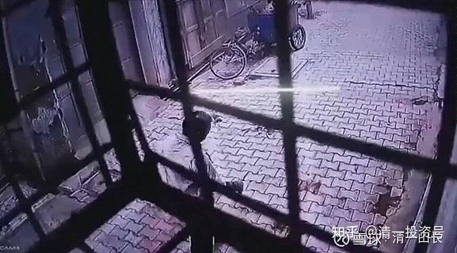

原雪球专栏[138篇.实战太极与现代格斗之谜一：发力技术](https://zhuanlan.zhihu.com/p/362455647)

清一山长 2021年4月5日

**凡是号称实战的武术，不跟你讲发力技术，只讲什么招式、动作的，就是在耍流氓！**

金庸小说只讲招式，因为金庸不懂武术。他就是个文人，他只看得见武术的招式！看不进武术的劲力。所以，你看了小说，以为这就是传武，你是金庸“小说传武派”，这种传武，是上不了擂台的，可以上舞台。比如一阳指的某派大师。

武侠电影，也只能够描绘出招式来。因为，影迷们看得见的只有华丽的招式，只要是打得人眼花缭乱的动作，你以为就是武术？这是影视作品好吧？咏春拳在电影里面击败了各种武术，还击败了泰森。但是，传武真有这水平的话，干嘛不去真打实战？拿几千万美元一场的出场费？常识就不对。

两年多前，我去佛山讲学，有两天的空闲时间，就跟佛山的朋友说：“来到了武林圣地，有没有高手可以去拜访？学习见识一下？”我一直对民间高手有崇敬之心。他们带我去了一家据说是佛山政府专门引进的“传武大师”，开着一所政府支持的传统武术培训学校，传授各种武术门派的技术。我去了，聊了几句，就发现这馆长，根本就不懂真正的武术，只是一个拳混子罢了。我问他：“怎么练武，怎么习武的？”他居然告诉我：“从小习武，小时候上的少林武校，后来成年了，就跟着电视和电影学的。”他从来不看拳经，也不懂拳经有啥重要性。我哑然。问了几个基础的问题，如传武的发力，速度的原理，格斗逻辑，完全鸡同鸭讲。我就不再说话了，早早地告辞走了。我很少遇到真正的武林人士，**很多号称的传武大师，无非是打着武术名字的江湖戏子、把式罢了**，**不是啥真练武的人。**雷雷、马保国等等，算啥武林人士？连票友都算不上。我勉强算个票友吧！但我的弟子，可能会算武林人士的，将来。

一个武术人，要练真武，就先必须弄清楚发力的问题。否则说什么都是空的，**不跟你谈发力的人，不去研究发力技术的流派，就是武术骗子**。柔如太极，更是要谈发力技术。因为这要么证明太极的发力技术超级高明，超出了人的想象，要不就是超级骗子。“犯者立扑”，不是闫芳这种发力打出来的效果。

研究发力技术，我们先看看没有训练过的普通人，是怎样发力的？徐冬瓜在与某“传武”人对战的时候，手都不抬，就拿脑袋让对方拳头打，他一点也不在乎。为啥？这是他在用动作怼人。表示：我就让你打，你都打不倒我。因为这人，根本就谈不上啥发力技术，就是一普通人乱抡拳头，打上去也伤不了人。为啥？力矩不够！只有一个小小的拳头打出去，有多大力量？因为**没有练过拳的人，力量是以肩膀为基座，用手臂来发力出拳的**。**这种力量，发出来的很小**，而且——很累人。**用肢节打人，是最耗费体力，而且最缺乏打击力。**所以，普通人的拳，练过的人，根本就不用躲，让你打，你都打不伤他的，累都可以让你把自己累死。

练过的人，双手发力的基座，就开始下降了：他们不再以肩膀为支架来发力，而是**以腰胯部为支架来发力**！这是目前几乎所有现代格斗拳派的发力技术。双腿支撑胯部，然后脚蹬地，转胯，转腰，摆肩，抡手臂，把拳头像流星锤一样重重地抡出去！这种力量的伤害性，就比上面的以肩膀为支架的强十倍左右。徐冬瓜是无论如何不会让你用这种拳法来打他的。因为他再练抗打，如果头部遭遇重拳，一样要被KO的。

**双腿支撑发力的技术，是现代格斗的基础。有没有一个练出一个稳定的发力支架，就是高手和低手的差别**。大家**比拼的**，不是啥技术、招数，而是彼此**谁的练的更熟练，细节的精细程度，以及肌肉群的力量大小**。但基本的发力技术，大家都是差不多的。比如拳击的刺拳，就是肩部为支架，前手努力探拳发力，快速，但无力。只用于打点数，干扰对方。但真正的重拳，是放在后手，利用前手刺拳干扰吸引注意后，冷不丁的转胯摆身发出一击后手直拳，或者后手摆拳。这是拳击，现代格斗主要的战术之一！谁能够把这些动作做到最完美无缺，谁就是赢家！拳击手中，发拳的时候，**身体善于左右摆动的拳手，就是训练有素的高手了。**大多数缺乏训练的人，发力的时候，身体是僵硬的。这种情况，就很难发出腰胯力，只能发出手臂力。光靠手上的动作，啥高明的招数，都不管用的。就像是小孩子跟大人打斗，用啥高明的招数、动作都白搭！古人早就说了：一力降十会。力量比你大，你的招数，甚至你的速度，基本上都是无效的。

我看电影上，咏春叶问宗师，对着别人的头胸连续打上几十拳快拳，看起来“威风”极了。拍电影可以这样拍，但真这样打，除非对方是没练过的。但只要是练过的人，第一是不可能让你这样，不还手让你自由打；第二就是你一两拳打不动对方的重心的话，对方还你一个重拳下来，你就完蛋了。我看徐东瓜与咏春某人打拳，就是一开始咏春人学叶问，突然猛攻打了很多快拳出去，冬瓜中招不少。但冬瓜的发拳虽然少而慢，但一拳算一拳，一腿算一腿。最后这个咏春高手，自己都累得站不起来了。假如他真练了发拳的力量训练，冬瓜应该伤得不轻。似乎冬瓜的躲闪速度不咋的，主要是抗打！偏偏练传武的，有些人的速度还可以。但真没有见过多少懂发力技术的人。去挑战现代格斗，自然是找抽了！就像小孩子去找大人打架一样。

如果传武要跟现代格斗去决战，你想用啥特别的招数动作去取得胜利，比如某号称武当派掌门人的家传功夫，居然学会了金庸的“降龙十八掌”，去对决现代格斗？这完全就是一个笑话，是不可能的任务。我们由于受电视和小说的影响太大，总是幻想传武和现代格斗去打的话，一定是用某种奇妙的、古怪的——我们想象不到的——只有山中老人想出来的怪招，就可以轻松地打现代格斗一个措手不及，传武华丽的赢了——这绝对是幻想。现代格斗打了这么多年，啥招式没体验过？啥动作没研究过？可以说，最实用，最简单，最有效的招数，都已经早就发现了。站立格斗中，**拳击的直勾摆，就是最实用的**。**关键是你练出来多少力量和速度**，不是你练出什么怪招来。

传武要能够跟现代格斗进行一场真正的对决，就只有两个可能性必须满足：首先是发力技术必须跟上，或者超越他们。第二个是你的出击速度，必须要跟上，或者超越！除此之外，别无他路。如果上述只谈跟上，就必须有第三个跟上：身体的抗击打硬度必须跟上。因为你必须在同一水平下跟他们硬拼身体，双方抗击打能力谁强谁胜。大多数职业拳击擂台上，对垒的双方技术都差不多，就靠意志拼体力拼下来了。史泰龙的拳击系列电影《洛奇》其实就是强调：我比你能挨打，所以我挺过来就是赢家。并不是洛奇具有什么奇特的家传武功。这样的洛奇，就是美国版的《叶问》了。拳王阿里老年痴呆，为啥？头部已经被击打受伤太多了。

如果我们练传武，想要让传武继续传承下去，只是在发力、速度，以及硬度上跟上现代格斗的水平和能力，其实我认为传武就没啥好练的了，干嘛不去学更实用、更普及的现代格斗？

如果我们练的传武，在发力技术，速度训练，以及抗击打能力上都不如现代格斗，不可能达到现代格斗的水平，我们也就承认落后，更不要去练啥传武了。就当火枪时代到来了，你去练啥大刀技术，练得再好，还是一样白费力气，除非你耍大刀是玩游戏，上舞台表演的。但千万别头脑发昏到要上火枪的战场。

传武，只有一种可能性，我们需要去捍卫，就是：

传武的发力技术高于现代格斗，传武的发力速度超过现代格斗。如果不能实现这两项的传武，就根本没有实战价值，可以直接退休了。

太极拳也一样，**太极是慢练快用——最终练慢是为了快。太极是积柔成刚，练柔是为了成极其猛烈的刚**。如果太极打不出达到甚至超过现代格斗的力量；如果太极打不出超过现代格斗的速度，就不是真太极，大家也别练了。或者自己承认就是体操太极，别出来号称是啥格斗太极了。

今天本文专讲发力：发力技术要怎样才算过关呢？就是如果你用空手去打对手的头部位置，一旦发力的话，对方一定会被KO。同时，你的手指骨一定会骨折。这就是懂发力与不懂发力的区别。普通人是不可能做到这一点的，往别人脑袋上打几拳也没事。

就算是练实战太极也一样，真练出了太极发力技术的人，如果用空手去打人，也一样会把自己手指打骨折的。所以，为了防止受伤，太极拳家发明了一种技术：就是用掌根来发力，在让对手KO的同时，自己手掌不至于受伤。所以，太极虽然名拳，但实际你看都是在用掌。当然，现代可以带拳套，就不用担心这个问题了。不过，用掌根发力虽然强悍，但散打和拳击技术里面，这却是犯规的动作——实际上用掌根发力难度很高，一般人也学不会的。特别是像直拳一样，正面直接就打上去，用掌根摧毁对方的打法，一般人真打不出来，这个动作没有练过的人，会很难受和别扭，更谈不上发出啥力量来了。一般人，最多只能像是王八拳一样用掌根打人吧？

说到掌根发力，你就开始发现：太极发力技术，已经跟现代格斗术不一样了。因为如果你用现代格斗的发力技术，双腿站稳，身子转动，用掌根去打人？难受不？特别的别扭！

但学会了真太极、真内家的人，却可以很自然地用出来。因为，太极传武有别于外家拳，有别于少林，有别于现代格斗的地方，就是太极的发力技术已经完全改变了。太极取消了正常人格斗时候用腰胯部来支撑的发力架子，把发力点直接放到了地上。这样就形成了一门全新的格斗武术学派。

你要说：“谁不是从地上发力呀？”还真不是的。对于现代格斗来说，地只是借用力量的地方，双腿站稳，腰胯转动，用人体中部支架支撑发力，腰胯才是发力点。

简单地说：我们普通人的力点，是在肩膀上，手像绳子一样自由摆动发力。绝大多数所谓练传武的人，其实都没学过发力。所以一旦上场，就是雷雷一样，根本就和没练过的人一样，只会乱打的。而且很重要的一点，这些人的腰胯、肩部，都是很僵硬的。我们可以从这一点，简单地判断出他们练的水准——只是业余拳手的水平。

练过外家武术的人，相对专业一点的格斗人才，已经会熟练地使用腰胯来发力了，以腰胯为力点发出力量，已经足够把任何人一拳打昏。这种发力技术，是把腰部一样都要练柔掉，假想腰部以上都像绳子一样柔软。想看到这种发力的练习方式，大家可以看看劈挂门的拳，这一个大家认为还有点实战价值的传武门派的拳。他们练啥？仔细看，就是练腰胯以上，在双腿的移动支撑下，双手臂以最大的摆动幅度，来获得最大的发力。这种发力技术，非常接近现代格斗的发力要领。当然，实战不能这样打，幅度太大，打不上的。只是练习罢了。但劈挂门练这种动作，肯定是要练出一门能打的拳——但练动作、套路，只是练发力，练得再好，离上擂台还早。而且，已经有了现代格斗技术训练，再去练这种功夫，恐怕不如直接练现代格斗更容易，起码系统性强一些！所以，我认为**劈挂门与现代格斗的目标，发力原理是一样的。所以，现代已经没有太多的习练价值，玩玩当然可以。**

传武的价值，不在于我们有现代格斗也有的东西，而在于我们有现代格斗没有的东西。比如——太极的发力技术。

太极的发力技术，比劈挂门研究得更深，走得更远：**太极拳要求，把整个的人体，都作为“鞭子”一样来使用，抡动起来攻击对方。把每次发力的力点，都落到了地面上**。所以，太极拳特别强调的“柔软”，并不是大家以为的手上的动作要轻柔，而是**整个身体，特别是脊椎部分，都要像面条一样柔软，又必须像弹簧一样，随时实现“松、活、弹、抖”的大力打击**。这样，就形成了五个很大的格斗优势：

第一：由于力矩加长，所以同样是前手刺拳，由于太极的发力点在地面，所以**太极的前手刺拳，寸拳，都可以发出普通人摆拳的力量，可以直接把人击倒，**击退几步！拳击手的刺拳是不可能有这种力道的。所有，**太极拳是强侧置前的格斗术**，与需要转动发力的拳派，把强侧置后，很不一样。

第二：太极拳的后手拳，可以发出更大的力量，实现更加隐蔽的后手攻击。同时更厉害的人，由于不需要摆动发拳利用惯性，所以太极实现了现代格斗梦想却无法做到的一点：**可以双手同出，而且双手可以同时去击打完全不同的方向。**比如一上一下，一左一右！甚至一前一后。

第三：**可以不收拳就出击**。这样，太极拳手可以在更短的时间内连续攻击。这无论对于古代的实战武术，还是现代的竞技武术来说，都是不可多得的优点。

第四：这种发力方式，还有一个重大的优点：就是**速度特别快**。因为必须采用全身抖动发力，全身是同时协调发力的。所以避免了现代格斗是利用肌肉里的传动，扭转，衔接的发力方式。所以，**太极拳发出一个重击的速度，要比传统拳术快得多！**

第五：这种发力方式，由于摆脱了现代格斗必须双脚支撑来发力打击的要求，所以，**真正的太极，可以在移动中发力，可以单脚发力**。所以，太极在实战中，将拥有很高的灵活性。往往可以让对手完全不知所措就被击倒了。太极拳经，不断强调单重，反对双重，为啥？就是发力原理的要求：现代格斗全都是双重发力，速度就慢了。太极强调单重发力，就要改掉习惯性发力的方式。不弄清单重，只会双重，就一辈子不是真太极。

我看陈氏太极，的确是练了发力的，不过是双腿支撑的发力。这是他们家传的炮锤，不是太极。基本的动作，原理就不像！所以，陈家人很聪明，实战就干脆直接练散打，现代格斗，再加上太极套路玩玩。所以，他们跟现代格斗也没啥区别了。因为真没太极拳的技术特点！

为了实现真正的太极发力方式，**太极拳必须全身柔软如棉，身体必须松沉。但必须一触即发。只有实现了这种发力目标和方式的，才是真太极！**

您想检验这种太极发力是什么？想试试看你会不会真正的太极发力？可以自己单足站立，让亲友全力来推你。您不但被人推不动，甚至还可以单足就把对方弹开几步，就说明：你会太极发力。如果您做不出来——算了，你就没学过真太极嘛，没啥奇怪的。我特别教你们这一招，就是让你去检验某些太极大师们，是不是真太极的。他们敢不敢单脚站着，让你来推他们。如果他们不会，就别信这些大师了，他们就不懂太极的！

各位想看看太极发力吗？想知道太极发力有多威猛吗？看下面的视频就知道了。猴子袭击人，一只小小的猴子，居然可以把比他重很多倍的人击翻，就是猴子会用全身力，弹抖力。与只会用局部力量的人相比，猴子要灵活多了，而且显得力气也很大！其实是善于用身体力。

孙禄堂号称活猴，你们显然知道：他肯定练成了我说的功夫！没练出来，不像猴子一样灵活，就别谈啥太极了。

[打不过又跑不掉！男子惨遭群猴乱殴，猴子分工明确让人冒冷汗](http://link.zhihu.com/?target=https%3A//www.bilibili.com/video/BV1Ax411f77m)

[https：//www.bilibili.com/video/BV1Ax411f77m](http://link.zhihu.com/?target=https%3A//www.bilibili.com/video/BV1Ax411f77m)

你们想看真人练的真太极吗？各位就再等等。等我的弟子出山了，你们就可以看到了。

一句话：敢说自己是真太极的，请去跟现代格斗打打。如果我们相信自己的技术体系是先进的，自然能够击败他们。如果无法击败，证明自己的技术体系就不如别人，就扔了算了。还要啥传统武术？我就没见过你们有汽车开，还非要去买个马车来“恢复传统文化”的！

除非真太极不是马车，而是特斯拉。否则，我们没必保留啥真太极的！

（以下内容为编者收录）

**评论回复：**

**嗨吃街餐饮服务回复清一山长：**

感恩山长传武分享，让我有幸拜读，在此有一惑求解，我家有女刚满5岁，健康聪颖，爱人现有意送其少林习武两年打基础（这点我们有异议），之后再来衔接新教育体系，期望最好是能直接进入今日学习（这块我们目标非常一致）。至于少林习武，我以为是多余，我宁愿她在进入今日之前哪怕是一张白纸，我们只管负责纸的厚度和宽度，至于蓝图，只想留她在今日里描绘，请山长点明拨正，感谢感恩！

**清一山长[2021-04-06 11:36](http://link.zhihu.com/?target=https%3A//xueqiu.com/9310099567/176371187)回复嗨吃街餐饮服务：**

**登封，少林的武校。可取之处是锻炼自己吃苦，不可取之处是下层人聚居的地方，容易学会很多坏习惯。想学真武道，可以模仿示范班学生分享的体育动作，公主班学生的训练。这些虽然不是武术，但可以说是武术的基础功。真太极，我们在15岁之后才开始教，专门去清一武道馆训练的，太早了，学不了。因为真的很难理解这种功夫，难度太高，非一般人能学。**

**卐范钰清创威达7回复清一山长：**

尊敬的山长，我是位家庭很普通的4年级的孩子妈妈，之前有幸去听了山长的三天清粉课，然后送孩子去合一上过一次21天的暑假班，孩子是属于很孝顺，也很乐于帮助他人，唯一一点就是学习习惯和学习态度及写作业严重拖拉，这也是孩子小时候我们做父母的没有做好，没有给孩子养成一个良好的习惯，所以导致孩子在这一块是有短板的，在体制内我感觉孩子很难做到改善，所以我想请教山长广东这边哪个家塾哪一位老师更合适孩子一些呢？我想救救我的孩子，孩子真的很聪明我不想因为我们没有经验不会做家长而害了孩子，请求山长能给予指点，感恩有您，感恩！

**清一山长2021-04-06 11:38回复卐范钰清创威达7：**

我不推荐任何学堂。你自己随缘去找吧！我是老师，只分享理念，不负责做中介。

**心向内回复清一山长：**

想像一下小时候我们玩的流星锤。江湖课上，您告诉我们把自己的身体当成一袋面粉砸出去。

**清一山长[2021-04-06 11:43](http://link.zhihu.com/?target=https%3A//xueqiu.com/9310099567/176371788)回复心向内：**

是这道理[很赞]，流心锤线越长，力量越大。速度越快。[笑]

迷财道回复清一山长：小时候练过流星锤，现在也看到公园里有人练，不过大都当杂耍练。强大的离心力一定要一个稳定的核心。

**[清一山长](http://link.zhihu.com/?target=https%3A//xueqiu.com/9310099567)**[2021-04-06 12:14](http://link.zhihu.com/?target=https%3A//xueqiu.com/9310099567/176373908)回复迷财道：

如果理解发力点？你们使用流心锤的发力点，力的支撑点，就在你的手上。由于连接是软鞭，所以需要抡起来旋转，用惯性来发力。劈挂拳，外家拳，力点降到了腰部，手就像流心锤。**真太极，力点要降到足弓上，身子要成为软鞭一样，这样才能出鞭劲，难度极高。**不过，可怕的是，**太极的身子，并不是完全是软的，它可以瞬间变硬**，就像你的流心锤的软鞭，**在软软地打上去的时候，会突然变成一杆长枪，可以直刺**。这就是“刚劲”出来了。太极“九柔一刚”，这一刚，就能要人的命！

**尤文鱼回复清一山长：**

我有一战友，从5岁学到15岁，跟一个老头学的。说是至河北传过来的炮拳，练到极处是一拳三炮。战友十年下来，上半身没什么区别，下半身因为练老树盘根，腿部肌肉跟筋肉人一样，战友说算是桩把士练十年的效果。作者大大，我战友这算学到真本事了吗？

清一山长[2021-04-06 12:35](http://link.zhihu.com/?target=https%3A//xueqiu.com/9310099567/176374562)回复尤文鱼：

你说的应该是炮锤，不是炮拳。炮拳是形意门的五行拳之一。炮锤是一个拳派，就是陈家沟人学的祖传拳，古代是有实战价值的拳种，外家拳之一，这是用下半身支持发力的拳。不知道你说的功夫是啥。“老树盘根”，是八卦掌练转身拧腰的练法。当然别的拳派也有。练“炮”，就算练成了真“炮”，还需要会瞄准，还得有速度、距离感、战术、防守技术等等，不是会发力就有功夫，就能实战的。想试试有无功夫，自己去拳馆打打实战就知道了，不用问我。几句话，我能说啥？（不是让你去踢馆，而是去体验，我的队员，都会去拳馆体验实战的）。

**琳溪回复清一山长：**

你亲眼亲自体验过山长的太极拳和孩子教育吗？到底谁是嘴炮[吐血]

**清一山长回复琳溪：**

你说的这混蛋，我骂他有人生，没人教，让他走人。还被他投诉，结果小秘书删除了我的帖子，给我警告[滴汗]。他关注我来写帖子骂我，反而倒没事。这世道真没天理。我已经拉黑了他，也没法去投诉，下次我记住先投诉，再拉黑[俏皮]。

**王小许回复清一山长：**

总结：市面上的大多数传武都是骗子，要学传武跟楼主学，他练的拳击。

**清一山长[2021-04-06 13:16](http://link.zhihu.com/?target=https%3A//xueqiu.com/9310099567/176377735)回复王小许：**

别自恋，你们还不够格跟我学拳的。以为我发文，是做我武馆的宣传广告吗？招生的吗？**我的清一武道馆是全免费的，吃住全免。我要自己花钱，为老祖宗们留一盏灯。**别以为你们想来练拳，我就收人的。让我贴钱来养你们这帮闲人练拳？别臭美了[大笑]。给钱我都不玩的。想送我钱的人多了，不缺你们这点学费。今天惠泉啤酒、燕京啤酒都在送我钱呢！都是大老板，主力给的赏钱，你们给得起？[大笑]

**琳溪回复清一山长：**

上了山长的财富课、齐家智慧课、心里行为课等课程，每次都能观摩到山长的武术示范，我虽是女流之辈不懂啥武，但是能看到山长在和很强壮的男学员对决时，轻盈、敏捷，男学员瞬间被放倒（我弟亲身和山长尝试交了下手，之后告知我自己力量还没出，山长很轻的一出手就感到一股力量让他瞬间就倒下，说当时把他疼坏了[大笑][大笑][大笑]，他领略了山长真人真功夫[很赞][很赞][很赞]）。不是亲眼见到，一般人很难相信山长对武学的研究，不仅理论通透，而且实操高深。我是亲自验证了，山长不仅是教育家，而且是武术家、音乐鉴赏家、投资专家，这些都是名符其实，当之无愧的[很赞][很赞][很赞]

**清一山长[2021-4-06 14:02](http://link.zhihu.com/?target=https%3A//xueqiu.com/9310099567/176382520)回复琳溪：**

抱歉，让你弟受伤了。以后，你们想看真功夫，就让你们男生来打我的女弟子好了（男弟子你们没法打，他们收不住手的）。我的力量看起来越来越柔，但我的弟子觉得我的力量越来越大，接手不小心都会青淤一片。所以，以后不能与你们过手了。

**你们看到的、体验的，还不是我真正的功夫，太极拳，强调冷、弹、脆、快，我根本就没用这些功夫来打你们，只用了一点绵力。**所以你们学员只是摔倒。如果用了脆快力，就要伤人了。所以你们无法体验的，不敢用。

有一次，河南有人过来，非要见识真传统武功。说自己一直热爱武术，练过多年拳击、搏击格斗。我说你们登封不都有吗？武术之乡。可他说的那些武校练的都是假的，专程跑来，想来看我的真功夫。当年我在云南，别人几千里跑过来，总要接待一下吧？这也是武林的规矩。我就跟弟子们练了一下，给他看，他不满意。自己上来跟我像你们一样接手，他还是不满意。说能不能双方都放开了打一场？他要体验，传武怎么对付他的武功的。这种玩，他觉得不真实。

我看此人来意不善，不像是友好交流的样子，而且，真懂武功，我们演示的他应该看出来不是对手的，但非要比，我觉得他不是交流学习，而是想找点成就感，想出去就吹牛他用真功夫掠了我们一把假功夫吗？我就变了脸色，客客气气的说：“您就是说实战模式，自由搏击，不是试招，是吗？”他说是。我说：“好，你就来吧！”

我就站了一个姿势，太极起势，一动不动的等他来进攻。这是武当拳派的攻防之道：后发制人，不先出手。此君看我不动，先试探着打了几个刺拳，看我毫无反应。以为我像雷雷一样只会站架子。其实，距离上这么远，你打不着我，我动啥？他以为我实战的反应速度不行，几个试探拳之后，就突然一步猛冲上来，用后手摆拳，重重的猛击我的头部，下手一点也不客气。但他的手还没打到我的头部，我就略略向前进了半步，用前手（右手)一巴掌就打在他的左脸上。我是右架，强侧置前。他被打晕了，马上就停手不打了，捂住脸（再打，我再抽嘴巴），脸上肿起来五根血红的印子，眼角被打出了血。

还好，这是九年前的事情，我的力道不够（也没下狠手，只是给他一点教训）。他摸摸脸，满脸的迷惑。问：“这拳怎么打的？用哪只手打的？”他怎么没看见？用的什么手法？问我身边观战的弟子学生，全都说没看见我是如何打的，更没看见用的哪只手打。只看他冲上来，然后就看到人影一晃，眼前一花，就听到脆脆的响了一声，啥都没看见。这次比武，就这样结束了。此人说：“很幸运，总算见到了中国真武术、真功夫，还以为失传了。”

这才是真比武。你们学员过来看的“比武”，只是大家友好玩玩罢了。不过让你弟弟感到很疼，肯定是我做错了。

此人记得姓李，河南郑州人，为人狂妄自大，特别的自以为是，喜欢踩别人上位。后来他去做了“清黑”，背后一直骂我。想想也正常，被我不客气的打脸，谁让他没眼色呢？现在如果此人再想找我比武，结果就不会只是脸肿了，而是身上的骨头要断了。

**我判断对手来意不善的话，会出重手的。冷、脆、快、重，这种才是真太极。看起来像跳舞，打起来像虎豹扑人**。我曾经一拳出去，停在对手的鼻子面前，但对手吓得大哭起来。因为我是在逼他失衡情况下击出的一拳，身体躲无可躲，看起来就像要被打死了，的确很吓人[大笑]

**琳溪回复[清一山长](http://link.zhihu.com/?target=https%3A//xueqiu.com/u/9310099567)：**

谢谢山长回复！山长不必道歉，我弟并没有受伤，只是感到一些痛感，是非常正常的事，仅由痛感他觉知了山长功夫的高深，这种开了眼界的体验也是一种荣誉，是非常感恩山长的。如山长所言，山长对学员只是用了一点绵力，学员们就有很深刻的力量体验，所以山长真正的功夫只有有缘人才能深入体验到。祝福武道馆[跪了][跪了][跪了]期待山长将中华真功夫传承并发扬光大。

**偷乐吧回复清一山长：**

楼主开武馆的？厉害啊！什么流派呢？

**[清一山长](http://link.zhihu.com/?target=https%3A//xueqiu.com/u/9310099567)[2021-04-06 14:12](http://link.zhihu.com/?target=https%3A//xueqiu.com/9310099567/176383655)回复偷乐吧：**

没事，没错，我就是开武馆的。清一武道馆就是我的。传武派，实战格斗派。不过我的武馆不收学费，我是从股市赚钱来开武馆，包吃包住。您想来吗？**只要您能考SAT1400分，半马过关，体能过关，目标是要拿世界冠军，专跟现代格斗过不去，年龄不超过16岁，就可以来我的武馆练拳了。**钱不是问题！您想不想当冠军，才是问题[大笑]

**[ellhll李华丽](http://link.zhihu.com/?target=http%3A//xueqiu.com/n/ellhll%25E6%259D%258E%25E5%258D%258E%25E4%25B8%25BD)回复[清一山长](http://link.zhihu.com/?target=http%3A//xueqiu.com/n/%25E6%25B8%2585%25E4%25B8%2580%25E5%25B1%25B1%25E9%2595%25BF)：**

感谢山长分享。山长的长文，一般情况下时间零碎我先不读，等有一整块的时间了才好好看。今天的这篇专栏是我学得最久的一篇。内容实在是全面精彩，读起来像是参加一场武林大会，不知道山长要用多长的时间来写这篇文章。这么详细，逻辑分明，即使我不是练武之人，读完之后也基本了解普通人、现代格斗、真太极的不同发力技巧和由此产生的不同力量、速度、结果。

在消化理解的时候我就想，难怪山长说**真正练武的人思维一定不差，这样练真太极，思维不行，脑子转得不快，真没法练。**

我作为读书人来理解文章，要用两三个小时，非真练武人，能看懂这篇文章吗？有耐心看完吗？如果能，没道理不折服于这份分析，有练武基础的人，更该是如获至宝、寻得高人一样欣喜。所以我想，在帖子底下喷山长的人，应该是没有看完，也没有看懂，就是扫了几句话，觉得和自己知道的不一样，就开始攻击了。无知而扮全知，损害的不是别人，是自己。
我习惯边看边划重点，贴出来，没耐心看完全文或是看不懂的，可以看一下这个摘录。
1.本文是百年来第一次明明白白地分析中华传武和现代格斗实质区别的第一文。（这篇文章之于中国传武的价值，可以相当于山长《给100年后代子孙一封信》之于教育的价值）
2.中止武林中争论的传武能不能打的核心问题——能练出超越现代格斗的发力，就能打，练不出，就不能打。
3.练真武，必须弄清楚发力的问题，真太极，更要懂发力技术。
4.没有练过拳的人，力量是以肩膀为基座，用手臂来发力出拳的，力很小，累人。
5.实战能力的传统武术，现代格斗拳派的发力技术，以腰胯部为支架来发力。双腿支撑胯部，然后脚蹬地，转胯，转腰，摆肩，抡手臂，把拳头像流星一样重重地抡出去！这种力量比以肩膀为支架的强十倍左右。
6.双腿支撑发力的技术，是现代格斗的基础。能练出一个稳定的发力支架，就是高手。
7.重拳，是放在后手，后手直拳，或者后手摆拳。
8.善于肩部左右摆动的拳手，就是训练有素的高手了。一力降十会。
9.《叶问》中的咏春快拳为了速度、牺牲了力量。常见的一些拳师的招数没有攻击力，不敢真打实战。
10.站立格斗中，拳击的直勾摆，是最实用的。关键是练出来多少力量和速度，不是练出什么怪招。
11.传武对决现代格斗要满足：发力技术、出击速度、身体的抗击打强度。如果这三项只是跟上现代格斗的水平和能力，传武就没传的价值，传武实际上的发力技术、发力速度都超过现代格斗，所以它才值得去捍卫，去学习，去传承。
12.**太极是慢练快用，积柔成刚，力量、速度不能超过现代格斗就不是真太极。**
13.真太极一拳超过一百公斤的力量，手指骨无法直接承受，所以用掌发力，比如掌根、掌背来发力。其发力技术，与现代格斗术不一样。
14.现代格斗的发力技术，双腿站稳，身子转动，没办法用掌根去打人。
15.普通人的发力点是肩膀，手像绳子一样柔软。
16.现代格斗的真正发力点是腰胯，腰部以上像绳子般柔软。
17.真太极的发力点放到了地上，整个人体像绳子，作为“鞭子”来使用。三个绳子哪个长？现代格斗长于普通人，力量是十倍；那真太极长于现代格斗，力量该是后者的多少倍？
18.因此，真太极相比现代格斗有五个优势：
（1）真太极的前手刺拳，可以发出普通人直拳、摆拳的力量。
（2）真太极的后手拳，可以发出更大的力量，实现更加隐蔽的后手攻击。更厉害的是，太极是唯一能双手拳攻击而力度不变的。
（3）真太极可以不收拳就出击。不招不架，只是一下。犯了招架，就是十下。
（4）真太极重大优点：速度特别快。
（5）现代格斗，是移动，支撑好，然后发力；真太极可移动中发力，可单脚发力，所以更具灵活性。

山长和武道馆的所有学生，非常肯定真太极的技术体系是先进的，是一定能够击败现代格斗的，所以愿意付出财力、精力、人力，垫上名誉，去捍卫、去传承真正的太极，真正的传武。

期待武道馆的学生出山的那天，一战扬名，向世界证明中华的真正传武。

[实战太极与现代格斗之谜1：发力技术！](http://link.zhihu.com/?target=https%3A//xueqiu.com/9310099567/176335637)

[https://xueqiu.com/9310099567/176335637](http://link.zhihu.com/?target=https%3A//xueqiu.com/9310099567/176335637)

**[清一山长](http://link.zhihu.com/?target=https%3A//xueqiu.com/9310099567)**[2021-04-06 22:14](http://link.zhihu.com/?target=https%3A//xueqiu.com/9310099567/176424836)**回复[ellhll李华丽](http://link.zhihu.com/?target=http%3A//xueqiu.com/n/ellhll%25E6%259D%258E%25E5%258D%258E%25E4%25B8%25BD)：**

**作为普通人，你真算有心的了。**看文章看得很细，总结很到位。我此文中讲的**这些武学道理，绝大多数武师，一辈子都没悟出来，练了一辈子的傻拳。都不知道练的是什么！绝大多数的武术博导，也不明白这个道理。这篇文章，是超越武术博士论文的水准。价值超高。**主要是必须要**一个能够跨越文武，跨越古今的人，才能解读其中的奥秘。现在纯武之人不懂文，弄不清武学的道理。文人又不懂武，也弄不清武学的道理。特别是古拳经写的古文，很多人无法理解。所以这些技术基本失传。但我已经用现代方式解析出来了。懂了我此文中写的武学道理，很多古拳经，你就能读懂了。很多有心人，可以根据此文，大大提高练武的水平。**

**包括现代格斗也能从我的文章中学习和提高练拳的效率。**今天我看拳击世界锦标赛女子冠军赛，水平真差。看起来很不专业，选手经常不护住头部，打击的力量也不大，速度也不快。特别是发力技术不顺畅，很多只用到肩部位置。遇到我的队员，她们会被轻易打倒的。不过我的队员是按照职业拳赛的要求来练习的，与这种世锦赛规则不太一样。似乎世锦赛为了安全，强调点数，不强调击倒技术。所以不重视发力。我看的**顶尖拳击界的选手，都非常的善于晃肩，就是善于用腰的表现**。今天看的两个场上队员，都不会这个技术。所以打起来我认为没啥水平，有点乱打。这两拳手，如果看了此文，水平一定会提升的，因为知道要练什么了。

**不过，要通过此文练太极，就别想了。除非有真懂太极的师父指导具体的练法。**一般人是不得其门而入的。就像是知道原子弹很厉害，原理也知道，但一般人真没有办法去造的。这里讲的武功之道，对有技术的人有帮助。但道与术，还需要相通。我指导学生们，就是依据以上文中之道，教她们武之术。两者结合，就可以成为高手。武之道与武之术，相辅相成。道为一，术为万。要练成此功夫，可以有很多的办法，不限制只有一种办法。

我也在变化各种练习的方法，用她们最能理解，最有效的方式来练出来这种力量。目前，三年练出太极劲，应该是一个全新的创造。一些老拳师一辈子都没练出来，虽然他们知道有这种功夫，也见过师父的示范，就是自己练不出来。所以，老师的价值是极高的。

其实，如果我来指导拳击运动员，也一样可以取得更高的胜率。大概率战胜很多专业教练员吧！自吹一下。当然，我就不去抢这个饭碗了。拳击圈内，要弄到个教练职位难度还是很大的，多少人争抢的位置。

我的清一武道馆，也有人专门练拳击，研究拳击、现代格斗技术的。并作为陪练与太极选手对招，并不是全部人员都练太极，只是大多数练太极罢了。我的武馆里面练拳击的人，根本不学我的太极。但练太极的人，必须要研究拳击，设法对抗拳击。所以我们会设对照组来研究。我认为：未来我们太极人，去拿拳击比赛冠军的时候，我们的拳击队员，应该也会获得不错的成绩。因为他们要天天和这些未来的世界冠军们打架，也差不了的。也会让他们陪练的拳击技术更进步的。也许他们将来会去教外国人——怎样才能对付太极拳手？[大笑]

**Allin的融资之路回复清一山长：**

只说一句话，用掌打人的话，不存在用肩发力或腰发力或腿发力了，是无需借助外界支撑的利用自身骨骼、肌肉产生的**“二挣力”**发力，这是内力，与运用肌肉的发力是完全不同的，这是功夫，是要练出来的，不是读懂了古拳经就会使用了的。

**[清一山长](http://link.zhihu.com/?target=https%3A//xueqiu.com/9310099567)[2021-04-07 09:46](http://link.zhihu.com/?target=https%3A//xueqiu.com/9310099567/176449154)回复Allin的融资之路：**

您理解正确，看样子是懂拳之人。的确不是传统和习惯的发力方式，是要使用你说的**“二挣力”**发力。也叫**“爆炸力”**，从内向外同时的发力。上要发冲冠，下要足入地。不过这还不是真正的“内力”，依然有力学依据的。只是有武师会用**“内力”**来忽悠外人。

**内力，是更高级的力，一般几年之内，是练不出来的。**多年前，我遇到一个会这样发“二挣力”的内家高手，我一碰他的手，就失去重心。我觉得他简直力大无穷，跟他对敌，根本就下不了手去，我只有挨打的份，就像不会拳一样。他说，他练的就是“内力”。问他如何练内力，支支吾吾，故做高深。一副“怎么可能告诉你”的样子。但我认真观察他的动作，看他跟人对打，过招的表现。特别是发力，发现了他发力的核心奥秘，就说他使用某某部位发力的。他大惊，赶快跟我说：不许告诉别人。从此再也不在我面前演练武功了，还让认识我的人不许把他练的武功告诉我。

后来他再找我，帮他招弟子呢！因为现在没啥人跟他系统的学习，业余教教少儿武术培训玩，赚点小钱。我已经帮他找好了弟子，是现在上明师荟，两个挑战3700万大学生的弟子之一，认他做武老师，做他的弟子。我这学生，很想学真功夫。但看到这师傅对我的这种态度，知道他绝对不会教给她他真功夫的，就自己放弃机会，不去了。说去了肯定学不到真功夫，不如在我身边学。好像她的判断是对的。

他的一个弟子，是我的好朋友，体院的教练，一直痴迷传武的。自己的师父去世后，就跟他学武功，已经学了快20来年了吧？对他像父亲一样尊重。这位朋友是一位武痴，今年快50了。为了练武，一直没有结婚。我经常会跟我的这位朋友过招切磋武功，探讨武道。每次见面就是讨论中国武道，有一次还遇到了香港国际武术大赛的老板，举办人，就是他的老同学。他说中国武术不是现代格斗的对手，只能当艺术品看，我们两人还跟他辩论了一场。

前两年，我去武汉体院，我们依然继续过招。他每年都在长进，勤练功夫。我们双手一碰，他连续变劲。一般人就封不住他的手，我封得好好的，让他抽不出手来。我对他说：“你身上没有你老师的功夫。我跟你老师对招的感觉，完全不一样，他没真教你。”他不相信，说每年都跟老师学习，过招的，他很认真地教了很多东西。我说：“肯定教了一些招数，但没教最核心的功力，发力方式。不是真教，是假教。”他还是辩护：“功力是练出来的，不是师父教出来的。”我真心佩服他对老师的忠义。老师的儿子，他帮忙弄到了体院。在他身边管着，给出路（武术界的人知道，这个机会难度巨大。武校人最盼望的“光明出路”）。他20年对老师都很恭敬，但这老师，依然没教他真功夫。只想留给他儿子吧！？但儿子不认真练。此人一死的话，他的功夫铁定失传，只留下一些招数，以及他打人的传说。

其实，当年我知道这个部位发力，就是看的古拳经说的。只是没看到有人练出来过，在他身上看到了而已。当时看到了他的动静，就想起来拳经说的。原来看拳经，觉得古人是不是乱说，故弄玄虚，这个部位，怎么可能把力量发到手上呢？看到了，就知道**古人诚不欺我。我潜心去练，也练出来了**。这说明：**看拳经，是可以学会的。不过一般人还是需要师父指点练的方法。没有方法，一般人不得其门而入。少数人可以翻墙。我是会翻墙的人**[俏皮]。

现在，我的弟子们跟我对打，也一样结果：觉得我力大无穷。平时多大的力气，跟我一碰就都用不上了，一接手身子就发软。因为我已经学会了这种发力。外人看会觉得纳闷：怎么就像是弟子在配合老师一样，任人打？手都不还？其实是一碰手，就失去了重心，学生们自然没有还手的余地。像是没练过拳的凡人一样。

这就是“二争力”发力，这就是太极的奥秘。我的弟子们也正在学这种发力方式，**我要求他们要学成了，才可以上现代格斗的擂台，不然出去就是丢人的。没工夫，不会发力，再漂亮的动作也是“银样镴枪头”。**

**清一武道馆的学生。每天勤奋练习传武武术，不是靠志气、理想，不是希望用幻想来捍卫传武，来赢现代格斗的。他们是看到了真东西，体验了真东西。这种东西，是现代格斗没有的，是拳击无法对付的。所以他们才有信心来练传武，才敢说要去拿世界冠军。**

当然，要练出来也不容易。一路血汗拼过来的。三年，是最起码的底线。也许有人要练十年才能出来，甚至一辈子出不来。

**默默不得闲回复清一山长：**

高手在民间！太极确实是一门高深的内家功夫，电影里面包括现在很多练的都不是真太极拳，只是体操。而真正的太极拳在民间永远不会断掉传承，因为它正像楼主所言，发力是从地上起来的，用的是整体的劲路，全身筋骨必须练得柔软，这样发力才能不伤，所以训练起来的难度可想而知，而现代格斗搏击只是取了一部分东西来学练，练好三板斧打一般人也是跟玩一样了。

**清一山长[2021-04-07 09:55](http://link.zhihu.com/?target=https%3A//xueqiu.com/9310099567/176451085)回复默默不得闲：**

“真正的太极拳在民间永远不会断掉传承”——您太乐观了。现在已经断得差不多了。你看徐冬瓜骂太极骂的多难听，有谁出来捍卫荣誉了？因为根本就没人了。中国的传武，这样下去，最多20年内，就全断了，连一点老根都不留了。**现在都是举国体制，哪里还有啥“民间”的空间？原来是有的。我知道的老武师们，有点功夫人，身边都没人学这些东西，都去考学校，上体制了，从义务教育开始，就不再有民间特色教育的空间。中国大地，现在全是体制，哪里还有“民间”**[捂脸]。**我的人，如果练不出来，20年后，中国就是“消逝的武林”。中国人，不再有传武。**中华传武，将来可能就只有日本才有了。

**[刘杰](http://link.zhihu.com/?target=http%3A//xueqiu.com/n/%25E5%2588%2598%25E6%259D%25B0-)回复[清一山长](http://link.zhihu.com/?target=http%3A//xueqiu.com/n/%25E6%25B8%2585%25E4%25B8%2580%25E5%25B1%25B1%25E9%2595%25BF)：**

想请教山长，软软的鞭子打上去之后，突然变成长枪，是不是类似少林寺古树上手指戳的洞。这种腾空起来发力，发力点肯定不在足弓，那这种发力点在哪里？为什么这么大的力量，手指不会骨折？是速度极快之后，类似于流体力学，口香糖可以开椰子？

**[清一山长](http://link.zhihu.com/?target=https%3A//xueqiu.com/9310099567)[2021-04-07 10:03](http://link.zhihu.com/?target=https%3A//xueqiu.com/9310099567/176452746)回复[刘杰](http://link.zhihu.com/?target=http%3A//xueqiu.com/n/%25E5%2588%2598%25E6%259D%25B0-)：**

“少林寺古树上手指戳的洞”。古少林的这种功夫，已经超出了我的武学逻辑和理解。这个应该就是真正的内功才能实现的了。我说过，我的功夫，只是初级水平。古少林这种功夫，应该是中级以上了。所以我无法告诉你们。只能说：我文中教的功夫层次，是练不出这种能力的。我教的武功，依然是力学层次的东西。这个少林指洞，已经突破了一般的力学原理了。我希望我老的时候，会知道是怎么回事。

**姚淏SZ回复清一山长：**

看完觉得真的叹服，我不懂拳术和武术，运动来说我打高尔夫，但是不是山长表达能力过于精准的缘故，我居然看懂了大半。我琢磨发现其实山长的拳术原理也非常适用于其他运动，比如高尔夫，现代拳手会用腰胯的转动来出拳，力量从腰胯发出来，这点和打高尔夫很像，如果要击到“甜蜜点”，一定是掌握了胯和腰的转动，而且要足够柔软，比单纯用手和肩的力量要强大太多，所以职业选手能击出300码以上都是因为腰胯的幅度比普通人扭矩要大太多，柔软度也极度好，我们形容像弹簧一样被拉紧，蓄力然后释放就好了，甩出去的时候自然力量很大。看完这篇文章，很想学学太极了，说不定会发展出一套高尔夫新打法。如果说发力点从地上到全身迸发出来，力量完全不可想象，前提是像山长说的身体足够柔软，也就是像鞭子一样抽出去的感觉。可能会开辟出一个超远距离击球方法，原理上是可行的。当然，还是更推崇山长的武道，把这个基础学通了，相信任何运动都是信手拈来。每天看山长文章收获太大了，无时不刻在启迪我们！对于所有体育专业尤其球类、对抗类、击打类运动员都应该好好看看这篇文章，中华武道“关于如何发力的一个开创性的方法”。极具价值的诠释，胜过很多武师、教练，悟一辈子也没悟出来的道理，感恩山长大爱分享！

**清一山长[2021-04-07 10:26](http://link.zhihu.com/?target=https%3A//xueqiu.com/9310099567/176456758)回复姚淏SZ：**

您已经看懂了文章。高尔夫击球的发力要求、原理，的确原理跟现代格斗技术一样：双腿要有稳定的支架，上身腰胯协同时转动发力。高手都这样使用身体。只有低手、初学者，是用肩部和手臂发力的，这是没训练过人的惯性发力方式。善于打高尔夫的人，打右手摆拳，力量应该很不错[很赞]，拿把大刀砍人，会比一般人强。不过，练真太极功夫，来打高尔夫，应该是很不现实的。第一是不需要。高尔夫是静态的，所以不需要快速的、变化的发力桩。第二是难度太大，完全没乐趣了。第三就是学了太极的人，是不会去打高尔夫的。因为认为**打高尔夫伤身。练得好的一定伤身，乱玩的也许还好。**因为你们是**单侧运动，而且是强力发劲的单侧运动。最终脊柱一定会偏移的**。我相信**老“高手”，腰部有问题的不少**。我有朋友打高尔夫，他就有腰病。人还很年轻。我在泰国是ELITE终身会员，国宾客人待遇。所有的高夫夫球场都对我开放的，可以随时出去打高尔夫，比国内便宜得多。但我从来不去。为啥？**花钱买抽的运动，不如做几个云手自己玩。**

**刘杰回复清一山长：**

感谢山长的指导，让我们窥见了太极的高度。腾空手指能在树上戳个洞——如果这都只是中级水平，不敢想象太极高级水平是什么样子，内心唯有恭敬和踏实练习基础发力，能摸到门边边已经是幸运中的幸运了。

**清一山长[2021-4-07 11:22](http://link.zhihu.com/?target=https%3A//xueqiu.com/9310099567/176465575)回复刘杰：**

我可以告诉你，**最高级的太极功夫**是什么？这是我的“超级指导老师”告诉我的。这种功夫，已经不去树上弄个洞了，显得太低档。而是**人在树下，随手一挥，满树的树叶，就纷纷落下来了，像是秋风扫落叶一样。**

我只知道，真达到这水平，就是传说中的**飞花落叶，皆可伤人了，或者伤人于无形了，不战而胜。**但我没见过中国现在有这种人存在。我只见到有几个初级功夫的人存在，中级的都没有。大多数所谓的太极大师，连太极的门都没有入。不过，这些中级的，高级的功夫，我想破脑袋，也不知道是咋练出来的。就像我不知道树上的洞怎么用手去戳出来的。实话实说，你给我一个钢手指，我都戳不出来，只能戳破皮，弄个圆圆的洞？我是没可能的。

**我的老师要我修内功，就可以练出来了。我哪有时间来修内功？每天有这么多事情要做。**所以，只能指望我的弟子们将来去修了，用一生去体验传武，看有无机会实现重新找回祖宗的武功，比如少林的失传武功。我对弟子们说了，我就一杂货铺，都是低档货色。只是周围人都没有，显得还比较高，实际只是初级水平。**他们将来要专精一思，在每个方面都要超过我。**全面超过就算了，不用玩这么多的。

**风凌石回复清一山长：**

山长，你应该站出来替中国传统武术和太极正名。那个徐冬瓜太狂了。

**清一山长[2021-04-07 11:52](http://link.zhihu.com/?target=https%3A//xueqiu.com/9310099567/176469395)回复风凌石：**

我不会去找徐冬瓜挑战的。

第一：我其实很感谢他对中国传统武术做出的巨大贡献。没有他，**不知道多少人依然蒙在鼓里，被一群江湖骗子、“传武大师”、“太极大师”们蒙得团团转，马云这么聪明的人一样上当**。这些人，都是中国传武的真粉丝，愿意出钱，出人来练武。但都被骗子骗了。

第二：我去挑徐冬瓜。假如我赢了，骗子们以后都会出来，继续冒充太极，继续骗人。这对传武有啥好处？我砸了徐冬瓜的饭碗，我也不要这饭碗。但让一众骗子去骗人，学几十年学个虚东西，不如让这些喜欢武术的人，跟现代搏击去学习，起码是真本事。

第三：我毕竟不是专业武者，只是票友。我年龄快60了。现在上擂台合适吗？赢了也只能说我这派后继无人。输了更是自取其辱。老不知老，老不知羞。徐某毕竟是专门吃武术饭的，我跟他打，也必须全力出击，跟他比体能、技巧、作战经验、临场反应，肯定不行。重量级也完全不是一个档次，打起来也蛮费劲的。我只能跟他死拼功夫：让他来打我，我也同时打他，看谁的力量强。这是武林中最忌讳的两败俱伤的打法。最终，就算结果是我赢了，我也难免要受伤，回来要养很久的。划得来不？（徐冬瓜目前的传武对手，连门都没有入，徐冬瓜其实没有真打他们，没有真发力的。不然，他用全力来出击，这些人全都会受重伤的。他就是玩，知道对手太差）。你们去认真看看视频就知道了，他只是玩一样的打，不是真打。几乎就是一个表演。徐冬瓜很聪明，看起来粗燥，其实精明过人，不会傻到弄出人命了，他只是炒作自己，嘲弄一下“传武大师”们，没玩命去拼的。

第四：就算赢了徐冬瓜，他也不代表现代格斗，这有啥意思？真有本事，真有门派，就去正规的现代格斗场上去打，成建制的去赢。这才是真武。场下较量？江湖斗殴吗？这可不是传武的做派。**真传武，要尊重自己，也尊重对手。只去参加正规的现代格斗赛事，用现代格斗的规则去比赛，用我们的特有技术来取胜，这才是最正确的选择。**

最终结论：**徐冬瓜是中国传武利益集团的“刺”，他打掉了他们每年数以很多亿万的“生意”。**想收拾他，让这些利益集团有本事自己去挑战去。不关我这民间野人的事情，我只专心培养下一代，不管江湖的事，不进这个江湖。我还没傻到替骗子们火中取粟。

**xiaostou回复清一山长：**

山长，您说的“超级指导老师”是古拳经吗？因为这实在太超过一般的认知了，高级功夫甚至中级功夫，您觉得曾经真实存在的几率有多大？

**清一山长[2021-04-07 11:58](http://link.zhihu.com/?target=https%3A//xueqiu.com/9310099567/176469905)回复xiaostou：**

少林千年古树上无数的小指洞，不就是曾经存在过的高级武功的证据吗？您还要什么证据？[捂脸]另外。我的超级老师不是古拳经，是你们无法理解的老师，所以就不多说了。他会示范一些我无法理解的武功。比如上面提到的。

**平凡回复清一山长：**

看来武侠片当中的功夫是真实存在的。

**清一山长[2021-04-07 12:05](http://link.zhihu.com/?target=https%3A//xueqiu.com/9310099567/176470479)回复平凡：**

瞎说[捂脸]。**武侠片哪有啥功夫，全骗人的。武侠片的东西，根本不符合武学原理。**

**潇湘南宫回复清一山长：**

现在的年轻人缺乏基础，古代士兵是用兵器训练的，打仗征兵集训一般不超过三四个月，现在的年轻人要练传武，需要先去锄一年的地，把基本功练一练。还要节制饮食，改变生活的习惯。否则，再好的功法，也不能把身体练好。齐齐哈尔有位姓何的老爷子，研究了一辈子的传武，也不限于他的师门传承，九十多岁的人了，他算是我所了解的研修传武的真正高手了，这也要有接触点才能发劲。他说他也还没练出凌空劲来。得到他东西的也没有几个人，我见过一个是部队退休的现在也七十多岁了，他说看现在的年轻人体质太差了，都怕不小心把他们给弄碎了，估计他的传人也没几个像样的。像山长说的真传武就要断绝了。传说中的飞花落叶，皆可伤人了，或者伤人于无形了。也许只是障眼法。只是身法，动作奇快，骗过了人的眼睛罢了。相信这些神奇的功法是有的，经过修练内功，可以自动补充自身，进而才能练出来凌空劲。甚至练出凌空飞剑来也不奇怪。只是我真还没见过，我承认自己孤陋寡闻，我也只是个爱好者、票友，最多就是活动活动身子骨，让这身躯轻灵一点罢了。

不过我相信以清一山长智慧是能训练出来战胜现代格斗的传武弟子来的，虽说这不是一件容易的事。现在格斗也有吸收传武精华的，但真正的精华部分他们还没有完全掌握。那就看谁的训练体系更完善了，更具有优势了。

**清一山长[2021-04-07 13:29](http://link.zhihu.com/?target=https%3A//xueqiu.com/9310099567/176477555)回复潇湘南宫：**

这种高级的武功，我没见过，不过南怀瑾老师说他见过。他的回忆武术上的记录，提到过他年轻时候在四川，见过一师徒两人的功夫展示。就是隔着空间（南老师说的是另外一个山头），云南四川的小山包，距离隔个几十米，上百米的距离吧？具体不清楚多少。这人一挥手发功，就把对面的一颗松树拦腰打断，倒了下来。这个就相当于我的“超级老师”指点的功夫了，肯定是高级的能量聚焦。但我从来没见过，没体验过。南老师也只是他青年时期见过，后来也再也没见过。从年龄推断，拥有这种功夫的人比南老师年龄更大。早就仙游了吧？我相信南老师肯定不是骗人的。这只是说明：**古书上说的一些东西，并不是假的。只是我们周围现在已经不存在了。现在谁说有这种功夫，隔空打人，基本上就是骗子，闫芳之流的骗子**。但最高层级的人可能达到过。其实历史上记录下来的孙禄堂等人的功夫，现在也没有人达到这种高功夫的水准。所以基本上停留在传说、神话的水准。

我猜测：能够练到这个高功夫水平的人，肯定是修道之人。清心寡欲，无心世事。所以社会上没有啥记录了。现在连修道的人都没有了，自然更不存在这种人了。**修道的土壤，已经几十年前就被破坏了。现在去终南山修道的人，天知道是什么人。**就像武当山的道士，掌门人，居然练的功夫，是“降龙十八掌”[为什么]，也是醉了。

**next彼岸回复[清一山长](http://link.zhihu.com/?target=https%3A//xueqiu.com/u/9310099567)：**

像是台大前校长李嗣涔教授研究的东西[牛][牛][牛]

**清一山长[2021-04-07 13:34](http://link.zhihu.com/?target=https%3A//xueqiu.com/9310099567/176470479)回复next彼岸：**

有点像。他接触过一起奇怪的高级的东西啊！只是想用现代物理学，找出一个解释来，不知道能否成功。

**[JustDoitmh0](http://link.zhihu.com/?target=https%3A//xueqiu.com/u/7907517772)回复[清一山长](http://link.zhihu.com/?target=https%3A//xueqiu.com/u/9310099567)：**

请教山长，传武在太极发力没有练成之前，如何发力为好呢？是否有个转换过程，比如随着练习的深入，逐步将发力的支撑点由腰胯发力转向地面发力？

**[清一山长](http://link.zhihu.com/?target=https%3A//xueqiu.com/u/9310099567)[2021-04-07 15:17](http://link.zhihu.com/?target=https%3A//xueqiu.com/9310099567/176491330)回复J[ustDoitmh0](http://link.zhihu.com/?target=https%3A//xueqiu.com/u/7907517772)：**

不行。**专门练了现代格斗的人，练不了我教的太极**。我这边一个拿过青少年搏击冠军的小伙子，已经习惯两个支撑点的发力，再**练我的东西，很别扭。基本上改不过来了。只能拿来当健身玩玩，高级别的比赛是不成的。**

**ellhll李华丽回复清一山长：**

太赞叹山长的学习之心了！也赞叹山长朋友对师傅的忠信。即便好朋友告诉他真相，也始终维护自己的老师。这样信师的人，天道会还他的。我愿意这样相信。

**清一山长[2021-04-07 15:39](http://link.zhihu.com/?target=https%3A//xueqiu.com/9310099567/176493995)回复ellhll李华丽：**

不是佛经故事说：阿难的师父和自己修的功劳算多少比例吗？佛说，99:1。因为**没有老师，你再勤奋也学不出来。当然，有老师，你不勤奋也学不出来。**

我这朋友，我真心惋惜：他已经学不出真功夫了。**他这一生爱武，但留在体制大学当武术老师，被体制害了，养成了体制武术的思维惯性。又被江湖武师忽悠，偏离了武功的正道，相信奇特的招数才是武功的秘密**。他认为武学的核心就是各种套路、动作，他每年假期自费到处找民间高手，学了很多东西，以为堆起来就可以大成了。其实已经被耽误了。多年前，我不是他对手。前两年，基本打平手。可我是业余的，他是专业的。他的问题，就是**老师没教他真东西，舍不得教。虽然他接触的老师，是有真东西的。**

**信师没错，但老师不真心教，你信了也白信的，越信还越麻烦。不如信“读古书”更靠谱。**所以，我认为**江湖武师，忽悠了一大批热爱传武的小白。害传武的人，就是传武人。**

**学佛也一样，很多人问我修习佛法，我说读佛经，照着做就可以了。但他们就是不信，要到处找老师去拜。**

结果，**一个很不错的小伙子，原来跟我学不满足。去外面拜师，学佛。最近号称自己已经学成了，自己拿屎来吃。还说，自己已经得道了，已经修成了“无分别心”[捂脸]。都学疯了，这样学佛学废掉的，还有几个武大我原来的学生。我一个中学同学的朋友，拜了西藏的密宗大师，现在也神神叨叨的，家里完全乱套了。一家人都完全的不正常。**

**现在心邪的“老师”太多了，武功如是，修行也如是！拜错了老师，误终身！**

江湖上的武师，我见过的太多。**功夫比我高的人有，但像个老师的人，恪守师道的人，真没见到几个，**我只见到一个。所以，我一直说：**别乱找老师了，喜欢武术，不如去现代格斗拳馆里面练练，费用也不高，起码不是骗子。**传武？想学去日本吧！现在中国，我谁也找不出人来推荐，有功夫也无师父。未来，恐怕功夫也没有，师父更没有。未来，也许清一武道馆可以教教传武。看缘分了，这批孩子出不出得来。

**[坐看云起如如不动](http://link.zhihu.com/?target=http%3A//xueqiu.com/n/%25E5%259D%2590%25E7%259C%258B%25E4%25BA%2591%25E8%25B5%25B7%25E5%25A6%2582%25E5%25A6%2582%25E4%25B8%258D%25E5%258A%25A8)回复[清一山长](http://link.zhihu.com/?target=http%3A//xueqiu.com/n/%25E6%25B8%2585%25E4%25B8%2580%25E5%25B1%25B1%25E9%2595%25BF)：**

武术，不跟你讲发力技术，只讲什么招式、动作的，就是在耍流氓！发力技术包括力量和速度两部分。对于太极，则是可甄别真太极还是体操太极。

**太极的发力技术：太极拳要求，把整个的人体，都作为“鞭子”一样来使用。**

第一：由于力矩加长，前手刺拳，由于太极的发力点在地面，所以太极的前手刺拳、寸拳，都可以发出普通人直拳、摆拳的力量。

第二：太极拳的后手拳，可以发出更大的力量，实现更加隐蔽的后手攻击。

第三：可以不收拳就出击。

第四：速度特别快。

第五：可以在移动中发力，可以单脚发力。

现在，我就是特别想看到这五点是怎么练出来的[大笑]

**[清一山长](http://link.zhihu.com/?target=http%3A//xueqiu.com/n/%25E6%25B8%2585%25E4%25B8%2580%25E5%25B1%25B1%25E9%2595%25BF)[2021-04-09 22:19](http://link.zhihu.com/?target=https%3A//xueqiu.com/9310099567/176750001)回复[坐看云起如如不动](http://link.zhihu.com/?target=http%3A//xueqiu.com/n/%25E5%259D%2590%25E7%259C%258B%25E4%25BA%2591%25E8%25B5%25B7%25E5%25A6%2582%25E5%25A6%2582%25E4%25B8%258D%25E5%258A%25A8)：**

真是聪明人。这五点的练法，就是最关键的“独门秘诀”了——实用的实战技术路线。谁能得到它，就可以轻松地赚一个亿，甚至更多（梅威瑟打一场可以得多少钱？）。陈家太极绝对愿意买这套秘诀的，买到了，他家的太极，就变成真太极了。现在还只是外家拳，不伦不类。很多人宣称会教你这个秘诀。不过，别相信。真会的话，就可以击败现代格斗，你看将来谁击败了现代格斗，再去相信这一套不迟，说不定是吹牛的。等到时候，您见到了，再开始去学吧！现在说啥秘诀，都是浮云。

**参考链接：**

[清一投资号：传武杀人技？太极不出门？](https://zhuanlan.zhihu.com/p/562299554)（专栏文）

[清一投资号：实战太极与传武高级黑！是实话，可真相是这样吗？](https://zhuanlan.zhihu.com/p/563538316)（专栏文）

[清一投资号：真被“武术界、国术界”给恶心到了!](https://zhuanlan.zhihu.com/p/563695431)（专栏文）

[清一投资号：11篇.武道论之一：武林遗事](https://zhuanlan.zhihu.com/p/562801583)（整理文）

[清一投资号：14篇.武道论之二：真比武是什么样的？](https://zhuanlan.zhihu.com/p/523056291)（整理文）

[清一投资号：15篇.武道论之三：拜错老师误终身](https://zhuanlan.zhihu.com/p/522738920)（整理文）

[清一投资号：16篇.武道论之四：文武合一，道术合一，不忘初心](https://zhuanlan.zhihu.com/p/522751539)

[清一投资号：17篇.武道论之五：太极的低级、中级、高级境界](https://zhuanlan.zhihu.com/p/522768387)（整理文）

[清一投资号：18篇.武道论之六：武功无秘密唯有苦练](https://zhuanlan.zhihu.com/p/522789501)（整理文）

[清一投资号：26篇.解答大家对真太极的误解](https://zhuanlan.zhihu.com/p/527851327)（整理文）

[清一投资号：33篇.观真太极，现众生相](https://zhuanlan.zhihu.com/p/529770512)（整理文）

[山长 清一：当代传武人画像！传武毁于"传武人“！](https://zhuanlan.zhihu.com/p/561047657)

[山长 清一：中国百年来“传武人”的丑陋暴露无遗](https://zhuanlan.zhihu.com/p/467233067)

[山长 清一：中华武林和泰拳交战的历史记录](https://zhuanlan.zhihu.com/p/495443356)

[山长 清一：泰拳500年不败神话，正被清一太极终结](https://zhuanlan.zhihu.com/p/488027181)（第一、二场）

[山长 清一：昨天决战结果：拿了一条金腰带；另一条泰国人死活不给](https://zhuanlan.zhihu.com/p/505089200)（第三、四场）

[山长 清一：太极征泰第五战视频及点评：太极和泰拳的不同](https://zhuanlan.zhihu.com/p/533876532)

[山长 清一：太极征泰第6，7，8场战报：明晓一对二获胜](https://zhuanlan.zhihu.com/p/537753601)

[山长 清一：清一木兰第九战：明晓越级挑战50公斤级对手](https://zhuanlan.zhihu.com/p/544183017)

[山长 清一：太极征泰第10场比赛：木兰明晓 VS 帕卡（pancake）](https://zhuanlan.zhihu.com/p/555150182)

[山长 清一：太极征泰第11战：木兰佳惠第5战 KO胜](https://zhuanlan.zhihu.com/p/557345876)

[山长 清一：太极征泰第12战：明晓第七战VS男职业拳手](https://zhuanlan.zhihu.com/p/557820557)

[山长 清一：太极征泰第13场：佳慧第6战 KO胜（最怪异的比赛）](https://zhuanlan.zhihu.com/p/560524655)

[山长 清一：太极征泰第14，第15场比赛！](https://zhuanlan.zhihu.com/p/562359802)

[山长 清一：太极征泰16战：明晓第9战，点数胜。原版无点评](https://www.zhihu.com/zvideo/1552263008361082880)

[山长清一：太极征泰第17战 木兰佳惠二番战KO胜](https://www.zhihu.com/zvideo/1553014525674364928)

[山长清一：太极征泰第18战（明晓第10战）KO胜 近景视频](https://www.zhihu.com/zvideo/1554023338728456192)

[山长清一：太极征泰第19场（佳惠第9战）近景高清视频](https://www.zhihu.com/zvideo/1554774629603840000)
