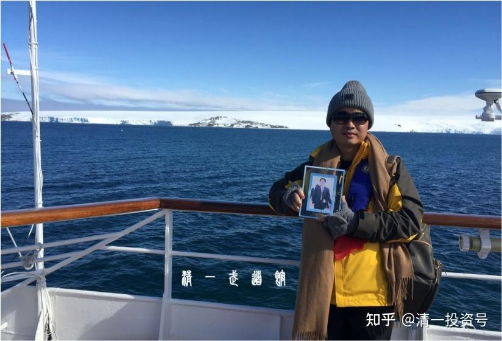

[原雪球专栏](https://zhuanlan.zhihu.com/p/565458966/edit)[139篇.董事长的持家之道](http://link.zhihu.com/?target=https%3A//xueqiu.com/9310099567/176690678)

清一山长 2021年4月9日

**[走进武道馆（7）：我的父亲——清明有感](https://zhuanlan.zhihu.com/p/363310575)李总在[清一武道馆](https://www.zhihu.com/people/mkaga)分享文章，我认为很有价值：有心人可以看看。**

知乎**[网页链接](https://www.zhihu.com/people/mkaga)：[https://zhuanlan.zhihu.com/p/363310575](https://zhuanlan.zhihu.com/p/363310575)**

这些分享很有价值，“**勤有功，戏无益**”。**中国的娱乐文化，会害死下一代的。家长以为对孩子好，就是供他好好的吃喝玩乐，实在是愚昧无知！**

天天强调孩子：“**长到18岁，就要自己养活自己了。**”孩子只好天天提升能力，自然就教育好了。如果一只母猫，一直不断地给小猫喂奶，喂食物，我认为这只小猫愿意自己去捕猎的话，几乎是要有“圣猫”的道德水准才行。

母豹子等孩子长到两岁左右，就会给小豹猎取最后一只羚羊。小豹高高兴兴地吃着，母豹就自己消失了，再也不回来。小豹在原地苦等母亲多日不来，饿得只好自己去打猎，吃腐尸、抓老鼠等。大约只有50%的小豹子能够适应过来，活下来，其中一半会中途死掉。这就是现实！

我在泰国，家里院子有一只母猫出没，四年来，看它总共生过10只左右小猫。这些小猫都是长大了，就自己谋取生路去了，死活自己负责。

中国的家长，从小不教孩子谋生，只教孩子享受，这是把孩子往死路上引！

在火车上，不教孩子读书，长见识，只教孩子玩游戏、追剧，就是往死路上引导。

我家的孩子，我天天要追她：你今天学了什么本事？她还每天要像工人一样干活，这几天在铺路，其他时间用来学习。她的学习，不是为了拿成绩，而是为了像父亲一样，长大后靠讲课就能过生活，这就是培养本事。

如果家长天天问：今天你开心吗？开心就好！看起来像是好父母，其实是坏父母。想让自己的孩子将来被很现实的社会虐待死吗？这样培养出来的孩子，就是感觉型的，认为天天开心就好。**我培养的是目标型——完成任务才是好！**

我相信绝对没有一个老板，每天下班的时候看到员工，只会问：“今天你上班开心吗？”

我相信毫无例外，真正的老板，要问员工的只有一句话：“今天的任务干完没有？”

如果你的孩子将来想要走向社会，干嘛不从小这样问她：**“你今天的任务完成了没有？**”这样，她**未来的适应力才会很强。**

我相信，**我的经济实力，是中国只有不到1%的家庭才能达到的水平**。要供养我的孩子一生吃喝玩乐，钱是够用了。但是，**我的孩子，都要从打工开始，从小训练和教育**。因为，**她的人生，不是来跟我享受以及吃喝玩乐的，她是来做她喜欢的事的。从小培养她做事的能力，就是父母对她最大的恩宠。**

你家的孩子，难道是皇子？富可敌国？你就直接从吃喝玩乐、享受开始培养孩子了？好愚昧的家长！

