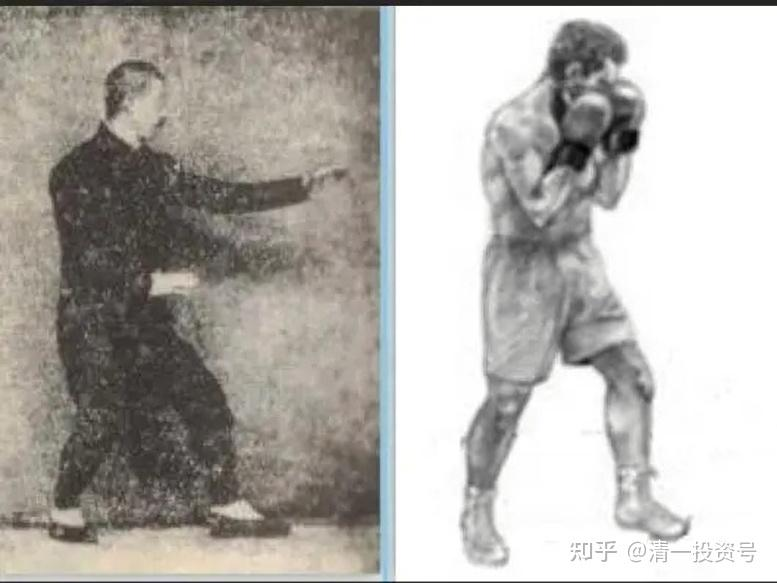

[原雪球专栏](https://zhuanlan.zhihu.com/p/566744903/edit)**[140篇.实战太极与现代格斗之谜二：防守技术](http://link.zhihu.com/?target=https%3A//xueqiu.com/9310099567/176756343)**

清一山长2021年4月10日

**有了力量，这是基础。还要练出进攻的技术，以及防守的技术，三者合一，才能上擂台。**

**这里，我先略过“进攻技术”，专讲防守技术。我的队员，是要先训练防守，基本过关后，再开始训练“攻击技术”。**

现代格斗的防守技术，站立式格斗，以拳击为代表，它的防守技术，是非常成熟的。

**首先是固定防守技术——抱架技术**：拳击的抱架，是遇到可能的进攻时，双臂紧紧地贴紧自己面部，利用拳套的面积，正面形成一个“盾牌”，让对手打不进来。如果拳手死命抱住自己面部，不还手，就没有啥漏洞（因为其他暴露的部位属于禁止击打位置），他可以用步伐拉开距离，避免追击。所以拳击手的步伐是非常灵活的。很多拳手对这种严密的抱架防守，其实是没啥脾气的。双方如果技术相当，反应得当，很难撕开这种抱架，实施有效打击。所以，这是拳击手在被攻击的时候，主要的防守方式。挨打完后，抽冷子赶快打两拳反击。所以，一般人还真不好对付这种抱架，采用**“一次攻击”、“直接攻击”**法的话，是不好破的。

外家拳，全都是**“一次攻击法”**（这个概念以后讲太极的“**二次攻击法**”的时候再讲），他们有效的攻击路线，就是一条直线，如果这条线被对手抱架挡住了，就无法攻击得手。就只能用步法调整角度，设法找到对手的空挡。或者趁对方攻击的时候，还没有恢复抱架的时候，进行攻击。就形成了双方你打我一拳，我也还你一拳的局面。互相拼体力，比赛挨打的忍耐力。

**传武武术**，基本上没有这个概念（抱架被动防守），因为传武的时代，是没有竞技武术的。**双方一旦接触，考虑的是如何最快速度把对方干掉。**没有可能像拳击这个样子，双方慢慢地按照格斗规则来打。你抱住头面，我就攻击其他虚弱部位。所以，我们只能用传武的思维模式来训练，补充太极的擂台防守技术。

不能去学拳击，必须是一种再创造。要不就是跟随模仿现代格斗技术了。如陈家沟人一样。麻烦就是：去模仿现代格斗，陈家太极咋卖钱？所以这个矛盾很大。我猜陈家沟人，不是不想做这件事情（练出能实战的真太极），而是实在不知道咋做，不知道练的方向。不然，陈家沟练出了真太极，这个拿来可以换多少个亿呀？所以，陈家沟一定很注意去发掘有这种格斗技术的全国传武人才，拿来训练自己的弟子。利益相关，不得不做。因此，我一直观察陈家拳的发展，可一直没发现他们用真正的太极技术来打格斗擂台。就算是宣传的某“陈氏太极格斗第一人”，其实是**踢拳道**出身的，不是太极，发力技术与外家拳完全一致。这个情况，基本上就说明：在中国，已经没有人会太极格斗技术了[捂脸]。

所以，现在没有练过这种抱架技术的，练传武的人，上了擂台，根本就没啥防守意识。要么就抢着出手，一旦打不中对方，或者对方一还手，就只能挨打了。因此证明：很多传武人，是没有“防守技术”这种想法的。传武人成天练拳，都是想如何打对方，而不是“如何挨打”。甚至只是想招式，练发力的人都很少。

**我教学生，是先从“挨打”开始。**所以上篇文章，我说：你们学员，可以来进攻我们的女队员。我们女生纯防守，不打你，看你的进攻，有无机会打到她们。你们这些如果只是业余练拳的话，即使对方只防守，战斗力明显降级，你们想要进行有效打击，也难度不小。基本上是打了白打，还累个半死。

**太极拳的防守式**，就不叫“抱架”了。主要是拳击，现代格斗才“抱架”。**太极是“抱势”**。张三丰拳经云：“**开合按势怀中抱**”，就是这个防守式，拳经云：**“开合按势怀中抱，七星势视如车轮，柔而不刚。彼不动，己不动，彼微动，而己意先动。由脚而腿，由腿而身，如练一气。”**

清一武道馆的学生们场上格斗之前的准备架势，就是两手抬起来，双掌相对，前手位置大约是口鼻的高度，后手在胸部位置，随时可以上下拨动。呈现“开合”之势——只要双方一接手，双手就变开合两势，打出两个劲来。一开劲，再接一合劲，都是旋转劲，类似于摆拳，但动作像是直拳，可以破掉对方的进攻，同时还可以直接攻击。

**凡是真太极格斗，一出手就是两下，双手就是四下，身法是一开一合。**不是如拳击一样，一拳一拳的傻打。我听说某民国时期的武当剑高手，号称武当剑仙的李景林，跟人比剑术，每次都是一击两落点。别人不懂为啥这样，我知道就是“阴阳开合手”。出剑的时候，劲力是一阴，一阳！这种剑，已得武当剑之真传。据说他出手极快，15步内，用枪都没他快。刚把枪抬起来，就被他的剑打掉了（所以，别以为武当的太极拳、太极剑，是你们看到的套路表演一样，慢悠悠的，其实实战时，真的快极了）。真练出来的人来看现代搏击，我常常觉得：好慢呀！这能打到人吗？其实大多数情况下，他们也真的打不上对手，大量的出空拳，场上浪费大量的体能。**太极拳的要求，是“打不到不打，打不重不打”**，下一句话是**“打不死不打”**。绝不轻易出手，一出手就是排山倒海地打过去。

上面这幅图像，就是传武和拳击抱架的区别。上图是形意的拳式。清一太极，如果用于跟拳击手作战，两手的位置都要更高一些。前手口鼻部，后手位置比图中的也要高一些，大约胸部以上的位置。不过图中这是左架，我们的格斗式是右架。如果用于搏击、MMA、UFC等，格斗式双手都会更低一些，更接近图中的姿势。因为要防鞭腿和下盘攻击。拳击基本不考虑这些中下盘的攻击，所以双手会抬得更高一些。

两大拳派的姿势不同，就是两大拳派的攻防逻辑和原则不同。拳击是抱住自己的关键部位防守——头部，让对方无法进攻。然后随时准备出手攻击。

按照拳击的观点，来看传武武术的抱架，就是一个笑话。首先是前手放出去太长了，不利于回手实施攻击。而且双手都没有护住头部，很容易遭到快拳的攻击。其实雷雷就是站了这个势子，对方闪开正面，从侧面一下就钻上他的面部攻击了。因为他的步子很死，身子转动不灵。手只是摆动作，放在这里，不知道是咋用的[捂脸]。

太极拳这种**前手置前的技术**，要求并不是简单的防守，而是**抢攻——“以攻对攻”。**当对手进攻的同时，就抢先进攻。**武当拳经云：“彼不动，我不动。彼若动，我先动！后发先至。”**如果不能实现这些目标，这种动作就是找抽的。

为啥**武当拳能够做到“后发先至”？奥秘**就是两个。

**第一是前手大幅伸向前方，近乎伸直（似直非直），离对方的头部距离，比对手用拳击抱架，离我方的头部距离更近，所以能够后发先至**。当然，这**要求拳手必须要有从地面足弓发力的技术**，这样**才能不用收回手，直接就出手攻击，打出力量来。**没练成这种功夫的，遇到攻击，想还手，需要先回手，再出手——显然慢了。西方拳击手都知道这一点，所以会把双拳紧贴自己面部，而不是伸出来。就是为了防守后，以最快速度，从防守变成攻击！

**第二个要点，就是必须练成“随动”的反应能力，就是对方一动，自己马上就跟着反应，随动进攻。**反应慢了，怎么练招都没用。这一点，需要经常的双人格斗练习，一攻一守，练习随动技术。没练过的，肯定反应不过来。就像雷雷一样傻站着挨打了。

既然格斗太极前手拳的任务，是“抢攻”，身子要求在错开对方攻击线路，从两侧抢攻。这正是对方的弱点所在。此时，自己头面部的防守任务，就交给后手拳了——要求在前手拳抢攻的同时，作出面部防守的动作，封住对方的攻击手。或者守住面部，不被对手攻击。这个动作，是用双手的“开合劲”来配合完成的。攻防同时完成，同时用力。这对于外家拳来说，又是做不到的。因为他们是左右手轮换发力，要同时发力，实在是不可能做出来。不信你们自己试试看。你们大约只能双手同时前推，同时后退。能否做到左右手，不同方向，同时发力？上下左右变化？

**太极防守式**还有一大要点，就是**要做到“拳背防身”。**用刀的人，知道要“刀背藏身”的道理。因为刀锋所向，是我锋锐之兵，敌人是不可能从这个方向来近身攻击的，反而要躲开。所以，**只要把身子藏在刀背，就是很安全的，这是用刀的奥秘**。当然，**要在运动中不断藏身刀后，也是一个技术活**。需要很好的练习才能实现。**单重的武当剑**，也是一样的道理：**身体要害，都躲在剑行进路线的后面，永远用锋锐对着敌人**。这说起来简单，做起来难，除非你站着不动。一动，就要武术的技巧了。

太极格斗，就是要**“拳背藏身”**，**在攻防动作中，随时把身子、头部，要藏到发起进攻的拳头背后**，不能放在中间，给别人瞄准击打。我们变招的同时，也同时变身、晃身。这样我们头部的安全度就最高。如果是右手置前，脑袋平时是放到右拳后方的，对方从正面，是无法瞄准和攻击的。对方如果左式前手对我右拳，“火力强度”也是对方的弱项，攻击力不足。我方可以“硬打硬进无遮拦”，像坦克一样推进。拳击手唯一的攻击点，是从我的左方，用摆拳、直拳攻击。此时我方应该向右倾斜一点，快速地前进小半步，一个小寸步。在左手封住自己头部的同时，右手直接攻击对方头胸部。如果对方是试图用左式的右手重拳打我中部的，此时他们的脑袋、中线，正好暴露在我右拳的攻击范围内，形成一个正面的迎击点。这是最佳的打击时刻，可以一个重击就结束战斗。左手在保护右手的攻击防守任务完成后，还可以继续向前攻击，完成第二下后手攻击的任务，由于加上了摆动发力，拳力更强，速度更快。**关键是心态上要沉着、勇敢，在对方攻击时不躲不闪**，直接向前一个弹身发力就完了。站在原地防守，是最笨的，退后就更糟糕。会让敌人步步紧逼的，失去重心就只能被动挨打。所以，**最佳攻击时机，就是在对方攻击的时候，错位反攻击，就是武当派的最大心要。**

**防守技术二：移动防守技术！**

在原地抗着被打，当盾牌，只是不得已的方式，但拳击却不得不这样做。为啥？因为拳击的技术，是双腿支撑发力的，移动中无法发力，一旦用移动防守技术，可能会被追着打，自己却没有机会打对方。所以，拳击格斗，发展出了一种特别的技术：摇闪技术，来对攻击的拳进行移动防守。

这种技术，做得最好的，应该是这个视频了：

[https://www.bilibili.com/video/BV1mE411r714](http://link.zhihu.com/?target=https%3A//www.bilibili.com/video/BV1mE411r714)

B站[网页链接](http://link.zhihu.com/?target=https%3A//www.bilibili.com/video/av71601201)：阿瓦雷兹顶级的头部躲闪动作

[https://www.bilibili.com/video/BV1mz4y127Mz](http://link.zhihu.com/?target=https%3A//www.bilibili.com/video/BV1mz4y127Mz)

B站[网页链接](http://link.zhihu.com/?target=https%3A//www.bilibili.com/video/av586786797/)：阿瓦雷兹躲闪空击训练

从这个实战视频，以及后面的训练视频中，我们发现拳击和现代格斗，由于采用支撑式发力，要在靠近对方，站稳之后，才能发力击打。所以，面对对方攻击，如果用步伐躲开了，自己也无法打对方。所以就站在原地，用身子和头部目标的移动来躲避攻击。然后找机会躲过攻击后反攻。这个视频，充分说明了我上文中说的**现代格斗的发力原理：用腰胯支持发力，腰部以上，要柔软如棉。腰以下的支撑要稳定，力量强。拳击手用战绳来练，就是典型的支撑发力模式。我们也练战绳，但使用方式完全不同——因为要服务不同的发力要求**。具体就不说了，这是本派的“秘密功法”[大笑]。

同时，你们也看见了视频中：他躲闪的时候，是无法发拳还击的。而且，你一定观察到了，对手攻击的时候，空门大开。正好是攻击的最佳时刻！可是，由于拳击手忙于躲闪，是无法出手的，所以双方相安无事。一个负责攻，一个负责躲，各忙各的。这种时刻，对手攻击的时刻，强调“攻防合一”的太极，正好是出击时间。

通过视频，你也看到了，拳击的攻击，是有一定节奏的。左右，左右的轮流打，高手，随动能力好，反应好的人，就能找到攻击中的缝隙，躲开攻击。这个视频中，你看到他完美地躲开了对手一系列的连续攻击，并找到机会反攻成功。练太极的，也必须了解这种特点——知道对方攻击的时候，是防守最弱的时候。

您会不会想：如果能够在躲闪的同时进攻，不就很完美了吗？也不用这么危险地躲来躲去的。

是的，拳击也知道这么做更好。可是他们就是做不到。因为**他们的发力技术，主要靠强劲的中盘支撑，重心是落在双腿中间，不移动的**。**不支持这种边躲边打的技术。只有把发力点降低到地面，足弓位置，单重发力，才能实现这种移动中的攻击，以及在接手防守的时刻同时攻击。这，就是真太极的格斗防守模式。**

**太极要求拳手，用步子的移动，带动身体的移动来躲开对手的正面直线攻击。**在拳击手出击的一条直线上，对方集中了全部的优势兵力，被击中可能会被KO的。所以我们要尽量避开这条攻击线路。只有练过的高手，才能找到对手的“攻击路径”，并不断移动躲开对手的攻击路径。拳击手在对阵的时候，会不断地移动位置，就是尽量不给对方有瞄准和出拳的机会。不像雷雷，徐某东在移动，试探的时候，他居然没啥反应，傻站着不动。一看就知道是完全不懂基本的格斗常识，身体对可能的攻击毫无反应，当然要遭遇重击了。

高手可以在对手面前，当对手刚瞄准目标想攻击时，就移动头部换位，对手不得不重新锁定瞄准，你不断换位，对方就不断重新瞄准——结果对手就一直无法出拳。这叫“晃法”。对手多次无法瞄准后，就会松懈，此时你突然发动攻击，往往很容易击中对方。传武和太极，非常重视这个技术。

我有时开弟子们玩笑，让他们攻击我，我双手不去保护头部，用晃法站在他们面前。结果他们半天都不出拳，让旁观者莫名其妙。其实就是让人无法瞄准。但换个人来学我乱晃，就毫无用处，弟子们可以轻易找到出手的机会，直接就打上去了。

**太极可怕之处在于：在身形躲闪，晃动的过程中，是可以随时发力攻击的。**因为太极在这个移动过程中，重心是从一条腿，移动到另一条腿的。这个移动过程中，外家拳是无法发力的，这是他们最虚弱的时候。但是真太极，发展出了一整套的“单腿发力技术”，可以在移动中的任何支点上发力，不必等到重心完全移动到位才发力。当然，也可以双支点发力。这很难练，但练出来了，就拥有了完全不一样的攻防技术。高级的太极，还可以无支点发力，就是空中发力。难度当然更高，其实也不神奇。

我给弟子们看过视频，猴子就可以空中发力，这是利用弹身子来发力的。所以只有支点也可以发力。这样，就与现代格斗技术相比，增加了很多的“火力点”，随时发力。这个技术，可以在地上技术中使用出来。因为进入地面战之后，外家拳习惯的发力支点没了，所以双方都无法用拳攻击对方，就算打也打不出力量来。我跟弟子们试过：就算躺在地上，手被压住，依然可以用太极力发出重拳来，把对手打翻。因为太极是身子躺在地上，也可以利用弹动发力技术，把力量传递到手上的（一般人做不到这一点），所以很多人比较怕地面战。

太极这种力量也很好理解：你能在地上按住一条大鱼吗？没可能吧？因为鱼就是用身体发力的。你按什么地方，都按不住它。太极并不神奇，就是要练出鱼一样的，身体随意弹动的功夫来。我们将在太极打赢拳击后，再专门来研究地面战的太极技术，这样才能去打MMA，甚至UFC。

拳经《九要论》中，要求练内外三合。其中一个要点，就是**“手与足合”**。当脚步落地的这一刻，手上的力量也同步到位。而不是脚落下后，站稳，手再打出去。虽然高手可以把这个时差练到极短，一般人看不出来，也抓不住时机，觉得几乎是“同时”了，但依然有时差。**太极拳，就可以做到“没有时差”，让脚步落地和拳击发力同时到位**，这就**超越了现代格斗的发力技术，可以在移动中打出重拳来。**

**太极拳手们，天天练拳，练单招，练身体，就是练这个“同步到位”**，**仔细地校准自己的脚步和身上的协调度，学会发力协调的整体劲**。拳经云：**“上下相合人难进”**。就是指练到这个水平（上下相合），别人是进不了身的。这就是最佳的太极防守动作。

而且**太极要求是“一步一锤”**，就是**每换步一次，就发出一拳。**高手更甚，走一步，可以发出两锤、三锤。我现在可以一步两锤，如果用上双手发力，就可以走一步，打出四拳来。此时手法是一开一合，身形是一高一低。但步子只有一个。这就超越了绝大多数人的理解。一步之间的攻击速度和转换之快，是一般人难以想象的。眼前一花，人就被打了N拳。所以，一旦出手，一般人没有防守的机会。拳击手由于没有见过这种技术，没有专门的应对手法，面对这种攻击，上述的闪躲高手，不但躲不掉太极拳手的攻击，反而会直接撞到太极拳手的重拳上。而且，我们不会给他机会回击的，只会连续的双拳攻击，直到他被击倒或者逃开掉为止。

**太极防守**，还有一个绝活就是**“封闭”。**利用对方攻击的时候，向前半步，与对手搭上手，粘住对方的手臂（制其中节）。由于外家拳手，是必须在手臂“空”的状态下（不受约束的情况下），转动身体，才能发力攻击的。如果手上被太极拳手搭上了，就算是很小的力量，也能让对方无法继续攻击。**对方如果想松开后，撤手再攻击，绝对会暴露面部关键部位，你一觉察到对方松手，就马上实施攻击，一定会抢先击中对方要害，这是要点。**由于练拳的人都知道这一点，所以一旦手臂被粘上，本能地会使劲去抵抗，不敢松手。由于太极用身子发力，还会化劲，你用手上的力量，是顶不住的。所以，就会被慢慢地压下来，然后被打！在外人看起来，就是怎么这人躲也不躲，打也不打，傻傻的，看着拳头慢慢地攻上来，以为是演练着玩的。

我跟弟子们这样玩的时候，就有人说：肯定是配合的。其实是对方的劲，已经被完全的控制住，身子、手上，都无法正常地移动发力。而太极拳手，却可以利用自己身体的重心移动，来催动发力。手贴在对方身上，依然可以发出猛烈的**“爆炸力”**，造成杀伤性的攻击。

所以，**太极防守，并不是设法保持跟对手的安全距离，而是尽量地接近对手，“贴住对手”，进入对方无法发力的死角位置。**这就是太极拳的特有战法，一旦进入所谓的“内围作战”阶段，外家拳就完全处于被动挨打的境地，因为太极会让他们站不稳，就无法发挥自己的优势，只能任人随便打了。所以，**测试一个人太极水平的高低，就是看他是否能接近对方，贴身，控制住对方的劲，甚至绕到对方身后**。这个站位，完全可以让对手抓狂。因为他完全无法应对，生死完全交给对手掌控了。

多年前，某武师号称可以教我的学生一年就击败我，自信满满。我说，三年内能击败我，都算他带弟子很了不起了。一年内能够击败我带的学生，就算他符合要求。我给他的条件，一年相当于可以获得超过百万的收入。他很想得到这个机会。可他太看不起我的功夫，就说，要击败我教的学生，他只要教几个月就可以了。我的已经学武一年的学生，拿给他教一年，击败我是没问题的。因为我跟这武师对阵，连一招都接不住，一接手就失去重心。他就是我上文中所说的，功夫很好，但不教给别人，也不让别人知道他发力位置的武师。当时，我觉得：我的确是打不赢他，但我的学生，想要一年击败我，也没这可能。业余拳手，能够击败我的人也不多的。就跟他说：“跟你过招，我当然完全不是对手。但你没看到我的弟子跟我的真实对战水平，别对她们的能力过于高估了。”我就让两个弟子戴上拳套，全力来攻击我，让他了解弟子们与我的实力差距，真想击败我，到底需要多久？

我采用的技术，就是上面的说的技术。两个弟子拼尽全力，也打不中我，一出手，我就贴住进攻的手臂，一闪身进去内圈了。然后在对手身后绕一圈，手在其头部、脖子上放一下，又走开。两弟子打来打去，出了很多拳，一拳都没有打中我。打完了，我问这师傅？他教一年，能打赢我吗？结果此君大笑一阵，说：“半年！半年就够了。”我觉得，他眼力有问题吧？现在回头想想，其实可能就是吹吹牛的，没当真。也可能是不懂太极功夫，虽然他的格斗水平很高（一些搏击冠军，都没法跟他过上一招的）。从他的回答来看，真没看出其中的奥秘。我示范的这种功夫，虽然没有发力，但要做出来极难，只有比对方水平高很多，速度反应都快很多，才能够这样游刃有余的近身、离身。如果双方的功夫接近，就只能拼功力了，发力动作就难免了。

这段视频，后来播放给我一个朋友看，某省级非物质文化武术门派掌门人。一看，就骂我：“你对弟子下手太狠毒了，招招致命。”让他提心吊胆，生怕我伤了人。的确，我示范出来的身法、步法、手法，如果想取两个弟子的命，随时可以做到。但我根本就没做发力。只是手比划一下。我问这个师父（我也打不赢他的，别人毕竟是专业的实战派武师）。我问他，我把弟子交给他教，多久能够击败我？他摇摇头，说：“你已经练到了化打合一，怎么跟你打？”意思就是他没办法教出来！

说半年就能击败我的武师，不知咋样，就是没看明白我的功夫，认为我就是玩游戏吧！也可能是为了拿到好处，先乱承诺下来，以后再找理由说？不知道。后来我的两个弟子问他，我的功夫到底怎样？他说就是健身、养身的吧！怪不得，他有自信半年就击败我。以为我的功夫就是雷雷、马保国这种“太极大师”，的确只要认真训练了半年的专业格斗手，就可以收拾他们了。说我的拳是健身的，这种口气，弄得两弟子回来跟我说，这师傅就是没看懂我的功夫，眼光不行。两弟子是知道我实力的，两人已经全力出击，却拿我毫无办法，而且是多次打过，验证过的，也知道我一旦发力是啥状况。发力进攻我的时候，手臂在我的格挡中，经常会被我看起来轻飘飘的接手弄到青紫。所以怀疑这师傅是不是有问题？我说：我打不赢他是事实，我们大打过的。他看不懂，可能是不懂太极，隔行如隔山吧？（其实他是练武当派的，算是同门。两种拳，原理是一致的。他看不懂别人的拳，也教不了拳。我的门派，可以不练拳击，但必须懂拳击，不然怎么打？）。

好了，这就是知己知彼。懂得现代格斗、拳击的人不少，我说的拳击防守技术有啥不对的，欢迎指正！

以为懂太极的就算了，你真懂，早就练出来了[笑]！

（以下内容为编者收录）

**评论回复：**

**罗米1:回复清一山长：**

山长老师讲的太精彩了，脑洞大开。“刀背藏身”以前听过，“拳背藏身”第一次听说。**真太极是攻防合一的功夫，防中有进攻，攻中有防**。老师讲到双手无法按住在地上的鱼，前几天捕鱼的时候我是碰到这种情况，原来鱼用了全身的弹劲，才不好控制，可想而知，如果人学会全身的弹劲，人的双手哪能控制得住。所以真太极实在是高，从另外一个维度和现代格斗PK，怪不得清一武道馆的学生都对拿世界冠军自信满满，是山长把实现冠军的路讲得明明白白，也自己能做出来了。虽然山长很谦虚说自己的武功刚刚入门，可那是高手的入门，普通人或者业余武术很难接近的水平。

**清一山长**[2021-04-10 12:08](http://link.zhihu.com/?target=https%3A//xueqiu.com/9310099567/176773539)**回复罗米1:**

**对懂的人来说，价值万金。对不懂的人来说，一钱不值[大笑]。**

**王华_雪_球回复清一山长：**

国之利器，不可示与人。山长如此早就将秘密公开解析，估计是现代职业格斗人士，就算是知晓，也无法模仿破解？之前是马保国说对手不讲武德，这下估计对手无法将这四个字套用到将来KO他们的武道馆学员这边了：击败你的秘密，我们师父早就告诉给你们了[笑]。

**清一山长[2021-04-11 13:59](http://link.zhihu.com/?target=https%3A//xueqiu.com/9310099567/176815346)回复王华_雪_球：**

**武功其实没啥秘密的，就是自己只要懂得基本的原则，自己去练出来**。拳击还有啥秘密？练出来你就拿每场千万的奖金。

泰拳更是这样：就是**死练，苦练，练到别人不能忍受，你就是高手。**看播求的练拳视频，真苦，我们去真受不了，所以他当拳王。

**太极也一样，知道原则、方法，还要苦练出来的。太极更难的就是要理解的武道更多，所以粗人没法练，师父教都听不懂。**

明琪不就自己说了：几年前，听我讲拳理，他就是听不懂，连女生都比他练得好。他是现在才听得懂我讲的话了，还不一定做得出来。

所以，**没文化的人，是练不出真太极的。但可以练拳击和泰拳。**

**但有文化也不一定能练出来，得像练拳击和泰拳一样苦练才行。**

所以，**太极注定是寂寞的拳种。要求文武双全才有可能练出来。**

你们看到的**全民太极、万人太极，练起来轻松舒服的太极，注定只是表演罢了。不是真太极！**

**清一山长[2021-04-11 14:33](http://link.zhihu.com/?target=https%3A//xueqiu.com/9310099567/176816561)回复王华_雪_球：**

“现代职业格斗人士，就算是知晓，也无法模仿破解？”

现在的格斗界人士，基本的发力习惯已经固定，是改不过来了。可以借鉴一下。也许可以想出一些应对和破解的方式？不知道。但**练过外家拳的人，练内家拳真心不容易，完全改掉原来的习惯太难。这种习惯，经过每天千次的重复，已经变成了神经系统的一部分。改不掉了。只可以改良，提高一些技术，但不能大成。**

**广东道法自然回复清一山长：**

山长所说的太极临战架势与我们武当赵堡太极拳的站立格斗架势比较类似，这一式我们拳架里称为“金刚三大对”，按我们师叔的说法，这个式是整套拳的母体架势。

**清一山长[2021-04-11 16:11](http://link.zhihu.com/?target=https%3A//xueqiu.com/9310099567/176820265)回复广东道法自然：**

您说这个式子，是赵堡起手式，的确很重要。格斗的攻守兼备的动作。不过，我猜你们都不知道用法吧？不是你们老师演练给你们看的：从腰部抬起双手，先接住地方的来拳，化力，拉回来，转过弯，再打出去。或者憋住对方的胳臂，拿住对方缠裹，控住小臂，脚下上步，或者踢一个低踢，破坏对方重心，或者踢裆……等。这是不懂格斗的人，教出来的“金刚三大对”，属于书呆子型的功夫，实战中根本用不上。**真正的实战，是要求你这一招，上面一系列的变式，你只能用半秒钟，至少不超过一秒钟，把全部变化都打出来，走完劲（此招全部，至少有八次变劲），让对方一出手打你，就莫名其妙的仰面倒下，甚至你只用半招就赢了**。剩下的是白送的半招，就是万一对方防住了你前半招，居然没有仰面倒下，你就让他往前栽倒，实现“犯者立扑”。右脚踢出的这一脚，其实是身子后侧中打出去的，是在手上已经控住对方身体的时候，破坏对方下盘稳定的绝杀招，这招，需要很强的桩功，单腿发力的技术，才能实现这样的精妙攻击。这才是真正的**“金刚三大对”**，才能与外家拳格斗并取胜！

**原始的赵堡太极，肯定是能实战的。**现在传下来的老架、小架，很多都是有实战价值的架势。但是，由于赵堡拳，好像**没有人去认真钻研和练习发力技术，拳师们都在谈练拳时候的松、软、慢、绵柔，都不知道咋发力了。所以，这些拳架子，就都是花架子了。后人们都当体操来练，师父也不知道咋打**，就忽悠后人：“拳打千边理自知！”让人傻傻地练套路，我看练千遍的人很多，但知道我上述的“理”的人有多少？我说出来，你们都不知道吧？

其实，太极讲松软，真的没有错。**这是练家子，已经练完了发力，懂得发力的人，自然成天只练松软，让发力可以更透、更快。**我现在就只练松软，看起来就像无害的舞蹈。但你学我这样练，就一辈子练不出了。**现代练太极的人，从来没练过发力技术，就直接练松软，所以练成了骗子拳。**

赵堡有一派，我看还在练发力。但练的人，似乎也不知道咋用吧？就是忽雷架，是练抖身劲的。我觉得这套路也许还是有点价值的。我以为他们既然会发力，应该会格斗。不过听写忽雷架书籍的赵堡研究者说，这些忽雷派的拳师，也无法上擂台真打实战，都不知咋用这些套路。日常互相推手，派内玩玩还可以。实战的话，没听说赵堡谁是真打实练的。而且，现在赵堡被陈家沟的“正宗太极”冲击很大，已经没啥影响力了。

两年前，我在昆明上江湖课，学员找了个练赵堡拳的“知名大师”来，上过中央台的，据说是实战派的太极大师，跟散打队员打过的人，据说练到了“全身透空”的地步。我的学员有拜他为师的，就请来我这里，说是跟我交流，估计是学员们不怀好意，想看我们打一场热闹架。我客客气气地接待了他，还带他去西山玩。因为这人说他练的就是“全身透空，西山悬磬”派的。我看这人在山上走路的样子，就怀疑这人的功夫是假的。我们是从后山上去的，山上路险，没有正常的路。大石头很多，看他走得战战巍巍的，很不稳，走出一身汗。我给学员示范了一手走石头山坡的身法和步法，轻轻松松的，如履平地。无论高低起伏。我身形都一样很稳。我还故意做了几个快走，急停，跳跃的步子，身法如鸟转换。学员一看，就知道不是一回事了。我也年龄一大把了，快60的人了，可以比年轻人走得更轻松。这人年龄略大一点，就底盘功夫如此差劲，还练啥高级功夫？就是一骗子。这人后来果然闹了大笑话，就灰溜溜地走了。我回去后，就再也不见他了，没空跟江湖骗子玩的。

**现在练太极的，恐怕真没几个真练的了。**很遗憾。孙、吴、陈、杨、武，历史上都有高手。现在，都只剩全国“太极大师”了[捂脸]。

算算账，就知道现在太极没真的。因为冬瓜一直叫嚣打太极，谁如果真有实力，跑去打了冬瓜，不仅仅为太极门出了口气，而且名利双收。多少千万、亿万的钱都要滚进来的。每一个江湖大师们，真有实力的人，想要扬名立万的人，不去找冬瓜扬名，就太傻了。跟钱，跟名过不去吗？

我等了三年，一个都没瞧见。我知道：中国太极无人了！[捂脸]

参考链接：

[清一投资号：实战太极与现代格斗之谜一：发力技术](https://zhuanlan.zhihu.com/p/567532235)（专栏文）

[清一投资号：实战太极与传武高级黑！是实话，可真相是这样吗？](https://zhuanlan.zhihu.com/p/563538316)（专栏文）

[清一投资号：真被“武术界、国术界”给恶心到了!](https://zhuanlan.zhihu.com/p/563695431)（专栏文）

[清一投资号：11篇.武道论之一：武林遗事](https://zhuanlan.zhihu.com/p/562801583)（整理文）

[清一投资号：14篇.武道论之二：真比武是什么样的？](https://zhuanlan.zhihu.com/p/523056291)（整理文）

[清一投资号：15篇.武道论之三：拜错老师误终身](https://zhuanlan.zhihu.com/p/522738920)（整理文）

[清一投资号：16篇.武道论之四：文武合一，道术合一，不忘初心](https://zhuanlan.zhihu.com/p/522751539)

[清一投资号：17篇.武道论之五：太极的低级、中级、高级境界](https://zhuanlan.zhihu.com/p/522768387)（整理文）

[清一投资号：18篇.武道论之六：武功无秘密唯有苦练](https://zhuanlan.zhihu.com/p/522789501)（整理文）

[清一投资号：26篇.解答大家对真太极的误解](https://zhuanlan.zhihu.com/p/527851327)（整理文）

[清一投资号：33篇.观真太极，现众生相](https://zhuanlan.zhihu.com/p/529770512)（整理文）

[山长 清一：当代传武人画像！传武毁于"传武人“！](https://zhuanlan.zhihu.com/p/561047657)

[山长 清一：中国百年来“传武人”的丑陋暴露无遗](https://zhuanlan.zhihu.com/p/467233067)

[山长 清一：中华武林和泰拳交战的历史记录](https://zhuanlan.zhihu.com/p/495443356)

[山长 清一：泰拳500年不败神话，正被清一太极终结](https://zhuanlan.zhihu.com/p/488027181)（第一、二场）

[山长 清一：昨天决战结果：拿了一条金腰带；另一条泰国人死活不给](https://zhuanlan.zhihu.com/p/505089200)（第三、四场）

[山长 清一：太极征泰第五战视频及点评：太极和泰拳的不同](https://zhuanlan.zhihu.com/p/533876532)

[山长 清一：太极征泰第6，7，8场战报：明晓一对二获胜](https://zhuanlan.zhihu.com/p/537753601)

[山长 清一：清一木兰第九战：明晓越级挑战50公斤级对手](https://zhuanlan.zhihu.com/p/544183017)

[山长 清一：太极征泰第10场比赛：木兰明晓 VS 帕卡（pancake）](https://zhuanlan.zhihu.com/p/555150182)

[山长 清一：太极征泰第11战：木兰佳惠第5战 KO胜](https://zhuanlan.zhihu.com/p/557345876)

[山长 清一：太极征泰第12战：明晓第七战VS男职业拳手](https://zhuanlan.zhihu.com/p/557820557)

[山长 清一：太极征泰第13场：佳惠第6战 KO胜（最怪异的比赛）](https://zhuanlan.zhihu.com/p/560524655)

[山长 清一：太极征泰第14，第15场比赛！](https://zhuanlan.zhihu.com/p/562359802)

[山长 清一：太极征泰16战：明晓第9战，点数胜。原版无点评](https://www.zhihu.com/zvideo/1552263008361082880)

[山长清一：太极征泰第17战 木兰佳惠二番战KO胜](https://www.zhihu.com/zvideo/1553014525674364928)
