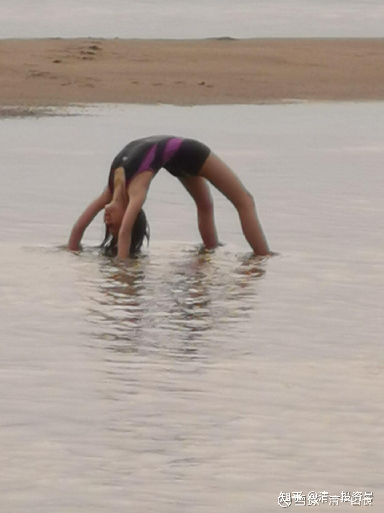

[原雪球专栏](https://zhuanlan.zhihu.com/p/569432171/edit)**[141篇.你家孩子，是第几等人？要用几等的教育适配？](http://link.zhihu.com/?target=https%3A//xueqiu.com/9310099567/176986672)**

清一山长2021年4月13日

人跟人，是不一样的，而且很不一样。如果某些教育专家，装好人告诉你：所有的孩子都是天使，我们要给所有的孩子无尽的爱，家长和教师，就要包容孩子的一切。这种人，不是傻，就是坏！而且坏透了！这是一碗毒鸡汤！

家长如果不认清自己孩子的等级，下等人你当上等人教，期待有上等的结果，最终不气死你才怪。我家小女，是二等人，我认清了这点，不用一等人的标准来要求她，彼此相安无事。因为今日是有一等学生的，如果我用一等学生的标准来要求她，恐怕我们双方都要气死了。

老子把人分为三等：上士、中士和下士。

**“上士闻道，勤而行之”**。就是如果他得到了最好的教育，就特别珍惜，是特别上路的一种人。

**“中士闻道，若即若离”**。就是就算你给了最好的教育，也时好，时不好的，时学，时不学的，需要老师特别地操心、纠偏。这种学生是数量最多的，**帮就有，不帮就没有了**。我建议学堂的老师，重要的是帮助这种学生。

**“下士闻道，大笑之”**。就是你给他最好的教育，他也不好好跟着学，就是喜欢跟你反着干的，玩捣乱，玩逆反的。这种学生，社会上数量也不少。我建议学堂的老师，把这种学生找出来，开除掉。无法开除的（比如学堂教师的孩子），就只好实施“特种新教育”了。

我们分得更细一点，就知道你的孩子的级别，适合上什么学校了。我们把孩子的能力、态度都分为上、中、下三等，就可以看出来结果了。

**第一等**的孩子，是**能力上等级别，态度也上等级别的**。有这种孩子，是家长的福气。这种孩子，无论在体制学校，还是在新教育学校，都是积极努力的好孩子，资质、根器都不错。在体制内，他们可以考上985大学，在今日学堂，他们22岁可以拿到四个大学的毕业文凭，跨越中西，跨越文理，书写不一样的人生。这种一等的孩子，其实上体制，上新教育，结果家长都会满意的。只是读新教育，他们会更出彩一点，更容易成为人上人。

一等的孩子，你要给他买最好的学区房，买了就完成任务了，他会上985的。二等人，可以考上211。其他级别的孩子，三等以及以下的孩子，你给他上最好的学校，都拼不过别人的。买学区房的钱，不如用来做本钱投资，将来每个月的利息，都比他大学毕业的工资更高。

**第二等**的孩子有两种状况：一是**能力上等，但态度中等**；或者是**态度上等，但能力中等**的孩子。这种孩子，要比第一等孩子让人操心很多，老师要随时沟通、引导，不到位就出不来。在体制学校，这种学生，如果家长跟进得好，大约考个211，考上了，结果也一般般，谈不上啥出彩的。差一点的，就只能考上二三流的大学，过着平庸的人生。比如据说有几十万大学生、研究生去当外卖小哥。这种学生，肯定就是态度很好，做事读书都很积极，但能力不太够，也不是最差，有一定的能力，不然也考不上大学和研究生的。但这种孩子，学新教育，就可以获得比去体制内考985大学更好的结果，只是不能“跨学科”，只能专精，走一条路到底，但最终的结果，可以以二流人才的等级，获得体制内一流人才的机会。不过，如果有“能力上等，但态度中等”的第二等人，到了新教育，很可能成为第一等人。因为新教育其实改变不了孩子的能力，这是天生的，但**新教育主要改变孩子的态度**，一旦一些上等能力的学生，改变了态度也成为上等之后，就会突飞猛进，成为第一流的人才。

我的小女，就是这个等级的。她是态度中上，能力中上的孩子。两样都不是顶级的，不太可能通过我改变能力成为顶级，但可以**改变态度**，超过大多数人。我已经很满意了。

**第三等**的孩子，就是**能力中等，态度中等**，随波逐流的人。这种人，在体制学校，基本上是“中下等学生”。由于能力、态度都一般般，他们很容易受到周围的各种诱惑，堕落成为差生。就算送他们去最好的学校，也跟不上最优秀的学生，还会受到心理打击，更容易自暴自弃。家长逼得紧一点，勉强可以考上一个二流或者三流的大学，出来往往也不愿意送外卖，只想在家啃老的一族。统计数字说，30%的大学生毕业后，是全靠啃老生存的，比例相当的大。有些家庭实在太差，被逼到社会上做平庸的工作，这种人，恐怕就基本上是家庭和社会的闲人和废物了。这种人，如果上新教育，可以获得体制一流大学的结果，而且肯定不会啃老，有基本的能力，也有基本的态度，可以自食其力，但无法取得新教育最靓丽的成绩。家长有可能对孩子期待较高，取得中等的成就，愿意自食其力，也很不错了。这种人是最多的，而这种人，是最需要新教育的。没有新教育，这种人就废掉了，一生会活得很压抑，有了新教育，这种人就是社会的有用之才，也可以凭借我们的三语优势，获得海外工作和发展的，堪比体制大学一流学生才能得到的机会，虽然不是杰出之才，但也一生吉祥平安。

**第四等人，态度中等，能力下等**。这种人，只能去打工，不能读书，也不用考啥大学了；读书也读不来的，学点手艺，干点粗活，能够自立就好。体制学校里面，这种人是“差生”，被教师、学生各种鄙视，这种人，基本上都是考不上大学的。考不上还正常的，一部分人被有钱的家长送去国外“假装读大学”，除了花掉大笔钱以外，啥都得不到，回家只能养着；一部分穷人，自生自灭的，就只能去外面打工，勉强度日。这种学生，在新教育，会教他们自食其力，起码身体好，将来打工没啥问题。但在新教育学堂，这种人的教育方式，主要就是做事教育，道德品质教育，不搞其它的精英教育、思维教育，教了也白教的。平时学习，以儒家经典为主，教他们做人做事，但绝对不教考大学的东西，也不教他们三语能力；不能让他们去上大学，虽然国外上个大学，甚至是不错的大学其实很容易，给钱就行；但他们上大学，也学不了啥有价值的东西的，不如专心学做事做人。

**第五等人，**他们不是问题学生，不是无能的人，不是废物，而是毒物！是最难对付、最恐怖的孩子！他们是天生的坏蛋。是能力上等，或者中上等，但是态度品行、德行特别下等，行为恶劣之人。无论家长和老师说什么，多么的循循善诱，苦口婆心，他都听不进去。你善良，他就欺负你；你讲道理，他就胡闹。只有你狠，他才怕你！这种人，在体制内是“坏学生”，体制外，也是坏孩子。在家里，他是让家长头疼、无奈的坏蛋，总是惹是生非，让家长操心着急。这种孩子嘴上会哄你开心，承诺种种，但实际上，从来不会让家长省心，只会让家长越来越抓狂。体制学校中，没有教这种孩子的学校，原来我小时候还有“少管所”，现在似乎没了。这些人，不管教的话，长大走上社会后，就是坏人、流氓、混混、痞子。因为他们有很强的反社会性人格，长大后，能力强，精力旺盛，恐怕什么坏事都可以做，为了自己的一点点利益，可以牺牲别人天大的利益，杀人放火都会干。因为他们根本就没有“尊重别人，尊重自己”的想法。这种人，未来大概率都是归宿去监狱的，当然，很多人会中途死掉，各种作死，就是他们的人生选择。想知道这种人是怎样的？看这个链接吧！“[被未成年用水瓶塞下体后，我的全裸受虐视频在朋友圈疯传](https://zhuanlan.zhihu.com/p/364307494)”[网页链接](http://link.zhihu.com/?target=https%3A//www.sohu.com/a/462535419_121058214)：

[https://mp.weixin.qq.com/s/45LI2NeUMLk-Ku-7Bd83Eg](http://link.zhihu.com/?target=https%3A//mp.weixin.qq.com/s/45LI2NeUMLk-Ku-7Bd83Eg)

今日学堂，现在就有两个这样第五等级的孩子，一男一女，都不到十岁。很不幸，还是今日教师的孩子（如果不是我们教师的孩子，早就赶走回家了）。对他们怎么办？跟班学习吗？他们就是把班级搅乱的高手，让老师抓狂的明星。所以，我们不得不专门为这种孩子，搞了一个“跑步学堂”，用来对治接纳。我告诉带队的教师，处理方式就是军队式、军管式，把他们当敌人看（来捣乱的，不是敌人是啥？），不再给他们讲道理，讲柔情，**只讲事实教育，采用因果教育，**只要他们敢来挑战、胡闹，就坚决的收拾回去。你要恶心我，我就要反过来，把你恶心死，以牙还牙，以眼还眼。

昨天老师反映：这种孩子，看到老师来了，就故意地拿自己的大便来扔了玩，还会故意地站在床上，拉尿在床上。但他绝对不是神经病，就是故意看你老师恶心，他们就开心得要命，看你老师善良，就可劲儿地欺负。所以，我给老师出的主意，就是一定也比他还恶、还厉害。要像监狱学习，警察是怎么对付犯人的，我们就怎么对付。不然，这种孩子，将来走上社会，一定干坏事。（我们对外是不招这种孩子的，避免家长投诉我们欺负孩子。因为**家长只愿意让孩子欺负老师，教师作为社会的弱势群体，是不能回击的。公立的不能，私立的更不能。**所以我们就不对外教育这种孩子，不是不会教，我们自己教师的孩子，当然必须自己管教。别人也没啥好说的。但是，我都是只出主意，不管闲事的，避免惹事[笑]。）

一句话：**你们别以为今日教师的孩子，都是第一等、第二等的，连我的孩子，都不是第一等的，她只是第二等的，我已经很满足了。**现在看，小女虽然是第二等的，但22岁拿四个不同国家的大学文凭，还是没问题，假装像是第一等人的样子，这就是新教育给她的好处和优势。这孩子，**如果去读体制学校，只会是一辈子平庸了，勉强度日罢了**。当然，因为是二等人，去体制上学，也可以养活自己的。只是**在新教育，她得到了我更多的支持和帮助，最终的表现，恐怕体制内的一等人也未必是对手。这就是教育的价值——提升了她的竞争力。**

作为“二等人”的小女，在泰国的一条知名河流——PING河（湄南河）里游戏！

（以下内容为编者收录）

**评论回复：**

**静静投机的小白回复清一山长：**

感恩山长[献花花][献花花][献花花]，我是去年才学习新教育的自觉得水平不行，自己在家教不了八岁的犬子，在家放免费师范班的视频犬子也不大感兴趣，都是三分钟热度[哭泣]。您说的十一岁才报名突破班，我中间这三年应该怎样对孩子进行教育(我也没有信心能有幸进入突破班)？是有机会就报名新教育系列的学堂么？还比如说积极参加某些学堂的夏令营？

**清一山长2021-04-13 21:52回复静静投机的小白:**

“您说的十一岁才报名突破班，我中间这三年应该怎样对孩子进行教育”

示范班学习只有三分钟热度？这样的话，您就别费心了，将来他是考不上突破班的。您的孩子，显然没有到一、二等的孩子，是考不上我们示范班、突破班的。最多考上外围学堂。

**孩子是分等级的。**

**第一等的孩子：**在体制学校学习也很努力，很认真。成绩优秀。在体制教育可以拿到985大学。在新教育，可以22岁拿到四个世界名牌大学的文凭。

**第二等的孩子：**不喜欢体制学校，忍住，混下去。成绩一般。喜欢新教育，成绩上等。22岁可以拿到新教育相当于两个大学毕业的水平。今日学堂，招收学生的最低标准，至少是第二等以上的学生。

**第三等的孩子：**讨厌体制学校，成绩差。但会喜欢上新教育，成绩可以实现中等水平，**可以考上相对一流的大学。**

**第四等的孩子：**厌学，不喜欢任何学校，只喜欢玩。不识好歹，不辨是非。

**第五等的孩子：**专门捣乱。以气死你为荣。（真有这种孩子）

新教育有不同的学堂，专门对治不同级别的学生。今日学堂作为新教育的顶级学校，一般只对第一等、第二等学生开放。

体制学校但凡有点成绩的，有出路的，只有第一等，其他等级的学生，只是陪读而已。

新教育学生，第一等、第二等都可以**成才**，第三种可以**成人**。第四、第五种，如果是我们教师的孩子，我们会设法帮他们弄成第三种，勉强成人。

如果是您的孩子：这个等级，就自己弄吧！自己的因缘，自己接受。要请人帮你做扶正教育，价格不菲，但多贵都是便宜的。因为，他们将来基本是废掉的出路，会是家庭和社会的负担。

**易理人生回复清一山长：**

看完老师对孩子的分类本人有一个疑惑，人是不是不可教育的。我在教育实践过程中，我想去教育一些孩子，但是无论你怎么做他就是不认可你、不听你的。那作为教育者就真的是看着这些孩子落到最底层嘛？还是说教育者的方法不对呢？

**清一山长2021-04-13 09:43回复易理人生：**

谁说不可教育？**第一等人，要给机会；第二等人、第三等人，给机会，还要多引导；第四等人，要给收拾，给惨痛教训，就会开始上进了；第五等人，就要像对待敌人一样，以牙还牙，以眼还眼，打、骂都要上。让他乖乖的听话，作奴仆，慢慢就走上正道了。**

**你认为把第四等、第五等人，都能够教成第一等人，才算是教育？自欺欺人！这种人，教成正常人，正常的公民，就是功德无量了。**

**我们原来什么等级的孩子都收，因为我们都能教。但送来今日学堂上学的家长，都只想要第一等、第二等的结果。但不接受第四等、第五等的教育结果。虽然我们教第四等、第五等更费劲。家长都以为孩子都是一样的。为了不让家长失望，我们现在就只收第一等、第二等的孩子了，连第三等的孩子（心态愿意平庸的孩子），都要劝退。这是被家长逼出来的，不然就要黑我们。**

**我们是弱势阶层，家长可以随便开除我们，我们不能随便开除家长和孩子。我们做一切事情，必须有道理，家长可以没有道理**[捂脸]。

**月亮的未来回复清一山长：**

请问老师，一等、二等、三等、四等、五等的孩子，是天生的，还是家庭教育的结果。因为家里的孩子是属于三等，我一直觉得是我不会教育的结果。但今日的老师，是懂教育的，孩子是四等，那么是如何变成四等的？

**清一山长2021-04-13 11:30回复月亮的未来：**

**有天生的。也有后天教的。爷爷奶奶，最喜欢按照废物级别来教孩子。只是毒物级别的，谁都受不了**[俏皮]。

**王林夕回复清一山长：**

这么看，大宅门的白景琦就是第五类人了，后面碰到能辖制住他的老师后，才开始变好的。

**清一山长2021-04-13 12:33回复王林夕：**

**大恶之人，也是大能之人。收拾过来了，比一般人更强。能做一般人不能做的事情。无能之人，想干坏事都不会干的，所以叫废物。恶人没有收拾过来，就是害人精。**白景琦如果小时候家长没有请来高手教育好，将来不知道要闯多少祸[为什么]。

**大恶之人，必须大能之人，才能对付他们。一般人，是根本搞不定的。**我们学堂两坏孩子，没有老师能搞定，学堂最优秀的老师，可以教优等生，但教不了这种坏学生。全学堂都是要找我想办法来对付。去年，坏孩子是在泰国，我亲自来对付的（谁让他爹妈，是我的学生、助手，我只能代管教）。我管的时候要乖巧很多。我打屁股特别狠，打完一定屁股上要留印子的。孩子被打的时候，会痛得话都说不出来。但孩子后来回国后，居然说：他最喜欢的老师是我[滴汗]）。

**抢救健康回复清一山长：**

无知又无畏的行为。真觉得自己行了，不需要打擂证明什么？直接进入社会，体现自身价值，为社会贡献价值。一个教育体系用培养的学生当工具，进行炒作，寓意何为？当事学生有何感想？

**清一山长2021-04-13 12:41回复抢救健康：**

送你一个字：GO。三个字：走远点！

看你的记录，你唯一加粉的人，是我。你自己——零粉丝。说明：你是什么东西呢？就是专门加粉来看我，来恶心我的（因为我的帖子不是粉丝不能发言），结论——你就是清黑，冒牌混进来看我的，黑我的！

我就喜欢你们看我不顺眼，又拿我没办法的样子[大笑]。而且，你为啥看我此文就很生气？因为你的孩子，就是扶不上墙的烂泥一堆，已经教育失败了。所以，你见不得我说孩子的分级！戳你的心！！

示范一下我的心理行为学水准！一叶知秋！[俏皮]

**龙心ecw回复清一山长：**

山长说的大恶之人也是大能之人，收拾过来比一般人都厉害，那么可以理解成第五等人如果遇到了好的老师也是可以被教导成二等甚至一等人吗？

**清一山长2021-04-13 12:48回复龙心ecw:**

**有可能，但很难，代价极高。让我来做的话，纠正一个坏孩子的精力，我可以用来教好几十个好孩子！所以，你给我十倍的学费，我都亏了！**[俏皮]

**王林夕回复清一山长：**

大恶之人，大能之人才能对付他们。两个学生喜欢的是您，白景琦对最后一位老师也是很恭敬喜欢，白景琦对最后一位老师的态度反转，简直不可思议，现在理解了，太有意思了。

**清一山长2021-04-13 13:07回复王林夕：**

跟坏孩子斗，你要处处都比他厉害，害人都比他更会害。他挖坑，你就让他自己跳坑，站在旁边笑话他，他就佩服你，就把你当老大，当你的小跟班了。时间长了，就慢慢变好了。如果没有能够制服他，他就自己要当老大，对谁都要怼的。对着干！

所以，**恶人必须恶人磨，对付恶小孩，你必须比他更恶才行**。**“以德服人，感化坏孩子”，这是书呆子干的傻事**。我有把恶小孩变好小孩的成功案例。

但一般人，一般的家长，都喜欢装好人，做不了这事的。

**信1970回复清一山长：**

我就是那种给再好的条件也考不上好学校的人，因为有些科目确实不会学。但是我也没觉得我那几个考上清华的同学比我对社会贡献大。特朗普都认为自己是普通人，不是精英，谁敢说自己是精英。

**清一山长2021-04-13 13:24回复信** **1970：**

别自吹了。不说清北了，你真比复旦的郭广昌对社会贡献更大？清北出身的各种大人物，多的是。成功率比别的大学就是高一些。别拿几个失败者来说事。

特朗普说自己不是精英，这没毛病，因为他就是精英。别人这样说，是谦虚。你吹自己比清北的精英都厉害，你就真的不是啥[俏皮]。

**龙心ecw回复清一山长：**

突然感觉我赚了几十倍的学费[大笑][大笑]孩子在体制里勉强算个二等，如果引导不好也很容易掉到三等甚至五等，很幸运进入了清一塾，在老师的辛勤教导下正在努力的从二等往一等奔！目标公主班[俏皮][俏皮]相信这样的好运都是来自祖先的功德吧！这辈子也要多行善事，多付出，希望后代子孙都能遇到真教育，遇见明师！感恩山长[跪了][跪了][跪了]

**清一山长2021-04-13 13:27回复龙心ecw：**

祝福您一家！清一塾目前正在大力调整原来的教学模式，强化教师团队的竞争力。未来将给国际今日，带来比现在更大的压力。

**倪琼芳回复清一山长：**

我儿子大概就是三等，喜欢阅读，英语能考130，数理化都不及格，天性善良，心疼受伤的小动物，想做兽医。

**清一山长2021-04-13 13:51回复倪琼芳:**

说明：你儿子的思维力差，逻辑能力不行，判断力不够。将来骗子最爱，小心一点，远离骗子。[俏皮]

**ellhll李华丽回复清一山长：**

谢谢山长分享。山长是真正的道家人：说真话，做真人。

【山长的女儿是二等人、学堂老师的子女有最末等的五等人】这样的陈述，没人问也没预期山长说出来，但山长就是没有一丝不自在，坦坦然，不粉饰学堂的完美形象，也不塑造自己的全能完美。山长还说过【我知道我能力有限，没办法照顾所有的人，我不是神，我不负责拯救世界。当我这样想的时候就很淡定，就老老实实做好我自己的事情】这两个表达，示范的正是坦荡磊落，事实就是事实，接受现实，合一做人。

一、1、一等学生，能力态度上等。精品

2、二等学生，能力态度一个上等一个中等。优品

3、三等学生，能力态度中等。中品

4、四等学生，能力下等，态度中等。次品

5、五等学生，能力上等，态度品质下等。毒品

山长在元旦分享会说，教育有三等：一等教育教会做人，二等教育教会做事，三等教育教会读书。看山长分析的新教育对五等学生的教育，一二三等的学生得到了【**做事、做人、读书**】的全面教育；四等的学生得到了【**做人做事**】的教育；五等人至少得到了【做人】的教育。所以在新教育，不管哪等学生，都得到了一等【**做人**】的教育。

二、体制教育的弊病大家是知道的，社会现实、家庭情况，让大部分人虽然知道有问题，仍然要继续留守其中。期望孩子的能力和大部分人不同，期望孩子的运气不同。其实是选择性的眼盲。孩子不管根器如何，**接受明显有问题的的大众教育，就是选择了降一个等级的教育。**

古语【取法乎上，仅得其中；取法乎中，仅得其下；取法乎下，无所得矣】，留在有问题的教育体制中，相当于直接选择下降一个等级，不【取乎上】，而是从【取乎中，取乎下】来接受教育。教育结果当然就是下降了一个等级。

新教育却把这句话反过来实现，是超等的教育。无所得者，得乎下；下等者，等乎中；中等者，得乎上；上等者，人上人。

三、我们的父母，出生时就已定下，不可改；我们的孩子，出生时就已定下，不可改；我们的资质，不可改；孩子的资质，不可改；这些都是不可变的条件。但是，环境可以改，追随的老师可以改，接受的教育可以改，是可变的条件。

人＋教育（老师伙伴环境）＝教育结果，我们想改变教育成果，唯有从教育这个条件去改变。要下等、中等、上等，超等，是自己的选择。选择什么样的因，就会有什么样的果。您为自己选择了什么？您又为孩子提供了什么样的选择可能呢？

**清一山长2021-04-13 14:42回复ellhll李华丽：**

**人生很多的都不能改，能改的是态度，是“心”。新教育教心，这才是真正的教育。要改孩子的心，家长的心也要改。家长不改心，我们改了孩子的，还是会变回去。家长还可能黑我们。改心，就改了命。所以，新教育是心的教育**。

**ellhll李华丽回复清一山长：**

谢谢山长教导。【**要改孩子的心，家长的心也要改。**】

这个原理，山长在清心课就教给我们，贯穿所有的课程，上到第12天时候，我才真正接收到，一下就清晰起来：**教育自己的孩子，最重要、最紧迫的是教育我自己，我自己提高了，心转变了，孩子的教育才能有实质性的变化。**因为自己改变提高之后，才能辨别真假教育，才能全然地信任老师，才能做出更好的选择。而且，在能量层面上，孩子是无意识地跟随父母的，父母能量没有提高，孩子会无意识地留在原地和父母共振。父母能量提升，孩子会无意识地自我提高以能追随父母。最后的两句，第一句很肯定。第二句只是理论层面上的认识，没有是实践验证。因为现实有的父母能量很高，但是孩子却不尽然。恳请山长指导。

**清一山长2021-04-13 15:21回复ellhll李华丽：**

**只有善缘的孩子，才会尽量跟你共振。恶缘的孩子，无论父母怎样做，好还是歹，他都一门心思跟你反着做。只是父母的能级越高，越不容易被他们控制、操纵罢了。否则家长放弃自己提升与坏孩子共振，就是“死”在他们手上，一起堕落苦海。**

**flnankai回复空一秒：**

特朗普难得的谦虚的话被他听进去了。[大笑]

**清一山长2021-04-13 17:30回复flnankai：**

特朗普的粉丝中，很多是无脑的下层阶级，他说这话，不是谦虚，而是和这些粉丝拉关系，表示大家是一伙儿的。他跟拜登代表的出身贵族阶层是不一样的。特朗普进入华盛顿，是特别滑稽的，因为这个城市，代表高端阶层的人多，基本上都是不投他票的。他进入的，是一个不欢迎他的首都。他下台时，你看挺他的人，都是其他城市进华盛顿的人。警察一封锁道路，挺他的人马，根本进不去首都。华裔是特朗普的票仓，因为华裔社会地位不高，期待特朗普给更多的机会。虽然特朗普对中国很坏，但对国内的下层民众，还是很不错的。

**投资即生活-少洪回复风火湿燥寒热：**

这孩子是社会的，不教育好他，他会继续危害这个社会。

**清一山长2021-04-13 17:35回复投资即生活-少洪：**

**在社会上去上“大学”，除了学校，还有监狱，还有各种作死。谁说只靠学校来教育了？张子强再凶悍，最终也只能服法。只有乱世，才是坏小子们的天下。**

**卖肾的哦回复清一山长：**

那坏小子在乱世估值才高。

**清一山长2021-04-13 18:36回复卖肾的哦：**

刘邦，不就是坏小子吗？乱世只有投奔他，才有前途。

**合一塾成偉回复清一山长：**

感恩山长的分享，让我们对自己的孩子和学生，有一个清晰的认知，不会报有不切实际的妄想，让自己和孩子都很焦虑。不过这里面有句话不太理解，想请教下山长。为什么说“因为新教育其实改变不了孩子的能力，这是天生的。”那语言能力，五项全能等，不都是新教育带给孩子的能力吗？

**清一山长2021-04-14 11:21回复合一塾成偉：**

你说的这些是“技能”，是可以教的。但不是天生的“学习能力”，这是不能教的。

比如，本届西语班，学习13个月后，几乎全员通过B2（有一个学生以为过了B2，实际还差两分。第二个月报了C1，结果没过）。但只有40%的学生通过了C1，只有10%的学生通过了C2。

一样的学，一样的老师带班，为何有这个差别？就是每个学生天生的能力不同。这是没法教的。**我们只能提供方法，让同样的学生，比体制更优秀。**比如我们**最平庸的学生，也能通过体制内优秀学生才能过的考试，比如B2**。但要一年就达到C2水平，真的靠学生的语言天赋。每个学生都是不一样的，结果是教师无法要求的。

**明道如昧回复清一山长：**

请教山长，学生的学习能力，从一个学期的短期而言无法改变，但是从十几年的长期来说，还是可以改变的吧？走体制路线的第一等学生，十几年下来，大部分也变得只是优秀一点点；而走新教育路线的一些第二等学生，不到十年，就有机会打败体制最顶尖的人。

**清一山长2021-04-14 12:06回复明道如昧：**

您说的是“学习成果”。这是学生的能力和态度加起来，另外叠加了我们的教育方式与体制不同，三者合一，带来的最终成果，可以称为学生拥有的“综合能力，综合素质”，但不是我说的学生的天生学习能力，这个基本不变的。基本的学习能力，很多学生都有，但体制对学生的学习态度压抑很大，所以影响了发挥。低效。

就像是学生可以有一天搬动1000公斤的体力，我们发挥了学生的积极性，他可以一天真的搬了1000公斤。这个结果，是他天生就有的潜能，我们帮助他实现，表达出来了。体制学校由于厌学，不配合，态度消极，可以被老师逼着干活，也只能搬500公斤。没老师管，就一点也不搬。**这个差别，不能说明他们“能力有差别”，是他们的“态度差别”，带来的结果差别。**

当然，新教育可能教学生们使用了工具，有可能用了一辆小车来劳动，所以可能一天就完成了一万公斤的任务。你们就称他们是“天才”，其实本质上，他们与体制学生能力是差不多的，发挥出来的结果不一样罢了。

**51nxp回复清一山长：**

山长，你的学校最小的学生多大？我觉得孩子要早点送过来，习惯最难得改了。

**清一山长2021-04-14 12:15回复51nxp：**

您说的对，**越早，教育效果越好。我的孩子，3岁多就上今日学堂了**。我专门为她办了一个明珠班，才五个学生。现在在我身边上学，也只有四个同学在一起。今日学堂正式对外服务的部分，正规的教育系统，是只招收11岁的学生入读的。今年也有招生的，对全国公开招考。其他新教育学堂有招少儿班的，您可以了解一下（其实我也不管这些学堂的，都是他们学我自己办学）。

**[清一山长](http://link.zhihu.com/?target=https%3A//xueqiu.com/9310099567)回复51nxp：**

为孙子操心的奶奶？[笑]

**[51nxp](http://link.zhihu.com/?target=http%3A//xueqiu.com/n/51nxp)回复[@清一山长](http://link.zhihu.com/?target=http%3A//xueqiu.com/n/%25E6%25B8%2585%25E4%25B8%2580%25E5%25B1%25B1%25E9%2595%25BF)：**

是的呢！

**[清一山长](http://link.zhihu.com/?target=https%3A//xueqiu.com/9310099567)[2021-04-14 16:31](http://link.zhihu.com/?target=https%3A//xueqiu.com/9310099567/177132757)回复[@51nxp](http://link.zhihu.com/?target=http%3A//xueqiu.com/n/51nxp)：**

其实，幼儿教育不是太难，自己也能做。**关键是让孩子多运动，少享福。小时候，折腾孩子越多，孩子越强悍。中国的问题，是全家从小把孩子当宠物养，大了又要求他“进取”，怎么可能做到？小时候娇养产生的一切负面信念系统，要调整过来费劲极了。**

**海角的孤星回复合泩堂娜娜：**

你孩子不要正规学历了？

**清一山长2021-04-14 12:58回复海角的孤星：**

今日学堂是正式注册的国际学校——今日国际学校，海内外都是有正规资质的学校。有啥不正规的？该发愁的，应该是如何才能考上吧？

**奶爸老三回复清一山长：**

山长老师，江苏能报你们今日学堂吗？附近有没有校区，有什么条件和要求，谢谢！

**清一山长2021-04-14 13:02回复奶爸老三：**

今日国际学校是全国招生的。国际生源，全寄宿制。你江苏有没有校区，这很重要吗？[笑]。当然，如果你们喜欢走读（有些家长非要天天看着孩子才放心）。今日的学区房，将在明年9月，正式推出第一届走读学生，跟全世界的国际学校一样，正式接轨。

**倪琼芳回复清一山长：**

请问山长学费一年是多少啊？

**清一山长2021-04-14 13:51回复倪琼芳:**

**有本事考上就免费。只要你跟得上示范班的进度，就可以拿到免费资格。**
