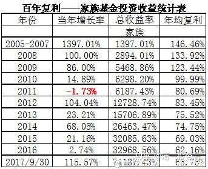
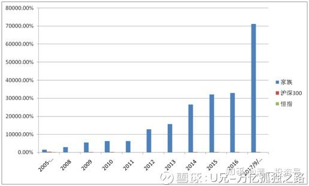
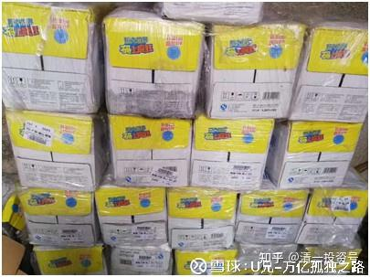
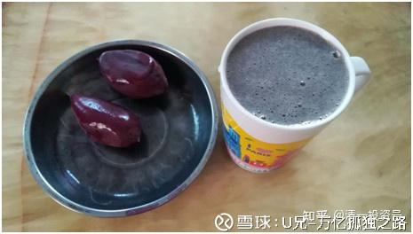
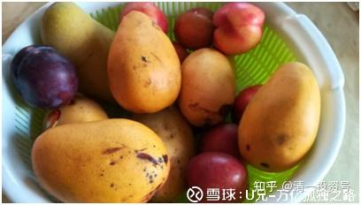
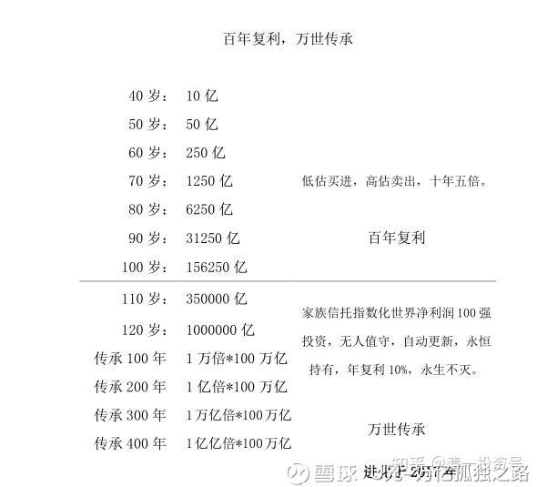

原雪球专栏18篇.万亿买不来家族传承！

清一山长 2017年11月27日

这篇文章已经到了个人财富修行的极致，其专注度、细致度，生活细节中知行合一的程度，我发现目前认识的人中无人能及，包括我在内[滴汗]。

作者更强的地方是：已经知道了“家族传承”的概念，不容易！99%的国人都不知道这个概念。可惜，U兄似乎把财富传承，当做“家族传承”的核心了。这只是入门级的传承要求。

如果钱多就能实现传承，就不会有秦始皇、朱元璋的遗憾了。这些人已经富极天下、贵极天下，都无法完成“家族传承”的宏伟愿想，就是因为财富、权利两者，虽然极重要，都还不是家族传承最核心的要素。还有比它们更贵重的东西。**真正的家族传承，一旦构建成功，乃家、国、民族之幸。但难度也极高，绝非一家一姓，能凭一己之力，凭个人的绝世天才和文治武功，就可以做到的。必须要有更大的载体才行。**

荷兰人数百年前的底层设计，真的让看透了财富之门的聪明人，找到了家族的“万亿之路”。可叹的是：世界上居然有这么多的人，不会利用这种设计，依然削尖了脑袋，都要去谋一个打工的位置。极少数发现了这个秘密的人，自然更容易实现我们轻轻松松的财富之路了。但是，要实现家族传承，还刚刚只是入门罢了。

希望有人能够真的窥见这个秘密，解决这个难题！

思考题一：我们这一代人，可以靠看似平凡，其实不平凡的、极其自律的生活方式和财富态度、财富思维，获得巨大的财富。但**我们如何保证我们的下一代也能和我们一样自律和不平庸，不愿意流俗呢？**

思考题二：假如我们自己，不经过任何的努力，就坐拥祖先留给我们的万亿资产，难道把万亿变成万万亿，会是我们的努力方向吗？还是更可能发生“繁华散尽”的逆转？子孙会自动选择“把万亿变万元”，也是一种有趣的玩法？**“聚散”两依依，事物从来就不是单向发展的。**

思考题三：如作者U兄所言，一天早餐2元就是最好的早餐了（我在泰国也几乎是类似的生活：两个香蕉，一杯椰子，加上破壁机，就是最好的早餐食物）。我们还要劳心苦意，特别的自律，去创造万亿财富干什么呢？**创造一笔偌大财富的目的，就是耐心地用百年的时间，看万元变万亿，或者继续看万亿变万万亿的数字游戏吗？**

思考题四：**人生用来做什么？会让我们觉得更有趣？更好玩？更有意义？**

思考题五：**财富用来做什么？会让我们觉得更有趣？更有意义？**

思考题六：作者也学佛的，那么，如果真的相信佛法，就必定相信因果，就知道**我们“赚到”的万亿，就是无数人共同“失去”的万亿（不说金融市场是“零和游戏”这样有争议的话，起码我们手上持有的股份，是别人转让给我们的份额。如果我们赚了，就是卖给我们的人，失去了赚的机会）**。那么，我们如何才能平衡这“失去的万亿”带来的巨大的负面能量躁动，可能带给我们子孙的危害呢？难道要用钱去打造一个万亿的孤岛，把我们自己的“万亿财富子孙们”囚禁起来吗？

谁能回答上面这些问题，你就解决了你的财富问题，也解决了你的人生问题了。祝福大家！

**评论回复：**

[清一山长](http://link.zhihu.com/?target=https%3A//xueqiu.com/9310099567)2017-11-28 12:22回复[麻袋儿](http://link.zhihu.com/?target=https%3A//xueqiu.com/6246429201)：看你主页，是兴业粉。分析很细。说话风格，是仁厚之人[很赞]。我A股的银行主要就是兴业和平银了，其他都是港股内银。兴业的收益不比招行差，但主要来自上一轮（2014-2015年轮动）赚的钱，这一次重新持有后，没赚多少[滴汗]。但我相信兴业不会只值半个招行。我是毛估估派的，喜欢一眼看胖瘦，不算细账。你们的分析对我帮助较大。U兄我不了解其人，原来的东西在何处也没看过。只是看文字，觉得难得。显然是很有自己的想法，姿势也高。个人生活都奉行极简主义。如果真做到知行合一，投资赚钱真不难。

[麻袋儿](http://link.zhihu.com/?target=https%3A//xueqiu.com/6246429201)回复[清一山长](http://link.zhihu.com/?target=https%3A//xueqiu.com/9310099567)：**清一兄是难得的清明之人。我从你雪球的发言中学到很多。[献花花] 人难得的是：一是认知逻辑要统一，二才能说得上去知行合一。 很多人做到一都很难了，何况二，难上加难。我个人生活奉行的也是极简主义，一饭一茶，一书一床即可。 [赞成]。**

[清一山长](http://link.zhihu.com/?target=https%3A//xueqiu.com/9310099567)回复[麻袋儿](http://link.zhihu.com/?target=https%3A//xueqiu.com/6246429201)：**极简的物质生活，极富裕的精神世界[鼓鼓掌]。**

[山牁](http://link.zhihu.com/?target=https%3A//xueqiu.com/9487975061)2017-11-27 21:34回复[清一山长](http://link.zhihu.com/?target=https%3A//xueqiu.com/9310099567)：好像记得这个U兄曾在帖子里说出书是对抗自己的懒惰，只要10元钱，结果138元一本。现在帖子下面不允许评论。有的奇怪。

[清一山长](http://link.zhihu.com/?target=https%3A//xueqiu.com/9310099567)回复[山牁](http://link.zhihu.com/?target=https%3A//xueqiu.com/9487975061)：我个人认为，写书赚钱，说实话真划不来，卖两百元一本也划不来。赔钱去卖书，更没必要。他的书，要跟巴菲特出的书比，是贵了一点。要跟个人看书后的收益价值比，也许就很便宜。不过也可能还是划不来。他自己也说：99%的人看不懂，做不到。

附录：

百年复利，万世传承——以凡入圣

关善祥 一个平凡投资者的修行日常 2017年10月1日

【2023年9月28日下午，U兄——关善祥离世，年仅38岁】

(原山长的雪球专栏文《**18篇.万亿买不来家族传承！》评价过**)

[http://www.360doc.com/content/18/0124/20/29447843_724800212.shtml](http://link.zhihu.com/?target=http%3A//www.360doc.com/content/18/0124/20/29447843_724800212.shtml)

[https://mp.weixin.qq.com/s/_4h5J3edkJDX4sfe76GdDg](http://link.zhihu.com/?target=https%3A//mp.weixin.qq.com/s/_4h5J3edkJDX4sfe76GdDg)

[https://xueqiu.com/8994475388/93221442](http://link.zhihu.com/?target=https%3A//xueqiu.com/8994475388/93221442)

2017年9月30日投资业绩截止

2017年9月底，本年度收益率为115%。

家族总净资产增长711倍。其中99%的资产为股票。

百年复利，的确是一个任重道远的战略规划。但现在回头一看，通过坚持不懈的投资，过去十多年获得七百多倍的收益。当初播下的种子，经过十年的风雨洗礼，已经长成了不能说是大树吧，至少是有一定抗打击能力的中型树。复利投资，越早开启越好。长个三四十年，就可以抗击十级台风。

投资除了获得金钱这样显而易见的财富之外，还有很多看不见的成就感，满足感。我有时会一个人，静静对着这个收益图表发呆。是思考过去？展望未来？还是只是纯粹地欣赏这十几年来一笔一画创作出来的艺术？

对于别人来说看到的可能仅仅是一个收益率，仅仅是一个数字。但它却是我的心血之作，我的投资艺术品。而这还只是刚刚落笔打了草图，更宏大的华章还在后面五十年。

期望五十年之后，还能与各位读者分享这幅作品。

我只是一个很平凡很普通的人，我是属于那种，假如我能够成功，90%的人都能够成功的普通凡人。

我出生于农村家庭，祖上三代为农。没有关系后台，没有资源资金，甚至没有大学学历，连体面的工作都找不到。如此普通平凡的一个人，如何去改写他的人生呢？所以我才说，如果我能够成功，90%的年轻人都能够成功。

我说我能够成功的关键因素是因为我没有资金资源，没有关系后台。听起来像心灵鸡汤。资金与关系后台，是一种物资层面的资源，现在世人只能够看到这一层维度，而往往忽视了精神层面的资源。精神层面的资源是勤奋，思考，战略，格局，这些听起来很虚的、常常被人骂是无用的心灵鸡汤，是另一个维度另一个时空里面的更强大更重要的战略资源。

常常有读者惊叹，为何我的格局这么大，为何我的战略能想得那么长远。都是被逼出来的：太穷了！没有任何的关系可以利用去做好的生意，没有资金去做好大的生意。那么我只能用大格局大战略实现人生的逆袭。我只有用百年的战略布局，才能让家族摆脱贫困。

假如我一开始就拥有很好的资源，那么我就可能会安于现状，不会去改变，更加不会去思考未来。在广东这个制造强省，我遇到很多民营企业家，他们过去都取得了巨大的成功。但在制造业转型升级的今天，他们过去非常成功的经验，成为了他们今天改革的包袱。我已经可以预见他们将被时代所淘汰，慢慢的淘汰，温水煮青蛙，毫无知觉。他们的成功，是过去那个时空的成功，到了下一个时空，就变成了包袱。你有好的产品，很快竞争对手改良出更好的，价格比你还便宜。你与政府有良好的关系有后台，谁都有下台的一天。物质层面的资源，是很容易被复制的，很容易被取代的。而几千年都不变的，只有精神层面的资源，是无法被取代，无法被复制，这才是最强大的核心竞争力，永远无法被战胜，永远无法被打败。而精神资源：战略、格局、耐心、时空，这些听起来很虚的东西，却被世人所忽视。

没有资源也许是另外一个维度里面的一种资源，平凡无奇也许也是另外一个维度世界里面的不凡奇功。而我，却窥见了这个维度的圣境，从此打开了另外一个世界的大门，懂得了如何用平凡的小事，构建我不凡的一生。

我曾经想过，到了80岁之时，写一本自传。但要怎么写呢？我的一生实在太平淡无奇，无事可写。我一生所做的事，几句话便写完了。每天养生，运动，读书，思考，陪伴家人，偶尔去去旅游。每一天都是简单的重复，日复一日，年复一年，近乎复制一般的时间安排：每天六点醒来，七点起床，八点早餐，九点看资料，十点做运动，十二点午餐，十四点午休，十五点看书，十八点晚餐，二十二点入睡。

每天吃的东西都一样，早餐豆浆番薯，正餐玉米配时令蔬菜。饿了吃点水果，渴了喝点蜂蜜。

每天看的都一样，经济，管理，传记，访谈，新闻。偶尔看个电影，追个电视剧。

每天想的都一样，昨天哪个事情没有做好了？昨天跟家人说的那句话好像语气有点重了，一定要注意改进。每日在自省中醒来，在自省中入睡。

这些一切，都是我每一天的日常，都是鸡毛蒜皮的小事。我没有那些成功人士满世界飞来飞去分享他的成功经验的风光。更没有企业家们收购这个收购那个的满志踌躇。我作为一个普通人，只有日复一日、近乎无聊的日程琐事。

虽然我与普罗大众每天都做着相同的事情，每天都是吃喝拉撒，读书也好看电影也好，每天都是找事以充实自我。但唯一有一点不一样的是，你是站在凡境去做这些事，还是站在圣境去做这些事？

**事情所代表的意义不在于这件事情本身，而是取决于你所站的境界高度。同一个事情，同一个动作，在不同维度中有不同的含义，在不同的境界中有不同的内涵。**

**以凡入圣的投资之道**

我的投资之道很简单，低估买进优秀公司，耐心持有，高估卖出。选一些好的行业，大众都有永恒需求的行业，正处于朝阳发展阶段的行业。理解什么是好行业难吗？一点也不难，因为我们也是人，我们自身有自身的需求，想想自己的需求，推己及人，就能知道大众需求什么，这点很平凡很简单，大家都能知道。这样的行业大概有十多个，与我们关系最密切。

在这些行业中，每个行业选出两三个优秀的公司。理解什么是优秀公司难吗？我们的日常生活中，几乎每天都在与这些公司打交道，每天都在使用它们的产品服务，它们的名字每天都会高频率的重复让你听见。其实这就是上天的一个声音，这就是天之道，**上天已经很直白的告诉你，好公司就是这些名字，它天天告诉你名单**，你自己麻木不仁视而不见而已。这几十个公司便已经代表了人类发展的未来。

在这些优秀公司之中，等待合适的时机，低估买入，高估卖出。如何理解低估难吗？2005年股市跌破1000点，股民都在骂娘，多少人发誓从此远离股市。人人都不好意思说自己是股民。这些声音你听不见吗？2008年百年一遇的金融海啸，多少企业破产倒闭，天天都上新闻头条，你没有看新闻吗？从2009年跌到2014年，整整熊了五年，这样还不足够让你知道吗？

如何理解高估难吗？2007年，各种评论版面都是“5000点是起点”，“10000点才是目标”，“死了都不卖”，市盈率都变市梦率了，你不知道吗？2015年十倍杠杆，百倍股神比比皆是，你没有看到这样的故事？低估与高估有什么难的，路人皆知的事。

**时机，是以年为单位的，又不是一刻几秒，很容易就被知道抓住。**不知道的人，只是被贪婪与恐惧蒙闭了心智而已，只是贪求快，却不懂慢即是快。

好行业，好公司，耐心等待一个好的时机买入，再耐心等待一个好的时机卖出。如此反复，即富可敌国。我在现在也想不明白，投资有什么难的，投资股票赚钱有什么难的，为何90%的投资者居然在一个长期上涨的股市中无法赚钱，真是不可思议。

保险是不是一个好行业？现在有点闲钱的人，都会为自己及家人买一份保障。不难理解未来二十年保险都会是一个好的行业。中国平安是一个好公司吗？一说保险谁不认识平安，想买保险的人谁不先看看平安的产品。这是一个好时机吗？短一点来说，从2015年5000点跌到现在3000点熊了两年。长一点来说，从2007年6000点到现在十年过去，还仅仅是在半山腰上。具体到平安，2007年60倍PE，到我在2016年投资的时候只有不足10倍PE。

**一眼看到的低估，一眼看到的好公司。**

好行业好公司好时机，天时地利人和皆已齐集，我一早已经看到财富在召唤我，毫不犹豫便重仓平安。买进之时我便已经知道自己会在平安上赚很多很多的钱，什么陆金所好医生估值多少亿，什么平安内涵价值多少亿，我已经懒得去计算。什么新监管什么偿二代什么陆金危机，我看都不想看。**几万字的分析，不如一眼看出的低估与优秀。**

我每天都做的投资，很简单很平常，读一下书，看一下报表，关注一下新闻。更多的时间在等待。平安整整等待了十年，才从60PE降到10PE。以至它什么时候涨，什么时候高估卖出，那也是需要耐心的等待。**时机未到不要急**。所以不要仅仅看到我目前投资了平安赚了到钱，而应该看到，我现在投资平安的这个布局，在十年前已经开始了。投资不仅仅是买卖这个动作。尽管我十年前一股没有买平安，但我已经开始投资平安了。**没有买，不等于没有投资，虽然我没有做“买卖”这个动作，十年前我已经在做“等待”这个动作**。我从12岁便开始做投资，尽管12岁时还没有股票帐户，但我不断的学习，读书，已经开启准备构建我的投资人生。

看到平安的钱堆在墙角里了，便毫不犹豫地重仓了。时机已到不要怕。这是一个已经等待准备了十年的时机。

至于现在平安已经大涨，错过了最佳买点的投资者，时机已过不要悔。好股票很多，机会无穷无尽，错过微软，错过谷歌，错过亚马逊，巴菲特依然是巴菲特。

假以时日，卖出平安，再次选择其他好的股票，等待好的时机。好股票生生不息，好时机总会到来。低估买进优秀公司，耐心持有，高估卖出，一切不过是简单的重复。

选几个好股票，耐心等待好时机，不必赚尽每一分钱，不必买到腾讯，不必发现马云，长期下来年均赚取15%是轻松平常的凡事。这么平凡简单的投资之道，谁都可以做到。原本赚钱是一件复杂的事情，你要开办公司，要创业，最后要盈利，都非常复杂、困难。而我将这复杂的事情简单化，将我的全部资产转化为优秀公司的资产，牢牢抱紧人类的发展未来。然后将这简单的事情重复做，用心做，日复一日，年复一年，日久建奇功，重复五十年，便可以富甲一方，成就我的投资人生，百年复利。

**以凡入圣的养生之道**

人，我们都是普通人，都是凡人。凡人都要吃饭睡觉运动，都有各种种样的情绪。什么是养生？无非就是把吃饭睡觉运动心情都做好。

我每一天醒来，我都强烈地意识到，这是我余生的第一天，怎可辜负。我醒来喝的第一口水，必须是长白山的矿泉水，必须是温水。我不允许我余生的第一天喝自来水，更不允许喝冷水。

（家中堆积如山的长白山矿泉水）

余生第一天的食物，我绝不允许自己吃垃圾食品。以麦当劳肯德基作为早餐，对于我来说简直是对生命的侮辱。我的食物必须是最天然最有营养的。一杯自制的豆浆两块紫薯，便是我每天的早餐。

一杯豆浆里面包含了十种杂粮，用破壁机把种皮豆渣全都粉碎，把最精华的营养都保留下来。紫薯饱含对抗衰老最有益的花青素，多的都溢出来了。每天吃着这样的早餐，我的生命充满了活力。这么有营养的早餐，才这么简单，才这么便宜（**成本大概就两元**）。

我整个生命都以素食为主，采食当季当造最新鲜的水果蔬菜五谷杂粮，这些都是有生命力的食物，我不允许有垃圾食品玷污我的身体。

每个人都要喝水，而我喝长白山之水，喝温水，我已经将这个小事做到极致，暂时无法再优化了。

每个人都要吃饭，而我只吃新鲜素食，有生命力的食物，我已经将这个小事做到极致，暂时无法再优化了。

每个人都要睡觉，为了把睡眠质量提高，我前前后后换了十几种枕头，十几床被子，尝试了很多种材料。试遍了中国、欧洲、美国、泰国、印尼，马来西亚，最后才找到一个最合适我的枕头，最舒服的被子。而我把房间的温度、湿度都调整到最合适，把枕头把床铺都调整到最舒适，把外面新鲜的空气过滤到原始森林的级别再放到房间里，保证不会缺氧，保证每一次深呼吸都像是一次生命的升华。每天10点必睡，6点必醒，我已经将这个小事做到极致，暂时无法再优化了。

还有运动，还有心情，这些都是每个人都要做的小事，而我将这些小事，将这些平凡之事已经到做了极致，做到了我暂时无法再优化的境界。与投资之道一样，我把养生之道复杂的事情简单做、重复做、用心做，天复一天，年复一年。每次同学聚会，同学们总是异常的惊讶：你怎么十几年都没有变过！？看着同学们一个个的大腹便便，越来越像“大老板”，而我却活成了孩子。就这样活了十年，越活越年轻。

养生就是对自我生命健康的管理，与财富管理一样，越早开始越好，越早开始“健康复利”越大。试想想，现在人开空调关着房门，一个小时就会开始缺氧，而我们却要每天这样子在室内过十几个小时，连续几十年，这种对健康的损害。想想我们的孩子每天都要这样子缺氧十几个小时，呼吸着污染的空气，对他们健康的损害。所以我在十几年前，当时我的全部身家才只有100万的时候，我就毫不犹豫花了10万元给全家安装了全世界最好的新风过滤系统，花费了我的全部身家的十分之一，要知道当时我已经开始的价值投资，这种决然一般人是没有的。但想想未来五十年“健康的复利”，我毫不犹豫就把十分之一的财富花出去了。

我的养生之道，就是把余生的第一天，每一天，每一件小事都优化到不能再优化，绝不委屈我的身体——这位与我相沫以濡的老战友。全部都仅是平凡的小事，任何人都可以做到。但把这样小事做好，我便已经在20岁之时，预见了我能够活过一百岁。

**体验过一切繁华之后，玉米番薯才是生命的真谛。这便是我以凡入圣的养生之道。**

**以凡入圣的佛学之道**

修心养性，是我投资体系中非常重要的战略体系。等待一个好的时机可能需要十年甚至更久，我才能等到熊市，等到优秀的公司有好的买入机会。买入之后，又要等待数年，才能有好的时机卖出。一来一回，十年八载是常事。这个等待的过程，往往令人心烦气躁，内心不安。为了解决这个问题，为了让自己面对股海波澜的同时而又自我的内心可以心如止水，我开始学佛。学佛对于我来说，不是宗教信仰，而是投资信仰，是人生信仰。（我对佛的理解，佛学并非佛教：《自渡成佛》：[https://xueqiu.com/8994475388/84169864](http://link.zhihu.com/?target=https%3A//xueqiu.com/8994475388/84169864)）

佛学的著作千千万万，但佛经其实只讲究了一句话：不以恶小而为之，不以善小而不为。

做好每一件小事，做好每一件平凡之事。哪怕是再小的事，在每一次善恶选择之间，都要坚持原则底线。我们的心，就会获得清宁平静。

我仅仅是一个普通的凡人，是凡人就有欲望，会生气。这些常常发生在我的身上。但每一次生气，每一次烦燥，我都会自省。以前的我，大概要在生气之后半天再明白过来，才发现自己生气了，然后我开始后悔，反思。希望一下次做得更好。久而久之，现在的我，在情绪升起的一分钟之内就察觉了，当我察觉这种情绪之后，在下一分钟情绪就消失了。所以我就不会把情绪转发为行动，很多人会将情绪转化为行动，导致自己决策失误。股票跌了就卖出，涨了就买入，甚至与家人大吵大闹，伤害感情。我是普通人，情绪是本能反映，但让情绪不要转化为害已害人的行动，就是我的能力。

什么是修行？修行不是刮光头，或在深山野林中念经打座。修行就是面对世俗，面对种种日常琐事，都能保持平静之心。面对每一件再小的小事，都保有善恶之分。

现在的我能在一分钟之内察觉出情绪的变化，我期望下一个二十年，能做到几秒钟，直到情绪完全被我掌控，而不是情绪掌控我。这可能就是古人所说的七十从心所欲不逾矩，我争取六十岁能做到吧。

**以凡入圣，寿见圣境**

**投资之道，养生之道，修心之道，三道合一为我的人生之道。**无非做好每件小事，每件小事做到极致。只要时间足够，只要我足够的长寿，便能到达圣境，便能建立万世之功业。

假如今天定一些小目标，让大家去完成：

1.今天不吃一切垃圾食品，红肉，高脂高油，只吃五谷杂粮，新鲜的水果蔬菜。不抽烟不喝酒。

2.今天要运动30分钟，任何你喜爱的运动都可以。

3.今天对家人，对朋友，对工作，对生活，保持一种平常平静的心。

4.今天晚上10点上床睡觉。

这些小目标，我相信99%的人都能够完成，很普通，很简单对吧。既然能做一天，能不能做一个月？能不能做一年？能不能做一辈子？

什么是修行？什么是得道？以无法为有法，即是修行得道的最高境界。谂经诵佛，闭关打座，只是修行的最低级形式，真正的修行是无形无法，却又是无处不在，即是做好每一件小事，每一件小事均是修行。我没有刻意去修行，没有去闭关思索，却时时刻刻在修行。无处，却又无处不在。无形，却又无形胜有形。

走一公里很平凡很简单，走一万公里就会变得非凡。**我的人生，就是每天走一公里，走一辈子。每天做了几件小事，做一辈子。**

**复杂的事情简单做，简单的事情重复做，用心做**，对于大众来说是心灵鸡汤，对于我来说，这就是我每天的修行，修行便从每一件凡事小事起始，这就是我以凡入圣的人生之道。我跟我老婆说，五十年之后，我会成为股圣的。老婆说，你这样写出来，会被人骂死的，太自大了。我说，骂就让别人骂吧，我的人生是我的还是他们的？何必要在意别人的评价。我不是自大，我是自知，因为我已经深知“道”的运行法则，我只是顺道而行，重复又重复，重复五十年而已。股圣不是一买就涨，一卖就跌。不是知道明天哪个涨停，今年哪个翻倍。没有抄底腾讯，没有发现马云，没有杠杆上恒大。只是简简单单的重复再重复，等待好时机买入好公司，每年15%的收益，重复五十年。养生长寿，修心养性，**以时间换空间，以格局赢人生。**所以我实在觉得，成为股圣，也不是什么难事，每个人也可以成为投资大师，只要15%的收益保持五十年，就是世界级的大师了。时间上自然而成的事情而已。我应该大大方方把我的思想写出来，子孙后人才能理解我的思想，知道他们的祖先是一个什么样的人。

平凡简单的事重复用心做一辈子，将点点滴滴做到极致，即为“圣”。以凡人之事，构建非凡之境，谓之“凡圣”。以凡入圣，就是我的人生最高目标。

这个文章写得唠唠叨叨，没有指点江山的气魄，只有鸡毛蒜皮的日常小事。因为我深刻的明白到，我身为一个凡人，各种平凡的小事，才是我生活的真实面目。但我同时从另一个维度的大格局中洞察到，平凡之中自有不凡之处，平凡之中自有高山深渊。所以我20岁之时便知道我能活到一百岁，所以我20岁之时便知道我一百岁的时候能够做到一万亿，所以我20岁之时便知道我这一生都会与家人过得非常的和谐幸福。一切不过是知“道”后顺道而为，自然而成之事，没有什么大不了的，没有什么难的。

**以凡入圣，以平凡的每一天，构建我不凡的一生。**

[2017-10-01 08:26](http://link.zhihu.com/?target=https%3A//xueqiu.com/8994475388/93221442)
